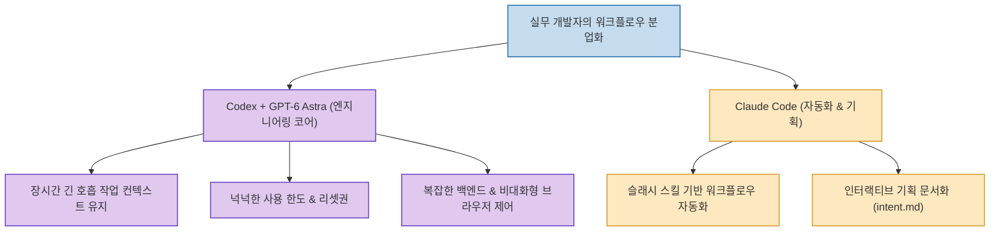

AI 코딩 어시스턴트의 양대 산맥인 Claude Code와 OpenAI Codex를 병행해 온 현업 엔지니어들 사이에서 최근 뚜렷한 작업 분업화 흐름이 나타나고 있습니다. 단순 벤치마크 점수 경쟁을 넘어, **"실제 복잡한 코드 작성과 백엔드 아키텍처 구현은 전부 코덱스(Codex)로 넘어가고 있다"**는 평가가 지배적입니다.

skills.ag 개발자가 공개한 **`왜 다들 코덱스로 옮기고 있나 — 아스트라가 바꾼 것`**은 **OpenAI의 차세대 모델 'GPT-6 아스트라(Astra)'가 가져온 장시간 작업에서의 규칙 유지력, 넉넉한 한도와 리셋권, 백엔드 및 브라우저 제어 안정성, 그리고 복잡한 하니스(Harness) 없이도 작동하는 에이전트 자율성**을 현업 엔지니어의 시각에서 명쾌하게 짚어냈습니다.

<!--more-->

## Sources

- [원문 유튜브 영상: 왜 다들 코덱스로 옮기고 있나 — 아스트라가 바꾼 것](https://youtu.be/ajp9S5y_KVI)
- [OpenAI Codex & Astra 공식 발표](https://openai.com)
- [스킬샵 커뮤니티 (skills.ag)](https://www.skills.ag/)

---

## 1. 실무 개발자의 Codex vs Claude Code 분업 구조

---

## 2. 아스트라(Astra)가 바꾼 코덱스의 4대 결정적 차이

1. **긴 호흡 작업에서의 컨텍스트 및 규칙 유지력**:
   * 대규모 리팩토링이나 수십 단계로 이어지는 엔지니어링 작업에서도 초반에 설정한 아키텍처 규칙과 컨벤션이 흐트러지지 않고 끝까지 일관성을 유지합니다.
2. **"페이블(Fable)은 뛰어나지만 오래 못 쓴다" (한도와 피로도)**:
   * Claude의 고성능 Fable 모델은 뛰어난 추론력을 보이지만, 대형 프로젝트를 장시간 연속 수행하기에는 세션 토큰 한도와 사용량 크레딧 소진 속도가 너무 빠릅니다.
   * 반면 코덱스는 **사용 한도가 훨씬 넉넉하고 리셋 주기가 유리**하여 개발자가 작업 중단에 대한 불안감 없이 몰입할 수 있습니다.
3. **백엔드 로직과 브라우저 제어의 압도적 안정성**:
   * UI 화면뿐만 아니라 시스템 깊숙한 백엔드 트랜잭션, 데이터베이스 마이그레이션, 비대화형 브라우저 에이전트 구동 등 '보이지 않는 영역'에서 코덱스가 실패율이 현저히 낮습니다.
4. **하니스를 다 걷어내도 되는 자율 통제력**:
   * 이전 세대 에이전트처럼 엉뚱한 탈선을 막기 위해 수많은 감시 스크립트와 가드레일 하니스(Harness)를 주렁주렁 달 필요 없이, 아스트라 자체의 안전한 판단력 덕분에 순수 CLI 환경에서 가볍고 빠르게 작동합니다.

---

## 3. 두 도구의 올바른 실무 역할 분담

* **코덱스(Codex + Astra)**: 코어 비즈니스 로직 작성, 백엔드 아키텍처 구축, 대규모 코드베이스 분석 및 장시간 연속 코딩 전담.
* **클로드 코드(Claude Code)**: 워크플로우 자동화, 인터랙티브 기획 명세서(`intent.md`, `PRD.md`) 수립, 프론트엔드 UI/디자인 이터레이션(`/design`)에 여전히 최적.

---

## 4. 시사점

AI 코딩 도구의 평가는 단순한 한두 번의 코드 생성 벤치마크가 아니라, **"실제 개발자가 매일 하루 종일 붙잡고 일할 때 겪는 피로도, 한도 스트레스, 긴 작업 일관성"**에서 결정되며, 아스트라 기반의 코덱스가 이 지점에서 실질적인 엔지니어링 표준으로 자리 잡아가고 있음을 시사합니다.
