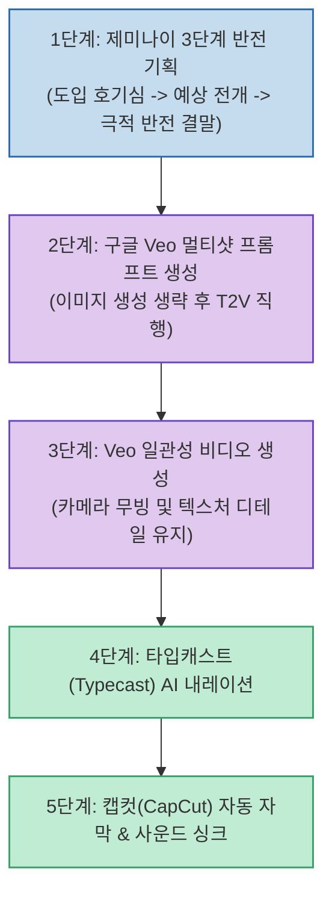

유튜브 쇼츠와 인스타그램 릴스에서 가장 높은 몰입도를 자랑하는 분야 중 하나가 바로 '기상천외한 AI 건축/공간 영상'입니다. 기존에는 미드저니(Midjourney)로 이미지를 뽑고, 런웨이(Runway)나 클링(Kling)으로 비디오를 생성한 뒤 수작업으로 컷편집을 맞추느라 영상 하나에 수 시간이 걸렸습니다.

원카AI 채널에서 공개한 **AI 건축 쇼츠 30분 제작법** 은 중간 이미지 생성 단계를 생략하고 **구글 Veo(비오)의 텍스트-투-비디오(T2V) 직행과 제미나이의 3단계 반전 스토리텔링 프롬프트** 를 결합해 작업 시간을 30분 이내로 압축한 획기적인 파이프라인입니다.

<!--more-->

## Sources

- [원문 유튜브 영상: AI 건축 쇼츠 30분 만에 만드는 법 전부 공개합니다](https://youtu.be/ObvCtB1ATnA)
- [Google DeepMind Veo](https://deepmind.google/technologies/veo/)

---

## 1. 30분 건축 쇼츠 고속 제작 파이프라인

---

## 2. 기존 방식 대비 시간 단축의 핵심: '이미지 생성 건너뛰기'

기존 방식과 30분 직행 방식의 차이는 불필요한 징검다리 단계를 제거한 데 있습니다.

* **구글 Veo의 공간 이해도**: Veo는 물리적 공간감과 카메라 무빙(드론 샷, 줌인, 패닝)을 텍스트만으로 정교하게 이해하므로 고해상도 참조 이미지 없이도 건축물의 압도적인 질감을 살려냅니다.
* **멀티샷(Multi-shot) 프롬프트 분할**: 카메라 각도(드론 조감도 ➔ 내부 진입 ➔ 디테일 클로즈업)를 프롬프트에 구조화하여 씬 간의 시각적 연속성을 보장합니다.

---

## 3. 제미나이 3단계 반전 스토리텔링 템플릿

시청 유지율(Audience Retention)을 80% 이상 끌어올리기 위한 제미나이 프롬프트 공식은 다음과 같습니다:

1. **후킹(Hook)**: 상식을 깨는 첫 문장 ("절벽 위에 지어졌지만 바닥이 유리로 된 집?").
2. **전개(Body)**: 건축학적 경이로움과 기능적 설계 묘사.
3. **반전(Climax & Twist)**: 마지막 3초에 드러나는 비밀 (실제로는 버려진 잠수함을 개조한 호텔 등).

---

## 4. 편집 및 오디오 싱크

* **타입캐스트(Typecast)**: 감정이 실린 내레이터 음성을 생성하여 스토리의 긴장감을 조성합니다.
* **캡컷(CapCut)**: 자동 텍스트 자막을 0.8초 단위로 배치하고, 건축물이 화면에 웅장하게 펼쳐질 때 딥 베이스(Deep Bass) 효과음을 매칭하여 완성도를 극대화합니다.
