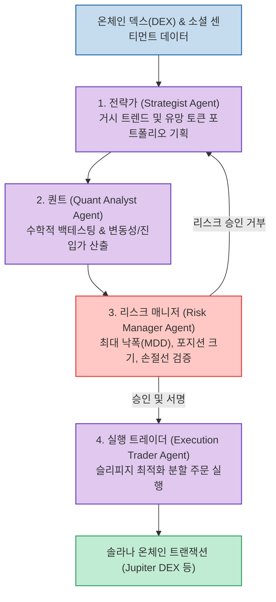

탈중앙화 금융(DeFi)과 인공지능 에이전트의 융합이 급물살을 타는 가운데, The Swarm Corporation이 공개한 오픈소스 프로젝트 **AutoHedge** 가 큰 주목을 받고 있습니다.

단순히 지표를 보고 매수·매도 신호를 발생시키는 기존 봇과 달리, AutoHedge는 **실제 인간 헤지펀드의 4대 핵심 직군(전략가, 퀀트, 리스크 매니저, 실행 트레이더)을 분리된 AI 에이전트로 구현하고, 상호 견제와 합의를 통해 솔라나(Solana) 온체인 트레이딩을 자율 집행** 합니다.

<!--more-->

## Sources

- [Threads 원문 포스트: h2smusic](https://www.threads.com/share/BCLrufpOmg/)
- [GitHub 저장소: The-Swarm-Corporation/AutoHedge](https://github.com/The-Swarm-Corporation/AutoHedge)

---

## 1. AutoHedge 4인 에이전트 협업 및 합의 아키텍처

---

## 2. 전문 에이전트별 역할 및 상호 견제 구조

1. **전략가 (Strategist Agent)**:
   * 소셜 미디어 트렌드, 유동성 풀 규모, 거시 경제 지표를 종합 분석하여 시장의 테마를 식별하고 전체 포트폴리오 자산 배분 비중을 결정합니다.
2. **퀀트 분석가 (Quant Analyst Agent)**:
   * 전략가가 선정한 자산의 과거 가격 데이터, 변동성, 호가창 깊이를 시뮬레이션하여 최적의 진입 시점과 목표 기대 수익률을 통계적으로 계산합니다.
3. **리스크 매니저 (Risk Manager Agent - 핵심 견제 장치)**:
   * **AutoHedge 안정성의 핵심**. 퀀트의 제안이 아무리 유망하더라도, 전체 포트폴리오의 최대 허용 낙폭(MDD), 일일 손실 한도, 단일 토큰 노출 상한을 초과하면 **즉각 거래를 반려(Veto)** 합니다.
4. **실행 트레이더 (Execution Trader Agent)**:
   * 리스크 검증을 최종 통과한 주문에 한해, Jupiter DEX 애그리게이터 등을 통해 MEV 봇 공격을 방어하고 슬리피지를 최소화하는 분할 스왑을 실행합니다.

---

## 3. 솔라나(Solana)를 선택한 이유

AutoHedge가 이더리움이나 타 L2 대신 솔라나를 기반으로 구축된 이유는 **서브세컨드(0.4초) 수준의 블록 확정 시간과 저렴한 가스비** 덕분입니다. 복수의 AI 에이전트가 실시간으로 포지션을 재조정하고 분할 주문을 집행할 때 발생하는 트랜잭션 비용 부담을 최소화할 수 있습니다.
