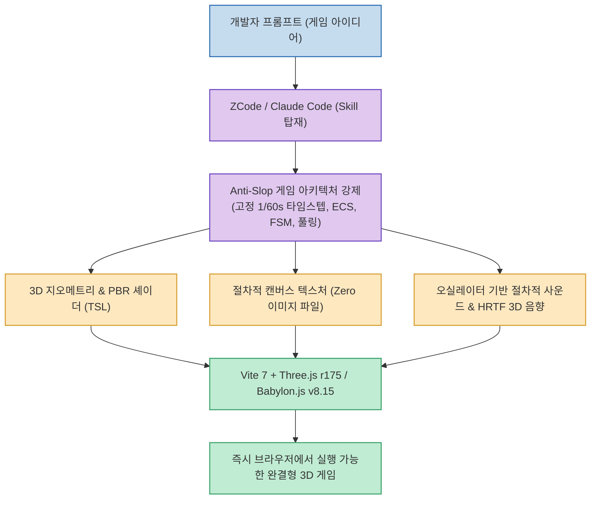

AI 코딩 어시스턴트로 웹 게임을 만들어 본 개발자라면 누구나 겪는 골칫거리가 있습니다. 모델이 작성해 준 코드는 그럴듯하지만, 외부 3D 모델(.glb)이나 텍스처 이미지, 효과음 파일 경로가 깨져 있거나 구식 코드를 생성해 브라우저 콘솔에 오류가 쏟아지는 현상입니다.

`@jakepansta` 가 추천하여 화제가 된 **Bufatechno WebGameDev** 저장소는 ZCode와 Claude Code Desktop 환경에 최적화된 전문 게임 개발 스킬(Skill)로, **외부 파일 의존성을 0%로 만들고 최신 2026 그래픽 스택을 준수하도록 강제** 합니다.

<!--more-->

## Sources

- [Threads 원문 포스트: jakepansta](https://www.threads.com/share/_6hlu0PQ1/)
- [GitHub 저장소: bufatechno/bufatechno-webgamedev](https://github.com/bufatechno/bufatechno-webgamedev)
- [쇼케이스 데모: Balik Kampung 3D](https://balik-kampung.vercel.app/)

---

## 1. Bufatechno WebGameDev 아키텍처 구조

---

## 2. 주요 기술 혁신

### 1) 제로 외부 에셋 (All-in-JS Packaging)
* **절차적 텍스처**: 나무, 벽돌, 금속, 잔디 등의 텍스처를 외부 PNG 파일 없이 HTML5 캔버스를 통해 코드로 직접 렌더링하여 매핑합니다.
* **절차적 Web Audio & HRTF**: 점프, 슈팅, 피격 효과음을 브라우저의 기본 오실레이터(Oscillator) 합성으로 구현하고 3D 공간 음향(HRTF Panner)을 적용합니다.

### 2) 2026 최신 웹 그래픽 스택 준수
* **Three.js r175+**: 최신 WebGPURenderer와 TSL(Three Shading Language) NodeMaterial을 적극 활용.
* **Babylon.js v8.15+**: Havok 물리 엔진, Clustered Lighting(1000개 광원 실시간 처리), Frame Graph 최적화(메모리 40% 절감) 기본 탑재.

### 3) Anti-Slop (저품질 코드 원천 차단)
* LLM이 무성의하게 작성하는 비동기 렌더링 루프를 금지하고, 60fps 고정 타임스텝, 엔티티 컴포넌트 시스템(ECS), 메모리 누수를 방지하는 오브젝트 풀링(Object Pool), IndexedDB 로컬 저장소를 필수로 강제합니다.
* 경량 모델인 Nemotron 3 Ultra나 DeepSeek 무료 모델을 사용해도 프로급의 정교한 게임 아키텍처가 도출됩니다.
