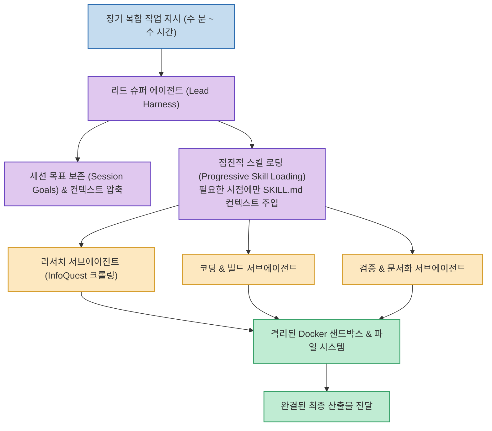

현재 대부분의 AI 에이전트는 5~10분 정도의 짧은 대화에서는 뛰어난 성능을 보이지만, 1~2시간 이상 걸리는 대규모 프로젝트를 맡기면 중간에 초기 목표를 망각하거나 환각(Hallucination)에 빠져 엉뚱한 길로 새기 일쑤입니다.

글로벌 틱톡 모기업 바이트댄스(ByteDance)가 공개한 **DeerFlow 2.0** 은 이 문제를 정면으로 해결하기 위해 **'오래 일하는 AI 직원(Long-Horizon SuperAgent)'** 을 표방하며 전면 재작성된 오픈소스 프레임워크입니다. 깃허브 공개 직후 스타 8.2만 개를 돌파하며 전 세계 개발자들의 폭발적인 관심을 받고 있습니다.

<!--more-->

## Sources

- [Threads 원문 포스트: h2smusic](https://www.threads.com/share/BAU5J5zE5k/)
- [GitHub 저장소: bytedance/deer-flow](https://github.com/bytedance/deer-flow)
- [공식 웹사이트: deerflow.tech](https://deerflow.tech)

---

## 1. DeerFlow 2.0 슈퍼 에이전트 오케스트레이션 아키텍처

---

## 2. 장시간 작업(Long-Horizon)을 가능하게 하는 4대 기술 축

### 1) 점진적 스킬 로딩 (Progressive Skill Loading)
수백 개의 도구와 매뉴얼을 처음부터 프롬프트에 밀어 넣으면 토큰이 낭비되고 모델의 주의력이 분산됩니다. DeerFlow는 작업의 각 단계에서 필요한 `SKILL.md` 만 동적으로 불러와 컨텍스트 윈도우를 항상 슬림하고 날카롭게 유지합니다.

### 2) 독립적 서브에이전트 오케스트레이션 (Sub-Agents)
리드 에이전트가 모든 것을 직접 처리하지 않고, 정보 검색은 리서치 에이전트에게, 코드 구현은 개발 에이전트에게 위임합니다. 각 서브에이전트는 격리된 컨텍스트에서 작업을 마치고 핵심 요약만을 리드 에이전트에 보고합니다.

### 3) 세션 목표 추적 & 컨텍스트 압축 (Compaction)
수십 번의 툴 호출과 반복 작업이 이어져 컨텍스트 한계에 도달하면, 과거의 불필요한 로그는 지능적으로 압축(Compaction)하면서도 최초 사용자가 부여한 **'세션 목표(Session Goals)'** 는 불변의 앵커로 유지합니다.

### 4) 안전한 격리 샌드박스 (Sandbox & InfoQuest)
바이트플러스의 지능형 검색/크롤링 툴셋인 **InfoQuest** 가 기본 내장되어 웹 데이터를 수집하며, 생성된 코드는 격리된 샌드박스 환경에서 안전하게 컴파일 및 실행됩니다.
