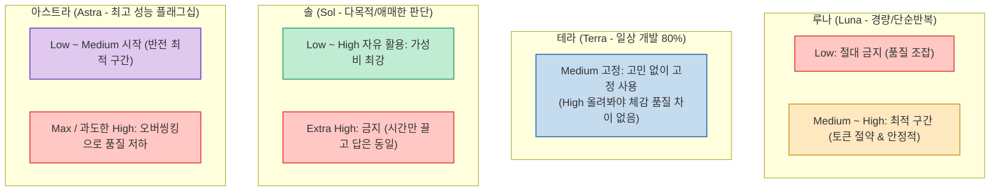
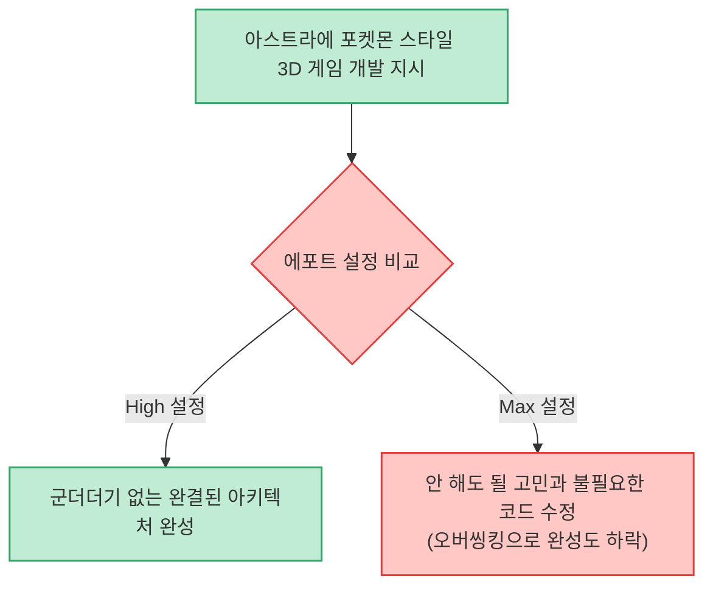

동일한 AI 코딩 환경에서 같은 프롬프트를 입력했는데도 어떤 날은 한 번에 끝나고 어떤 날은 코드가 꼬이는 현상을 경험해 보셨을 것입니다. 많은 이들이 이를 프롬프트 작성 탓으로 돌리지만, 현업 엔지니어들이 지목하는 진짜 핵심 변수는 바로 **추론 에포트(Effort, 생각의 깊이)** 설정입니다.

메이커 에반 채널의 **왜 고수들은 코덱스 에포트를 낮게 쓸까** 는 에포트가 단순한 '성능 업그레이드 스위치'가 아니며, **모델마다 딱 맞아떨어지는 최적의 구간이 존재하고 무작정 높이면 오히려 오버씽킹(Overthinking)으로 인해 코드를 망친다** 는 점을 실증적으로 짚어냈습니다.

<!--more-->

## Sources

- [원문 유튜브 영상: 왜 고수들은 코덱스 에포트를 낮게 쓸까 — 모델별 최적 구간](https://youtu.be/CRaXPSIvLs8)
- [스킬샵 커뮤니티 (skills.ag)](https://www.skills.ag/)

---

## 1. 모델별 에포트 최적 구간 요약

### 모델별 에포트(Effort) 최적 구간 및 추천 용도

| 모델 | 최적 구간 | 비추천 구간 | 주요 역할 및 활용 가이드 |
|---|---|---|---|
| **루나 (Luna)** | **Medium ~ High** | **Low (절대 금지)** | **초경량 반복 작업형** • 파일명 일괄 변경, 규칙 적용, 데이터 포맷 변환 등 단순 작업에 최적. • Low는 결과가 조잡해 재검수가 필요하므로 금지, Medium부터 토큰 절약과 안정적 결과 보장. |
| **테라 (Terra)** | **Medium (고정)** | **High 이상** | **일상 개발의 80% 담당** • 일상적인 코딩 및 기능 구현에 최적화. • High로 올려봐야 체감 품질 차이는 거의 없고 속도와 토큰만 낭비되므로 Medium에 고정 추천. |
| **솔 (Sol)** | **Low ~ High (자유 활용)** | **Extra High** | **가성비 & 판단 중심 다목적형** • 애매한 문제, 복잡한 비즈니스 로직 판단에 제격. • 저비용 고효율 모델. 단, Extra High는 시간만 끌고 품질 향상이 없어 배제. |
| **아스트라 (Astra)** | **Low ~ Medium** (반전 최적 구간) | **Max / 과도한 High** | **최고 성능 플래그십** • 강력한 모델일수록 높은 에포트에서 **오버씽킹(불필요한 고민 및 정상 코드 훼손)** 발생. • 반드시 Low/Medium에서 시작하고, 미해결 시에만 단계적으로 상향. |

---

## 2. 왜 'Max'를 켜면 손해일까?

* **기다림 대비 미미한 개선**: Max를 켜면 답을 내기까지 오랜 뜸을 들이지만, 결과물의 품질은 High와 비교해 유의미한 차이가 없습니다.
* **극심한 토큰 소모**: 일일 쿼리 한도가 있는 환경에서는 오전에 Max로 두어 번 돌리면 하루 사용량이 순식간에 소진됩니다.
* **원칙**: Max는 평상시에는 끄고, *'High로 2번 이상 시도해도 실패한 극단적인 수학 난제나 물리 공식 증명'* 에만 꺼내는 최후의 수단으로 삼아야 합니다.

---

## 3. 고성능 모델 아스트라의 '오버씽킹' 역설

가장 흥미로운 발견은 최고 사양 모델인 **아스트라(Astra)** 에서 나타납니다.

* **원인**: 강력한 모델에 너무 긴 생각 시간을 부여하면, 잘 작동하는 기존 코드까지 불필요하게 건드리거나 사소한 예외 처리에 매몰되어 전체 아키텍처를 망치게 됩니다.
* **권장 운용**: 반드시 **Low나 Medium에서 시작** 하고, 부족할 때만 단계적으로 올리는 것이 가장 안전합니다.

---

## 4. 최근 아스트라에서 진화한 2가지 강점

1. **완벽한 SVG 다이어그램 시각화**:
   * 시스템 구조도, 순서도, 아이콘 등을 좌표 왜곡 없이 완벽하게 작성해 발표 자료나 기술 문서에 즉시 활용 가능.
2. **화면 인지 Computer Use**:
   * 브라우저 화면이 완전히 렌더링될 때까지 기다렸다가 조작(클릭/입력)을 수행하여, 타이밍 불일치로 인한 자동화 중단 오류가 대폭 감소.

---

## 5. 결론: 표보다 중요한 '10분 테스트 습관'

작업 도메인과 모델 버전은 계속 변화합니다. 특정 표를 맹신하기보다 **새로운 작업에 착수할 때 에포트 설정만 바꿔서 딱 2번(10분) 비교 실행해보는 습관** 이 한 달의 엔지니어링 생산성을 좌우합니다.
