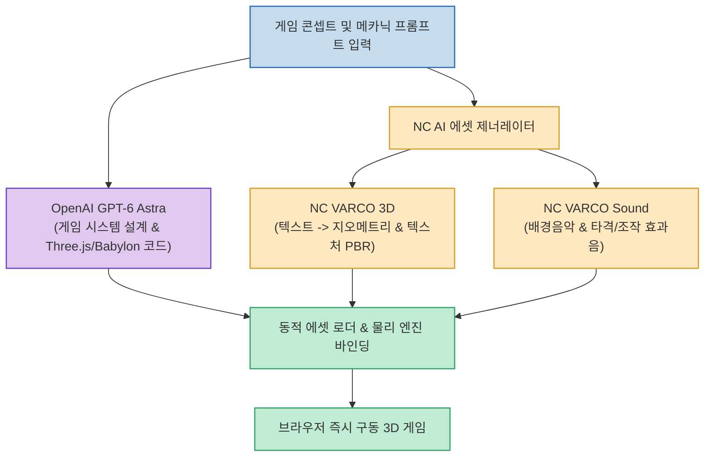

AI를 활용한 게임 개발이 2D 미니게임 시대를 지나 본격적인 **3D 고품질 실시간 게임 프로덕션** 단계로 진입하고 있습니다. 과거에는 LLM이 Three.js 코드 스니펫 정도를 짜주더라도 3D 모델링 파일(.gltf/.glb)과 사운드 에셋을 개발자가 일일이 수급해야 하는 높은 장벽이 있었습니다.

`choi.openai` 님이 공유한 워크플로우는 **OpenAI의 차세대 모델 'GPT-6 아스트라(Astra)'** 의 탄탄한 게임 루프 로직과 **엔씨소프트(NC AI)의 생성형 AI 스위트(VARCO 3D & Sound)** 를 결합하여, 프롬프트 입력만으로 에셋과 코드가 완벽하게 결합된 3D 게임을 실시간 빌드하는 혁신적인 파이프라인을 보여줍니다.

<!--more-->

## Sources

- [Threads 원문 포스트: choi.openai](https://www.threads.com/share/BBKhSWZzBr/)
- [NC AI VARCO 공식 기술 블로그](https://www.ncsoft.com/)

---

## 1. GPT-6 Astra + NC AI 통합 게임 제작 파이프라인

---

## 2. 기술적 핵심: 두 거대 모델의 상호보완

1. **GPT-6 Astra의 아키텍처 역량**:
   * 충돌 감지(Collision Detection), 카메라 궤도 제어, 캐릭터 이동 상태 머신(FSM) 등 복잡한 실시간 3D 게임 루프를 버그 없이 단일 파일 또는 모듈식 번들로 구성합니다.
   * 외부 에셋의 피벗 포인트(Pivot)와 바운딩 박스를 계산하여 에셋 로딩 시 정렬 오류를 자동 보정합니다.

2. **NC AI (VARCO)의 전문 게임 에셋 생성력**:
   * **VARCO 3D**: 게임 엔진에 즉시 임베딩 가능한 저용량·고품질 폴리곤 지오메트리와 PBR 텍스처 맵을 순수 프롬프트로 생성.
   * **VARCO Sound**: 점프, 타격, 폭발, 배경 앰비언스 등 게임 컨텍스트에 최적화된 효과음을 실시간 합성.

---

## 3. 게임 개발 패러다임의 대전환

기존 게임 제작이 `기획 ➔ 원화 ➔ 3D 모델링 ➔ 리깅 ➔ 애니메이션 ➔ 프로그래밍 ➔ 사운드 믹싱` 의 수직적 파이프라인이었다면, 이 워크플로우는 **단일 기획 프롬프트에서 모든 리소스가 동기화되어 즉시 플레이 가능한 빌드로 변환** 되는 '원샷 프로토타이핑' 시대를 열었습니다.
