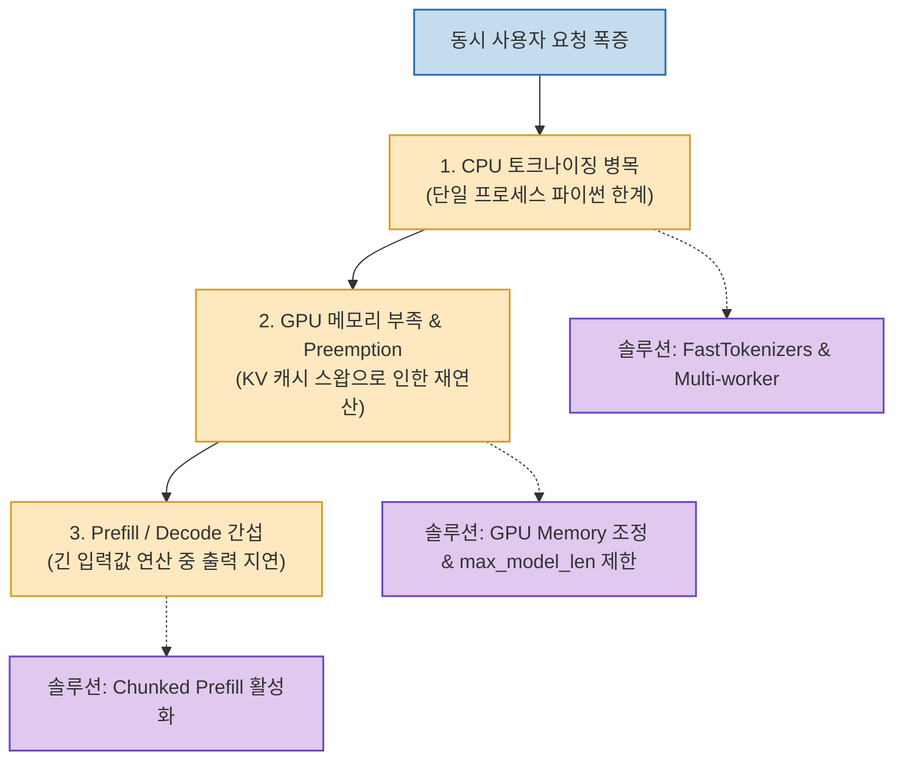
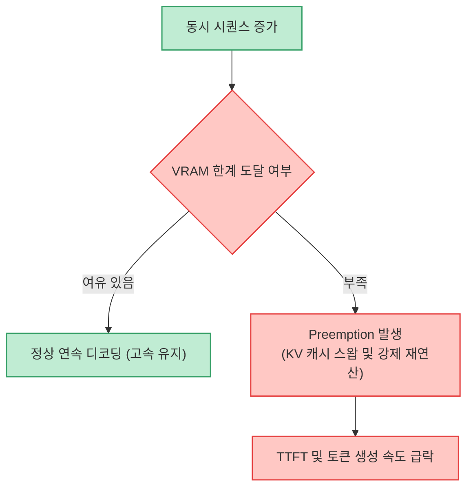

대규모 언어 모델(LLM)을 사내 인프라나 클라우드에 직접 서빙할 때 가장 널리 쓰이는 프레임워크가 바로 **vLLM** 입니다. vLLM은 PagedAttention 기술을 통해 높은 처리량을 자랑하지만, 기본 설정 그대로 배포하면 동시 사용자 요청이 몰릴 때 첫 응답 지연(TTFT)이나 급격한 토큰 생성 속도 저하를 겪기 쉽습니다.

많은 엔지니어들이 GPU 사양을 증설하거나 양자화(Quantization)부터 고민하지만, 실제로는 **인프라 변경 없이 파라미터와 아키텍처 설정만으로 2배 이상의 처리 성능 향상** 을 이끌어낼 수 있습니다.

<!--more-->

## Sources

- [원문 유튜브 영상: 초보자도 가능한 vLLM 빠르게 만드는 튜닝 방법 3가지!](https://youtu.be/VJkLGLuue3I)
- [vLLM 공식 문서 (vLLM Documentation)](https://docs.vllm.ai/)

---

## 1. vLLM 추론 파이프라인의 3대 병목 지점



---

## 2. 핵심 튜닝 1: CPU 토크나이징 병목 해소

vLLM의 기본 서버 구조는 파이썬 단일 프로세스로 인입 요청을 받아 문자열을 토큰 ID로 변환합니다. 동시 접속자가 늘어나면 GPU 연산 능력은 여유가 있는데도, **CPU의 토크나이징 속도가 따라가지 못해 GPU가 노는 현상** 이 발생합니다.

* **FastTokenizers 도입**: Rust 기반 고속 토크나이저를 채택하여 텍스트 직렬화 및 토큰화 속도를 비약적으로 단축합니다.
* **API 서버 워커 분산**: vLLM 인퍼런스 엔진 앞단에 복수의 API 워커 프로세스를 배치하여 CPU 코어를 골고루 활용하도록 구성합니다.

---

## 3. 핵심 튜닝 2: Preemption(선점) 최소화

`Preemption` 은 GPU VRAM 공간이 부족해 기존 요청의 KV 캐시를 CPU 램이나 디스크로 쫓아냈다가(Swap), 차례가 돌아오면 다시 가져와 연산을 처음부터 재수행하는 치명적인 성능 저하 요인입니다.



* **`--gpu-memory-utilization` 상향**: 기본값(0.90)에서 운영 환경에 따라 `0.92 ~ 0.95` 로 상향하여 KV 캐시 슬롯을 최대한 확보합니다.
* **`--max-model-len` 현실적 제한**: 모델의 최대 컨텍스트(예: 32K, 128K)를 무작정 열어두면 시퀀스당 예약 블록이 커집니다. 실제 비즈니스에 필요한 길이(예: 4096 또는 8192)로 제한하여 동시 수용 가능한 블록 수를 대폭 늘립니다.

---

## 4. 핵심 튜닝 3: Chunked Prefill로 TTFT 개선

기존 LLM 서빙에서는 긴 프롬프트를 한 번에 계산하는 **Prefill** 단계가 기존 대화 토큰을 생성하는 **Decode** 단계를 블로킹하는 문제가 있었습니다.

* **Chunked Prefill (`--enable-chunked-prefill=True`)**:
  * 긴 프롬프트 입력을 작은 덩어리(Chunk) 단위로 쪼개어 배치 디코딩과 번갈아 수행합니다.
  * 다른 사용자가 5000자짜리 질문을 던져도 기존 사용자의 답변 출력이 끊기지 않으며, 첫 토큰 응답 시간(TTFT)과 토큰 간 지연(ITL) 편차를 극적으로 안정화합니다.

---

## 5. 실전 권장 시작 플래그 요약

```bash
python3 -m vllm.entrypoints.openai.api_server     --model meta-llama/Llama-3.1-8B-Instruct     --gpu-memory-utilization 0.94     --max-model-len 8192     --enable-chunked-prefill True     --max-num-batched-tokens 2048
```

이 세 가지 파라미터 조합만으로도 동일 GPU 환경에서 200% 이상의 동시 접속 안정성과 지연 시간 단축 효과를 체감할 수 있습니다.
