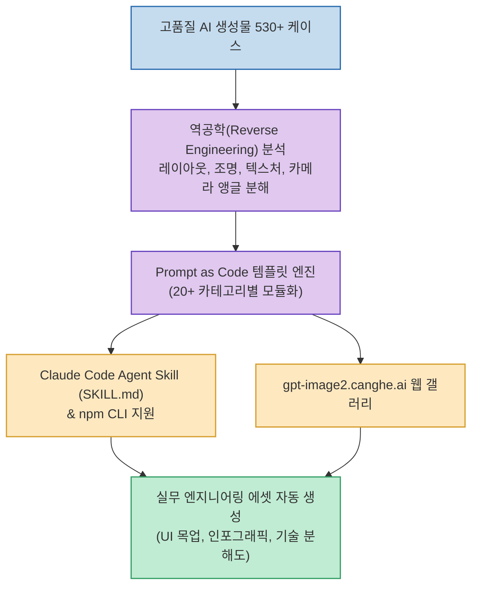

AI 이미지 생성이 단순한 취미용 일러스트 제작을 넘어 인포그래픽, UI/UX 디자인 시안, 기술 분해도, 브랜드 마케팅 에셋 등 실제 산업 현장으로 빠르게 확산되고 있습니다. 하지만 프롬프트가 길어질수록 원하는 디테일이 뭉개지거나 일관성을 유지하기 어렵다는 고질적인 문제가 있었습니다.

최근 깃허브 공개 이틀 만에 스타 1.8만 개를 돌파하고 현재 약 3만 스타에 도달한 **awesome-gpt-image-2** 는 이러한 문제를 해결하기 위해 **'Prompt as Code(코드로 관리하는 프롬프트)'** 철학을 도입했습니다. OpenAI의 최신 모델 **GPT-Image-2** 에 최적화된 530개 이상의 실제 제작 사례를 역공학(Reverse Engineering)하여 산업용 템플릿과 AI 에이전트 스킬로 체계화했습니다.

<!--more-->

## Sources

- [X(트위터) 원문 포스트: Lucas (@lksmlabc)](https://x.com/lksmlabc/status/2097070150390256016)
- [GitHub 저장소: freestylefly/awesome-gpt-image-2](https://github.com/freestylefly/awesome-gpt-image-2)
- [공식 비주얼 갤러리: gpt-image2.canghe.ai](https://gpt-image2.canghe.ai/)

---

## 1. Prompt as Code 아키텍처 및 파이프라인

---

## 2. 4대 핵심 가치 및 특징

### 1) Prompt as Code (모듈형 파라미터 구조)
* 감에 의존한 모호한 형용사를 배제하고, 카메라 렌즈 화각, 조명 셋업, 텍스처 재질, 레이아웃 그리드를 변수화된 코드 블록처럼 정의합니다.
* 특정 도메인(예: 패키지 디자인, 인터페이스 화면)의 핵심 파라미터만 교체하면 일관된 고품질 결과물을 보장합니다.

### 2) 20개 이상의 실무 산업용 템플릿
* **인포그래픽 & 데이터 시각화**: 복잡한 비즈니스 지표와 흐름도를 한눈에 정리하는 템플릿.
* **UI/UX 인터페이스 스크린샷**: 웹/모바일 앱 화면 목업 및 디자인 가이드라인 에셋.
* **기술 분해도 (Exploded View)**: 기계 장비나 전자 기기의 내부 부품이 분해되어 공중에 떠 있는 3D 렌더링 스타일.
* **브랜드 일러스트레이션 & 카드 세트**: 일관된 캐릭터 화풍과 세계관을 유지하는 멀티 에셋 팩.

### 3) Claude Code 및 에이전트 스킬 연동
* Claude Code 플러그인 마켓플레이스와 `SKILL.md` 포맷을 공식 지원합니다.
* 개발자가 터미널에서 코딩하거나 문서를 작성하는 도중, 에이전트에게 *"이 아키텍처에 맞는 인포그래픽 프롬프트를 짜줘"* 라고 요청하면 라이브러리에서 최적의 템플릿을 자동으로 인출해 호출합니다.

### 4) 실시간 웹 갤러리 (gpt-image2.canghe.ai)
* 웹 갤러리에서 500개 이상의 완성작을 스타일별로 필터링하고, 원클릭 프롬프트 복사 및 실시간 생성 테스트가 가능합니다.
