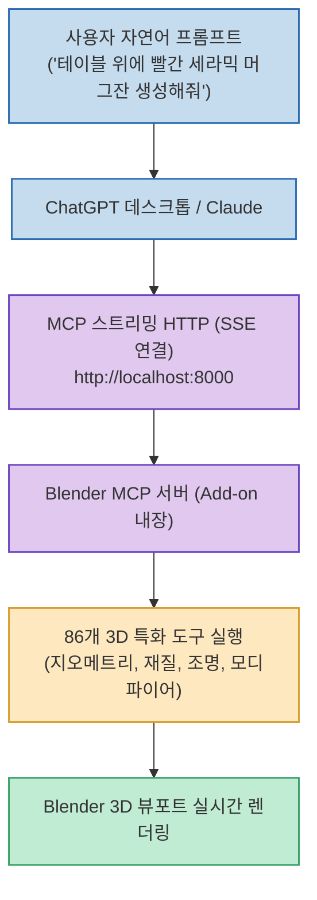
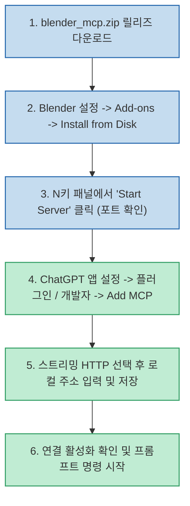

3D 모델링 도구인 블렌더(Blender)는 방대한 기능만큼이나 초보자에게 가파른 학습 곡선을 요구합니다. 최근 LLM의 함수 호출(Tool Calling)과 **MCP(Model Context Protocol)** 가 발전하면서, 복잡한 3D 뷰포트 조작과 파이썬 스크립트 작성 없이 **자연어 프롬프트만으로 블렌더 씬을 직접 구축하고 수정** 하는 작업이 현실화되었습니다.

`@geekknowit` 님이 공유한 **Blender MCP 연동 가이드** 는 복잡한 터미널 환경 설정 없이, **단일 ZIP 애드온 파일 설치로 Blender와 ChatGPT 데스크톱 앱을 스트리밍 HTTP(SSE)로 연결** 하는 가장 직관적인 실전 워크플로우를 제시합니다.

<!--more-->

## Sources

- [Threads 원문 포스트: geekknowit](https://www.threads.com/share/BADOEUhNh8/)
- [GitHub 저장소: emeryporter/blender-mcp](https://github.com/emeryporter/blender-mcp)
- [대안 오픈소스: ahujasid/blender-mcp](https://github.com/ahujasid/blender-mcp)

---

## 1. Blender MCP 동작 구조

---

## 2. 초간단 7단계 설치 및 연동 워크플로우

1. **ZIP 다운로드**: `emeryporter/blender-mcp` 릴리즈 페이지에서 `blender_mcp.zip` 을 내려받습니다.
2. **블렌더 애드온 등록**: Blender 메뉴의 `Edit` ➔ `Preferences` ➔ `Add-ons` 우측 상단 `Install from Disk` 를 눌러 ZIP 파일을 선택하고 체크박스를 활성화합니다.
3. **로컬 서버 기동**: 3D 뷰포트에서 `N` 키를 눌러 사이드 패널을 열거나 설정 화면에서 **`Start Server`** 를 누르고 로컬 HTTP 주소(예: `http://localhost:8000`)를 확인합니다.
4. **ChatGPT 앱 연동**: ChatGPT 데스크톱 앱의 `설정` ➔ `플러그인 / 개발자 도구` ➔ `Add MCP Server` 를 클릭합니다.
5. **엔드포인트 등록**: Server Type을 `스트리밍 가능한 HTTP(SSE)` 로 선택하고, 이름과 로컬 URL을 입력해 저장합니다.
6. **프롬프트 입력**: 연동 완료 후 모델에게 명령을 전달합니다.

---

## 3. 실전 사용 시 주의점과 꿀팁

* **MCP 서버 이름 명시하기**:
  * ChatGPT 앱에 지시할 때 *"Blender MCP를 사용해서 원뿔형 탑을 세우고 금속 재질을 입혀줘"* 처럼 **서버 명칭을 명시적으로 언급** 해야 합니다.
  * 서버 이름을 생략하면 모델이 MCP 도구 대신 `Computer Use` 기능(화면 마우스 클릭 자동화)을 시도할 수 있습니다.
* **풍부한 3D 도구군**:
  * 단순 스크립트 실행뿐만 아니라 씬 계층(Scene Hierarchy) 탐색, 메시 변형, 유니티(Unity) 엔진 호환성 검증 등 86개 이상의 정교한 API를 지원합니다.
