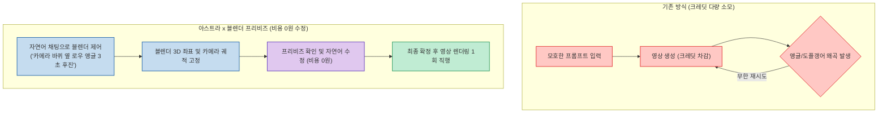
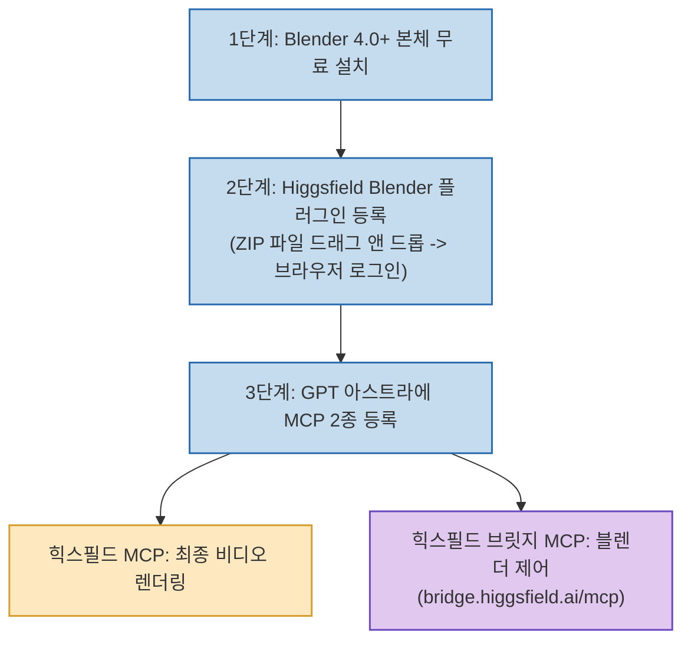
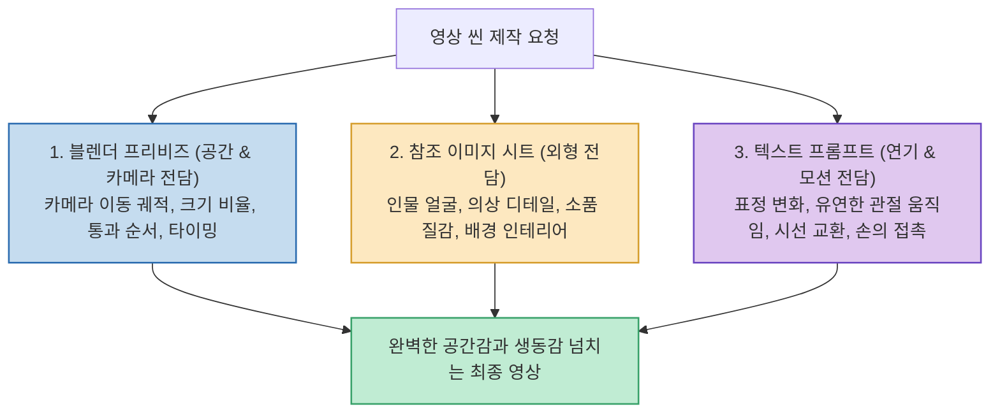

생성형 AI 비디오 모델(시댄스, 런웨이, 클링, 힉스필드 등)을 다뤄본 크리에이터라면 누구나 겪는 고질적인 문제가 있습니다. 프롬프트에 아무리 자세히 묘사해도 **인물이 둘로 복제되는 도플갱어 현상, 좌우 배치가 뒤바뀌는 공간 왜곡, 시킨 적 없는 엉뚱한 카메라 앵글** 이 튀어나와 수십 번 다시 뽑느라 막대한 크레딧을 낭비하는 일입니다.

유튜브 채널 'AI 아스트라'에서 공개한 **GPT-6 아스트라 x 블렌더 프리비즈 워크플로우** 는 이 문제를 정면으로 돌파합니다. **"프롬프트는 단순한 부탁이지만, 블렌더(Blender) 프리비즈는 정확한 지시"** 라는 원칙 아래, 자연어 채팅만으로 3D 블렌더 좌표를 세팅하고 카메라 앵글을 확정함으로써 영상 제작 크레딧을 90% 이상 절약하는 혁신적인 파이프라인을 제시합니다.

<!--more-->

## Sources

- [원문 유튜브 영상: GPT-6 아스트라 x 블렌더⚡AI 영상 크레딧 90% 절약하는 미친 무료 조합](https://youtu.be/gr8FPi5JJfE)
- [Higgsfield AI 공식 플랫폼](https://higgsfield.ai/)
- [Blender 공식 홈페이지](https://www.blender.org/)

---

## 1. 기존 프롬프트 방식 vs 블렌더 프리비즈 파이프라인 비교

기존의 텍스트 프롬프트 방식은 AI에게 '공간 좌표'를 제공하지 못해 계속된 재시도로 크레딧이 낭비됩니다. 반면 프리비즈 방식은 무료 3D 뷰포트에서 완벽한 앵글을 잡은 뒤 렌더링에 진입합니다.

---

## 2. 10분 만에 완성하는 무료 연동 환경 구축

블렌더를 전혀 다룰 줄 몰라도 단축키나 메뉴 공부 없이 순수 자연어 명령만으로 조작이 가능합니다.

* **연결 확인 프롬프트**:
  > `"힉스필드 브릿지로 현재 실행 중인 내 블렌더에 연결을 해 줘. 현재 장면에 오브젝트 이름, 활성화 카메라, 프레임 범위를 읽어서 알려줘. 아직 장면은 수정하지 마."`

---

## 3. 핵심 노하우: '마네킹 현상'을 극복하는 정보 3분할 법칙

블렌더 프리비즈(회색 인형 3D 가이드)를 그대로 영상 모델에 넣으면 카메라는 완벽하지만 **인물 관절이 마네킹처럼 굳어버리는 치명적인 문제** 가 발생합니다. AI 비디오 모델이 프리비즈의 뻣뻣한 관절 각도까지 그대로 복사하기 때문입니다.

이를 해결하기 위해 영상 제작 정보를 **세 갈래로 완벽히 분할** 하여 발주해야 합니다:

---

## 4. 실전 성과 및 확장 기능

1. **복잡한 멀티 앵글 15초 원샷 구현**:
   * 서핑 씬에서 드론 조감도 ➔ 파도 터널 통과 ➔ 사이드 트래킹 ➔ 수면 로우 앵글로 이어지는 5개 앵글 전환을 왜곡 없이 완벽 구현.
2. **다인원 씬의 도플갱어 완전 박멸**:
   * 3인 이상 댄스 씬이나 복잡한 파티 씬에서도 각 인물의 3D 좌표가 박혀 있어 인물 복제나 위치 뒤바뀜이 원천 차단됨.
3. **3D 세트 자산화 및 조명 룩 비교**:
   * 의자, 테이블 등 자주 쓰는 세트를 한 번 블렌더에 배치해 두고, 맑은 낮·노을·실내 조명 등 룩(Look) 비교 이미지만 뽑아본 뒤 최종 렌더링 선택 가능.

---

## 5. 결론: 카메라의 통제권을 되찾다

지금까지 AI 영상 제작이 'AI가 무작위로 뽑아준 결과물 중 그나마 나은 것을 고르는 수동적 입장'이었다면, 아스트라와 블렌더의 결합은 **감독이 직접 카메라를 세팅하고 AI는 그 지시대로 촬영만 수행하는 진정한 연출의 자유** 를 제공합니다.
