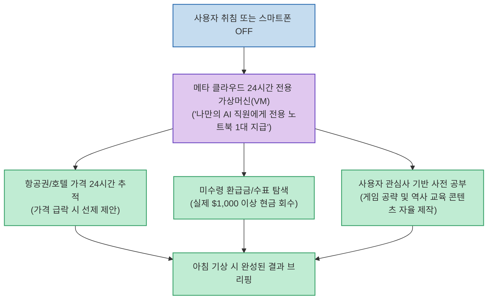
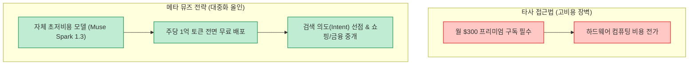

단순히 질문을 던지면 그럴듯한 답변을 내놓던 챗봇의 시대가 저물고, 사용자가 잠든 밤에도 전용 컴퓨터에서 실제 업무를 묵묵히 처리하는 **진짜 AI 에이전트의 시대** 가 열렸습니다.

'내일은 투자왕 - 김단테' 채널이 다룬 **'지상 최고의 AI Agent 나왔다'** 는 메타(Meta)가 전격 공개한 개인용 슈퍼 에이전트 **뮤즈(Muse)** 의 파격적인 행보와, 글로벌 AI 생태계를 뒤흔들고 있는 OpenAI의 차세대 플래그십 **GPT-6 아스트라(Astra)** 의 파급력을 투자자와 테크 관점에서 명쾌하게 분석했습니다.

<!--more-->

## Sources

- [원문 유튜브 영상: 지상 최고의 AI Agent 나왔다 (내일은 투자왕 - 김단테)](https://youtu.be/knGTxa-K9zQ)
- [메타 AI 연구소 공식 블로그](https://ai.meta.com/)
- [OpenAI 공식 커뮤니티 소식](https://openai.com/)

---

## 1. 메타 '뮤즈(Muse)'의 핵심 혁신: 24시간 전용 클라우드 VM

기존 개인 에이전트(오픈클로 등)는 사용자가 맥미니나 고사양 PC를 24시간 켜두어야 하는 치명적인 하드웨어 진입장벽이 있었습니다. 메타는 이를 클라우드 상에서 전격 해결했습니다.

---

## 2. 왜 메타의 무료 정책이 시장을 뒤흔드는가?

일론 머스크의 xAI 그록봇(GrokBot)이 월 300달러 수준의 고가 요금제로 전용 VM을 제공하는 것과 달리, 메타는 **주당 최대 1억 토큰까지 전면 무료** 로 배포하는 파격적인 전략을 취했습니다.

* **모건스탠리 분석**: 소비자용 에이전트 시장은 향후 **30조 달러** 규모로 성장할 것이며, 사용자가 검색창을 열기도 전에 평소 관심사를 파악해 선제안하는 메타 뮤즈가 **구글 검색 광고 모델의 가장 위협적인 파괴자** 가 될 수 있다고 진단했습니다.

---

## 3. OpenAI GPT-6 아스트라의 폭발적 독주와 난제 해결

한편, OpenAI 진영에서는 아스트라(Astra) 모델의 사용량이 폭증하며 전례 없는 현상들이 잇따르고 있습니다:

1. **Pro 신규 구독 일시 중단 검토**:
   * 서버 인프라 한계로 인해 가장 비싼 Pro 요금제의 신규 가입을 일시 중단해야 할 정도로 전 세계적인 수요 폭발.
2. **추론 비용 25,000배 절감**:
   * 과거 o3 모델이 ARC-AGI 87.5%를 달성할 때 50만 달러가 소요되었으나, 아스트라는 단 **20달러** 로 이를 뛰어넘는 벤치마크를 기록.
3. **90년 미해결 물리 난제 해결**:
   * 아스트라의 차세대 후속 연구 모델이 90년간 미해결 상태였던 유체역학의 난제 **'나비에-스토크스(Navier-Stokes) 방정식'** 문제를 해결했다는 발표가 나오며 과학계와 시장에 거대한 충격을 안김.
4. **깃허브(GitHub) 커밋 지표 역전**:
   * 실무 개발자들의 실제 코드 커밋 수와 생성 라인 수에서 OpenAI 코덱스/아스트라가 Claude를 압도적인 격차로 따돌림.

---

## 4. 시장의 명암: 상위 1% 기업의 AI 지출 효율화

핀테크 플랫폼 램프(Ramp)의 법인카드 결제 데이터에 따르면, AI 관련 지출을 가장 많이 하던 상위 1% 기업들의 결제액이 소폭 감소했습니다.

이는 기업들이 AI를 포기하는 것이 아니라, 모델 가격 인하 경쟁과 함께 가성비 높은 경량 모델(Lightweight LLM)로의 **'비용 최적화 및 스마트한 지출 조정'** 단계로 진입했음을 시사합니다.
