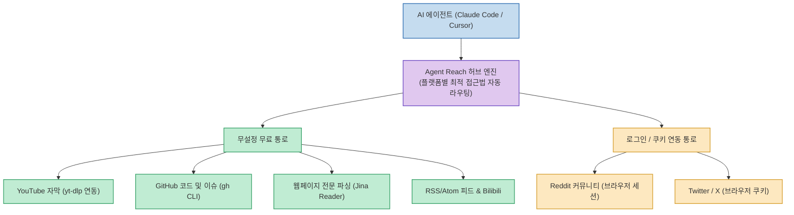
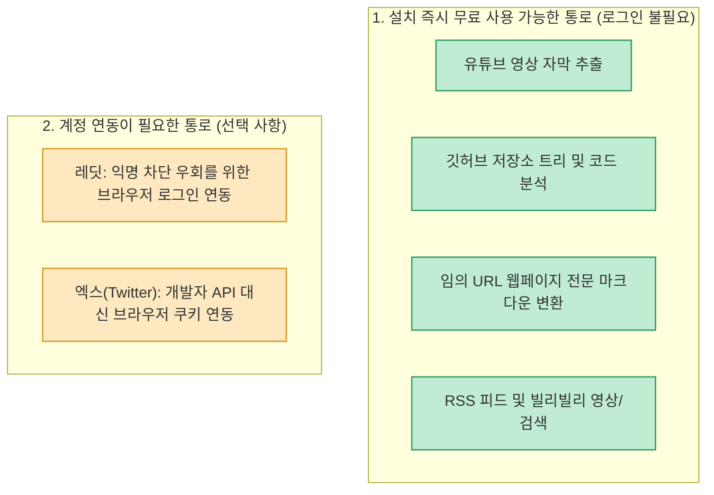

클로드 코드(Claude Code)나 커서(Cursor) 같은 최신 AI 에이전트를 실무에 투입할 때 가장 큰 벽에 부딪히는 순간은 바로 '외부 실시간 정보 조사'입니다. 기본 상태의 클로드는 **유튜브 영상 주소를 줘도 자막을 읽지 못하고, 레딧(Reddit)은 접근이 차단되어 있으며, 엑스(Twitter/X)는 고가의 유료 API를 요구** 하기 때문입니다.

'게으른 빌더' 님이 정리한 **클로드가 유튜브·레딧·깃허브를 무료로 긁어오게 만드는 도구** 는 오픈소스 **Agent Reach** 를 활용하여, 플랫폼마다 현재 가장 안정적으로 작동하는 수집 도구(yt-dlp, Jina Reader, GitHub CLI 등)를 하나로 묶어 AI 에이전트의 외부 탐색 통로를 단 3분 만에 무료로 개방하는 실전 가이드를 제공합니다.

<!--more-->

## Sources

- [원문 가이드: 클로드가 유튜브·레딧·깃허브를 무료로 긁어오게 만드는 도구 (게으른 빌더)](https://lazyowen.com/guides/agent-reach)
- [공식 GitHub 저장소: Panniantong/Agent-Reach](https://github.com/Panniantong/Agent-Reach)
- [yt-dlp 공식 저장소](https://github.com/yt-dlp/yt-dlp)
- [Jina Reader 공식 저장소](https://github.com/jina-ai/reader)

---

## 1. Agent Reach의 동작 구조 및 외부 통로 개방 아키텍처

AI 에이전트가 직접 웹 스크래핑을 시도하면 각 플랫폼의 차단 정책에 걸려 빈손으로 돌아오기 쉽습니다. Agent Reach는 AI와 외부 플랫폼 사이에서 검증된 전문 도구들을 중계하는 스마트 허브 역할을 수행합니다.



---

## 2. 지원 채널 분류: 무설정 vs 로그인 연동

플랫폼의 보안 정책에 따라 지원 채널은 크게 두 묶음으로 나뉩니다:



* **무설정 통로만으로도 충분**: 일반적인 개발 문서, 최신 기술 영상 자막, 공식 깃허브 코드 조사는 별도 로그인 없이도 100% 무료로 즉시 활용할 수 있습니다.

---

## 3. 3단계 초간단 설치 및 상태 검증

Python 3.10 이상 환경에서 `pipx` 를 사용해 격리된 환경으로 설치하는 것이 권장됩니다.

```bash
# 1. 패키지 설치
pipx install https://github.com/Panniantong/agent-reach/archive/main.zip

# 2. 내 컴퓨터 환경 자동 검사 (시스템 변경 없음)
agent-reach install --env=auto

# 3. 연결 상태 한눈에 진단
agent-reach doctor
```

`agent-reach doctor` 실행 시 터미널 화면에 아래와 같은 상태창이 출력됩니다:

```text
👁️  Agent Reach Status
========================================

✅ Ready to use:
  ✅ GitHub repos and code
  ✅ YouTube video subtitles
  ✅ Bilibili search & video detail
  ✅ RSS/Atom feeds
  ✅ Web pages (any URL)

🔍 Search:
  ⬜ Web semantic search

🔧 Configurable:
  ⚠️  Twitter/X — needs credentials
  ⬜ Reddit posts and comments — needs login

Status: 6/9 channels available
```

* `✅ Ready to use` 항목에 깃허브, 유튜브, 웹페이지가 표시되면 핵심 리서치 준비가 완료된 것입니다.

---

## 4. 실전 다채널 교차 검증 리서치 프롬프트

단일 출처만 확인하는 대신, 유튜브 자막과 커뮤니티 실제 반응, 최신 글을 한 번에 교차 검증하는 프롬프트 구조를 사용할 때 진가가 발휘됩니다.

```text
1. <유튜브 영상 주소>의 자막을 받아 핵심 다섯 개로 정리해 줘.
2. <내 주제 또는 제품 이름>에 대해 사람들이 실제로 불평하는 내용을 커뮤니티에서 찾아 주제별로 묶어 줘.
3. 같은 주제로 최근 글 세 개를 찾아서 다수 의견과 반대 의견을 나눠 줘.
4. 위 셋을 합쳐 브리핑 하나로 만들고, 문장마다 출처 주소를 붙여 줘.
5. 막힌 통로가 있으면 다른 통로로 대체하고, 어디를 썼는지 표시해 줘.
```

* **안전장치 한 줄의 중요성**: 마지막 5번 문장(`"막힌 통로가 있으면 다른 통로로 대체하고..."`)을 반드시 포함해야 특정 플랫폼이 일시적으로 차단되었을 때 AI가 빈손으로 돌아오지 않고 대체 출처를 찾아냅니다.

---

## 5. 정기 유지보수 및 트러블슈팅

* **월 1회 상태 점검**: 플랫폼별 스크래핑 방식이 변경될 수 있으므로 한 달에 한 번 `agent-reach watch` 명령어로 최신 상태를 확인합니다.
* **`command not found` 오류**: 터미널 환경 변수에 pipx 경로가 등록되지 않은 경우이므로, `pipx ensurepath` 실행 후 새 터미널 창을 엽니다.
* **클로드가 도구를 안 쓸 때**: 질문 프롬프트에 *"유튜브 자막을 분석해서"*, *"커뮤니티에서 불만 사례를 찾아서"* 처럼 명시적으로 탐색 대상을 언급해 주어야 내장 지식 대신 외부 도구를 호출합니다.
