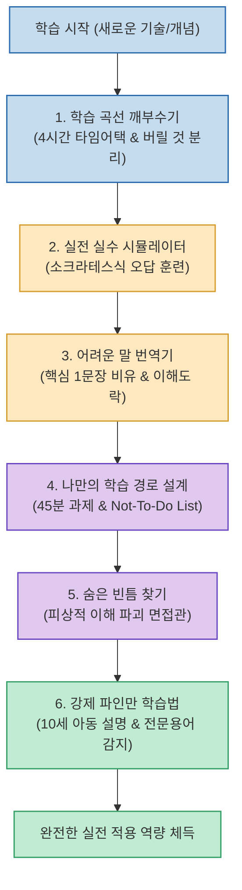

새로운 기술이나 지식을 배울 때 생성형 AI를 단순한 '요약기'로만 사용하면, 방대한 이론 목록에 압도되어 실제 업무에 적용하기도 전에 지치기 쉽습니다. AI의 진정한 가치는 단순히 정답을 읊어주는 백과사전이 아니라, **나를 극한으로 몰아붙여 메타인지를 깨우는 1:1 개인 튜터** 로 활용할 때 발휘됩니다.

스레드에서 화제가 된 **클로드의 '학습의 신 모드'** 는 AI에게 시간 제약과 역할극, 오답 유도, 비유적 설명, 블라인드 스팟 공격을 강제하여 **어떤 기술이든 4시간 만에 실전에 써먹을 수 있는 수준으로 압축 학습** 시키는 6대 실전 프롬프트 세트입니다.

<!--more-->

## Sources

- [Threads 원문 포스트: aialnam](https://www.threads.com/share/BAC7tmBWPc/)
- [Anthropic Claude 공식 프롬프트 엔지니어링 가이드](https://docs.anthropic.com/)

---

## 1. 6대 프롬프트의 학습 인지 파이프라인

단순 암기식 학습에서 벗어나, 압축 ➔ 오답 시뮬레이션 ➔ 메타인지 검증으로 이어지는 정교한 인지 학습 사이클을 구현합니다.

---

## 2. 실전 프롬프트 6선 상세 복사본

### 1) 학습 곡선 깨부수기 (실전 4시간 압축 모드)
> *"너는 나와 딱 4시간만 함께할 수 있는 선생님이야. 그 이후에는 다시 만나지 못해. 네 유일한 목표는 시간이 끝나기 전에 내가 [기술]을 실제로 써먹을 수 있게 만드는 거야. 실전에 쓸 수 없는 이론은 설명하지 마. 목록만 던져주지도 마. 무엇부터 배워야 하는지, 무엇은 완전히 무시해도 되는지 알려줘. 그리고 딱 한 번만 해봐도 몇 달째 배우는 사람들의 70%보다 앞설 수 있는 연습이 무엇인지 알려줘."*

### 2) 실전 실수 시뮬레이터 (소크라테스식 오답 훈련)
> *"[개념]을 설명하지 마. 그 개념을 실제로 써야 하고, 내가 실수할 가능성이 높은 상황에 바로 놓이게 해줘. 내가 틀리면 정답을 알려주지 마. 내 논리가 어디서 잘못됐는지 스스로 발견할 수 있는 질문을 해줘. 최소 두 번은 시도한 뒤에 정답을 알려줘. 망설이지 않고 제대로 해낼 수 있을 때까지 이 과정을 반복해줘."*

### 3) 어려운 말 번역기 (핵심 1문장 비유 & 이해도 락)
> *"아래 글이 이해가 안 돼. 설명하기 전에 먼저 알려줘. 이 글에서 어떤 한 문장만 이해하면 나머지도 자연스럽게 이해할 수 있을까? 먼저 그 문장만 설명해줘. 전문 용어 없이 일상적인 비유를 사용해줘. 그다음 정말 이해한 사람만 답할 수 있는 질문 3개를 해줘. 내가 세 질문에 모두 제대로 답하기 전에는 다음으로 넘어가지 마.  [여기에 글 붙여넣기]"*

### 4) 나만의 학습 경로 설계 (45분 과제 & Not-To-Do List)
> *"내 진짜 목표는 [목표]야. 막연히 [기술]을 배우려는 게 아니야. [기간] 안에 [구체적인 결과]를 달성하려는 거야. 나는 이미 [배운 내용]을 알고 있어. 나를 위한 7일 학습 계획을 만들어줘. 매일 45분 안에 끝낼 수 있는 과제 하나, 제대로 해냈는지 판단할 수 있는 명확한 기준, 시간을 낭비하지 않도록 그날 하지 말아야 할 일을 포함해줘. 계획을 전부 따라도 목표에 도달할 수 없다면, 도달할 수 있을 때까지 계획을 다시 짜줘."*

### 5) 숨은 빈틈 찾기 (피상적 앎 파괴 면접관)
> *"나는 [기술]을 이미 익혔다고 생각해. 네가 그 생각이 틀렸다는 걸 증명해줬으면 해. 겉보기에는 간단하지만, 깊이 이해하지 못한 사람의 빈틈을 드러내는 질문 5개를 해줘. 내가 답할 때마다 그 답변을 통해 내 기초 지식에 무엇이 부족한지 짚어줘. 봐주지 마. 내 이해가 피상적이라면 그렇다고 직접 말해줘."*

### 6) 강제 파인만 학습법 (10세 아동 설명 & 전문용어 감지)
> *"방금 [주제]를 공부했어. 이제 네가 열 살짜리 아이라고 생각하고 내가 이해한 내용을 설명할게. 내가 뜻도 제대로 모르는 전문 용어를 쓰거나, 논리의 중간 단계를 건너뛰거나, 너무 단순하게 설명해서 내용이 틀려질 때마다 멈춰줘. 설명이 끝나면 이런 실수들이 내가 아직 어떤 부분을 확실히 이해하지 못했다는 뜻인지 정확하게 알려줘."*
