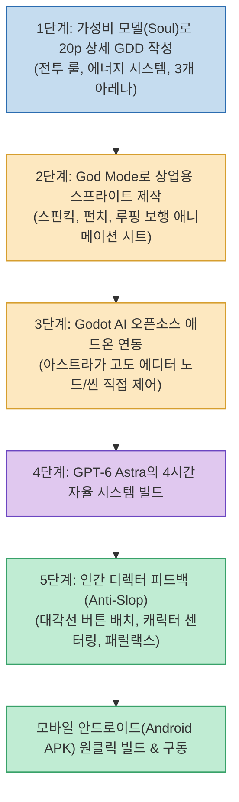

AI 코딩 모델로 게임을 만들 때 가장 자주 겪는 실망은 '겉보기엔 그럴듯하지만 조금만 플레이해 보면 버그투성이인 저품질 결과물(AI Slop)'을 마주할 때입니다. 단순히 "RPG 게임 하나 만들어줘"라는 프롬프트 한 줄로는 프로덕션 수준의 완성도와 손맛을 구현할 수 없습니다.

글로벌 게임 개발 튜토리얼 스튜디오 Letta Corporation의 Marco Paoletta가 공개한 **GPT-6 아스트라 x 고도 엔진 워크플로우** 는 **"개발자는 총괄 디렉터이고, AI는 가장 유능한 조수"** 라는 철학 아래, OpenAI의 최신 플래그십 **GPT-6 아스트라(Astra)** 와 스프라이트 생성기 **God Mode**, 그리고 오픈소스 **Godot AI** 애드온을 결합하여 빈 프로젝트에서 모바일(Android APK) 구동까지 완성하는 실전 파이프라인을 보여줍니다.

<!--more-->

## Sources

- [원문 유튜브 영상: GPT-6 Astra is AMAZING At Making Godot Games With God Mode](https://youtu.be/ps2o30WP_o8)
- [Letta Corporation 공식 웹사이트](https://lettacorporation.com)
- [God Mode AI 스프라이트 생성기](https://www.godmodeai.co/ai-sprite-generator)
- [Godot Engine 공식 사이트](https://godotengine.org/)

---

## 1. AI Slop을 배제하는 상용급 게임 제작 파이프라인

단순 프롬프트 직행 대신, 정교한 GDD 기획 ➔ 전문 에셋 제작 ➔ 에디터 바인딩 ➔ 디렉팅의 4단계 협업 체계를 구축합니다.

---

## 2. 핵심 3대 툴셋과 역할 분담

1. **GPT-6 아스트라 (Astra - 메인 엔지니어링 코어)**:
   * Claude Fable 대비 절반의 비용으로, 4시간 동안 컨텍스트 흔들림 없이 노드 계층 구조, 턴제 1v1 전투 알고리즘, 체력/에너지 소모 상태 머신을 일관되게 코딩.
2. **God Mode (프로덕션 2D 스프라이트 애니메이션)**:
   * 단 한 장의 캐릭터 콘셉트 아트를 입력하면 수백 개의 동작 라이브러리(사이드스크롤 전투, 루핑 이동 등)를 상업적 라이선스로 즉시 추출.
   * AI 투명 배경(Transparent Background)을 적용하여 고도 에디터에서 바로 쓸 수 있는 스프라이트시트 완성.
3. **Godot AI 애드온 (에디터 브릿지)**:
   * 고도 엔진 에셋 라이브러리에서 무료로 설치 가능한 오픈소스 플러그인으로, 아스트라가 외부에서 고도 에디터 내부의 씬 트리와 노드를 자유자재로 조작할 수 있도록 지원.

---

## 3. 디렉터로서의 실전 피드백 노하우

* **크레딧 절약 팁**: 기획과 콘셉트 도출 단계부터 비싼 아스트라를 쓰지 않고, 가성비 모델인 '솔(Soul)'을 사용해 20페이지 분량의 게임 디자인 문서(GDD)를 먼저 구축합니다.
* **디테일한 인터랙티브 교정**:
  * 캐릭터의 스케일 크기 조정 및 카메라 피벗 센터링.
  * 모바일 터치 조작성을 고려한 버튼의 대각선 2열 배치.
  * 3개 사원(Temple) 배경 전환에 맞춘 다층 패럴랙스(Parallax) 레이어 구축.
