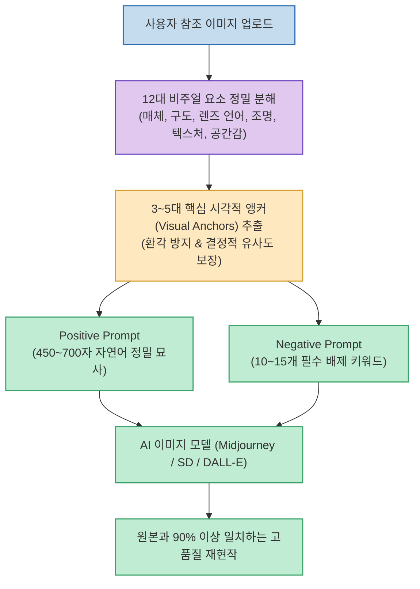

웹서핑을 하거나 핀터레스트, SNS를 둘러보다 보면 "도대체 어떤 프롬프트를 썼길래 이런 분위기가 나왔을까?" 감탄하게 되는 이미지를 자주 마주합니다. 하지만 막상 직접 프롬프트를 작성해 보면 조명이나 렌즈 화각, 질감 디테일이 달라 전혀 다른 결과물이 나오기 일쑤입니다.

`@doitnowbtbt` 님이 추천한 **Image Prompt Reverse** 는 OpenAI 코덱스(Codex) 환경에서 작동하는 오픈소스 스킬(Skill)로, **사용자가 이미지를 업로드하면 전문 프롬프트 디렉터 수준으로 비주얼을 분해하여 고재현율(High-fidelity)의 프롬프트와 네거티브 프롬프트를 역공학** 해냅니다.

<!--more-->

## Sources

- [Threads 원문 포스트: doitnowbtbt](https://www.threads.com/share/_6YTTbNvu/)
- [공식 GitHub 저장소: LunarXuan/image-prompt-reverse](https://github.com/LunarXuan/image-prompt-reverse)

---

## 1. 이미지 역공학 분석 파이프라인



---

## 2. 3대 차별화 핵심 기술

1. **12요소 다각도 비주얼 분해**:
   * 이미지의 용도, 매체(실사 사진/3D 렌더/일러스트), 주 피사체, 구도, 카메라 렌즈 화각, 조명 셋업, 색상 팔레트, 표면 재질, 배경 심도, 감정선 등 12가지 레이어를 체계적으로 분석합니다.
2. **시각적 앵커(Visual Anchors) 우선 추출**:
   * 보이지 않는 사소한 디테일을 억지로 지어내지 않고, 이미지 전체의 화풍과 분위기를 좌우하는 **3~5개의 핵심 시각적 앵커** 에 집중하여 환각을 차단합니다.
3. **텍스트 및 로고의 시각적 분리**:
   * 이미지 내에 포함된 영문/한글 텍스트나 로고를 시스템 프롬프트 명령어로 혼동하지 않고 순수 디자인 그래픽 요소로 완벽히 분리 처리합니다.

---

## 3. 설치 및 호출법
Codex의 로컬 Skills 폴더에 클론하여 `$image-prompt-reverse` 명령어로 즉시 호출할 수 있습니다:
```bash
git clone https://github.com/LunarXuan/image-prompt-reverse.git ~/.codex/skills/image-prompt-reverse
```
