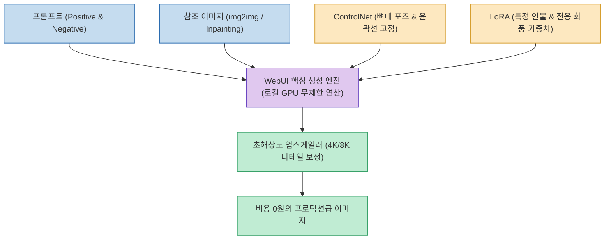

미드저니(Midjourney)나 유료 이미지 생성 API를 사용하다 보면, 원하는 컷이 나올 때까지 수십 번 생성 버튼을 누르느라 월 구독료와 크레딧 소모가 눈덩이처럼 불어납니다. 생성 비용에 구애받지 않고 무제한으로 연구·테스트하고 싶다면 **로컬 GPU 기반의 오픈소스 환경** 으로 전환하는 것이 정답입니다.

`@aiwire_kr` 님이 공유한 **AUTOMATIC1111 Stable Diffusion WebUI** 는 깃허브 스타 16만 개를 돌파하며 전 세계 AI 크리에이터와 개발자들에게 **'오픈소스 이미지 생성의 사실상 표준(Defacto Standard)'** 으로 확고히 자리 잡은 대표적인 브라우저 기반 GUI 플랫폼입니다.

<!--more-->

## Sources

- [Threads 원문 포스트: aiwire_kr](https://www.threads.com/share/_nzQ7V8ma/)
- [공식 GitHub 저장소: AUTOMATIC1111/stable-diffusion-webui](https://github.com/AUTOMATIC1111/stable-diffusion-webui)

---

## 1. Stable Diffusion WebUI의 핵심 파이프라인

---

## 2. 4대 핵심 생성 기능

1. **txt2img (Text-to-Image)**:
   * 텍스트 설명문만으로 상상 속 장면을 실사, 일러스트, 3D 등 원하는 스타일로 자유롭게 렌더링.
2. **img2img (Image-to-Image)**:
   * 기존 이미지의 구도와 색감, 윤곽을 유지한 채 스타일만 변경하거나 새로운 요소를 추가.
3. **인페인팅 (Inpainting)**:
   * 어색하게 나온 손가락, 눈매, 옷자락 등 특정 영역만 브러시로 칠해 해당 부위만 정교하게 재렌더링.
4. **업스케일링 (Upscaling)**:
   * 고화질 복원 모델(R-ESRGAN 등)을 활용해 깨짐 없이 4K 이상의 초고해상도로 출력.

---

## 3. 막강한 확장 생태계: ControlNet과 LoRA

* **ControlNet (형태 통제권 확보)**:
  * AI가 포즈나 구도를 멋대로 바꾸지 못하도록 인체 관절(OpenPose), 외곽선(Canny), 깊이 맵(Depth)을 강제 고정.
* **LoRA (경량 모델 갈아끼우기)**:
  * 수십 MB의 작은 가중치 파일만으로 특정 연예인, 버추얼 인플루언서, 웹툰 화풍을 완벽하게 재현.
