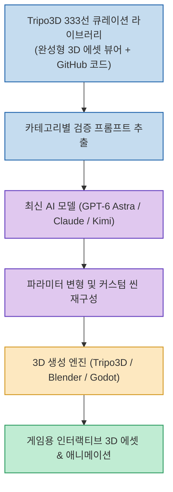

생성형 AI가 2D 이미지를 넘어 본격적인 **3D 지오메트리 및 공간 에셋 생성** 으로 진화하고 있습니다. 하지만 3D 프롬프트는 2D 그림 프롬프트와 달리 폴리곤 토폴로지, PBR 머티리얼 재질, 카메라 화각, 리깅 뼈대 세팅 등 고려해야 할 기술적 변수가 훨씬 많아 원하는 퀄리티를 얻기까지 수많은 시행착오를 거쳐야 했습니다.

`@geumverse_ai` 님이 소개한 **Tripo3D 3D 프롬프트 333선** 은 실제 프로덕션 프로젝트에서 검증된 333개의 실전 프롬프트를 큐레이션하여 원본 결과물 및 GitHub 오픈소스 코드와 함께 무료로 공개한 대형 라이브러리입니다.

<!--more-->

## Sources

- [Threads 원문 포스트: geumverse_ai](https://www.threads.com/share/BAW8MfdfVZ/)
- [Tripo3D 공식 프롬프트 라이브러리](https://www.tripo3d.ai/3d-prompts)

---

## 1. Tripo3D 프롬프트 라이브러리 활용 아키텍처

검증된 3D 프롬프트를 바탕으로 최신 LLM(GPT-6 Astra, Claude 등)과 3D 엔진을 연결하여 에셋 제작 기간을 단축합니다.

---

## 2. 주요 대표 프로젝트 및 카테고리 분석

1. **대규모 환경 & 도시 재현**:
   * **맨해튼 고층 빌딩 거리**: 빌딩의 유리창 반사, 아스팔트 질감, 거리 가로등 배치를 정밀 좌표로 재현.
   * **마인크래프트 스타일 복셀 월드**: 복셀 그리드 규격을 엄격히 준수한 모듈형 타일 세트.
2. **동적 크리처 & 인터랙션**:
   * **카이주(거대 괴수) 전투 씬**: 피부 질감의 범프 맵과 역동적인 타격 포즈 지오메트리.
   * **인터랙티브 슬라임**: 물리 엔진과 연동되는 유연한 젤리 재질과 반투명 셰이더.
3. **패키징 & 캐릭터 애니메이션**:
   * **접히는 포장 상자**: 종이 패키지가 단계별로 펼쳐지고 접히는 기하학적 키프레임 세팅.
   * **블렌더(Blender) 표정 쉐이프키**: 캐릭터의 눈, 입 모양 감정 변화를 위한 페이셜 리깅 가이드.

---

## 3. 실전 활용 팁
* **GitHub 연동 코드 확인**: 단순 텍스트 프롬프트만 보는 것이 아니라, 함께 제공되는 오픈소스 코드를 통해 지오메트리 인출 방식과 엔진 바인딩 방식을 벤치마킹할 수 있습니다.
