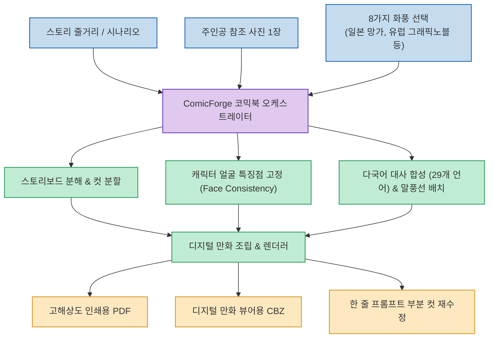
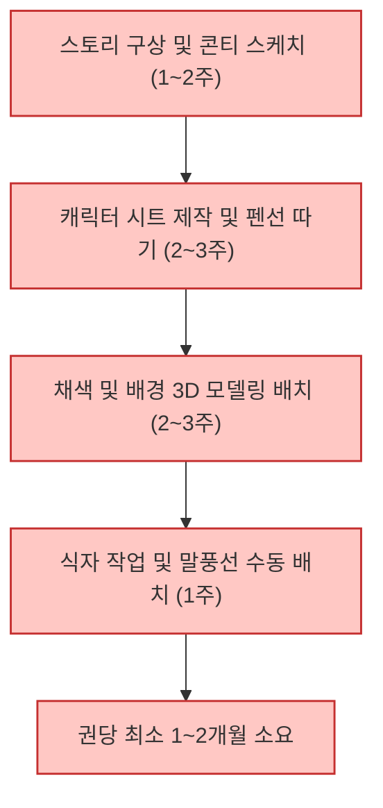
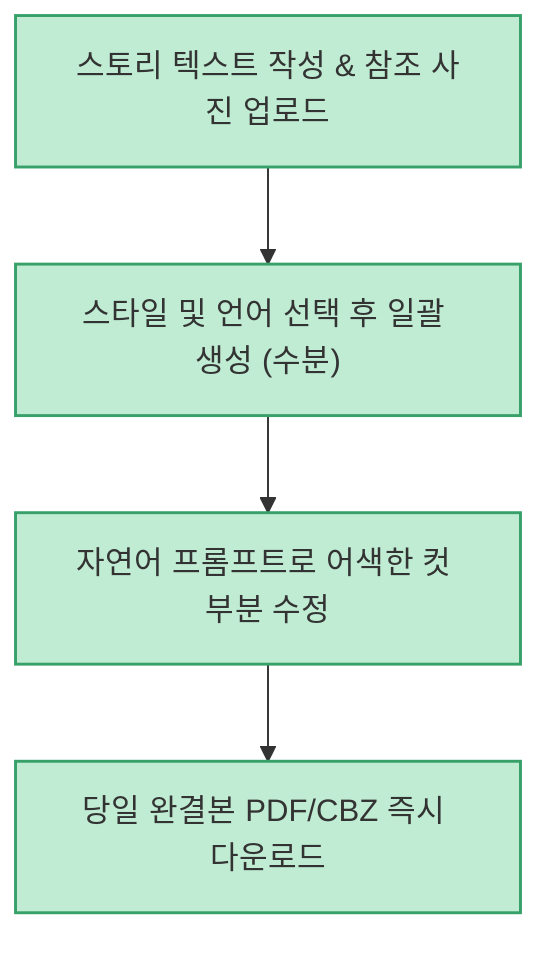

생성 AI를 활용해 만화나 웹툰을 제작할 때 가장 큰 기술적 난제는 **"컷마다 주인공의 얼굴과 복장이 달라지는 캐릭터 일관성(Consistency) 붕괴"** 와 **"스토리의 호흡에 맞춘 레이아웃 및 말풍선 수작업 배치"** 였습니다. 단일 이미지를 생성하는 모델은 흔하지만, 여러 페이지에 걸쳐 긴 서사를 유지하는 완성형 단행본 제작은 여전히 전문가의 막대한 후가공을 필요로 했습니다.

웹 기반 서비스로 등장한 **ComicForge** 는 줄거리 텍스트와 참조 사진 한 장만 입력하면 표지부터 페이지 레이아웃, 컷 분할, 29개국어 대사까지 최대 40페이지 분량의 코믹북을 원스톱으로 제작해 주는 **Prompt-to-Comic** 전용 생성 플랫폼입니다.

<!--more-->

## Sources

- [공식 웹서비스: comicforge.space](https://comicforge.space)
- [Threads 소개 원문: @itsshibaai](https://www.threads.com/share/BATna_VU0t/)

---

## 1. ComicForge 엔드투엔드 생성 파이프라인

ComicForge는 입력된 스토리 텍스트를 장면(Scene) 단위로 분해하고, 참조 사진의 인물 특징을 임베딩하여 컷마다 안정적으로 투영하는 파이프라인 구조를 갖추고 있습니다.

---

## 2. 주요 핵심 기능 및 차별점

### 1) 사진 한 장으로 완성되는 캐릭터 일관성
- 기존 이미지 생성 툴에서는 LoRA를 수십 장의 사진으로 직접 학습시키지 않는 한 컷마다 캐릭터의 생김새가 달라지는 문제가 있었습니다.
- ComicForge는 참조 사진 1장의 얼굴 임베딩 벡터를 추출하여, 2페이지 단편부터 최대 40페이지 장편까지 주인공의 이목구비와 표정 특성을 일관되게 유지합니다.

### 2) 8가지 장르별 아트 스타일 & 29개국어 지원
- 일본 소년만화 스타일의 흑백 스크린톤 망가부터, 프랑스·벨기에 스타일의 유럽풍 앨범 아트, 미국 마블·DC 스타일의 풀컬러 그래픽 노블까지 **8가지 화풍 프리셋** 을 제공합니다.
- 한국어, 영어, 일본어, 프랑스어 등 **29개 다국어 번역 및 폰트 타이포그래피** 를 지원하여 글로벌 독자를 타깃으로 한 번역본 제작이 즉시 가능합니다.

### 3) 만화 전용 규격 포맷 출력 (PDF / CBZ)
- 단순 웹 이미지 캡처가 아닌, 표준 출판 규격의 고해상도 **PDF** 와 디지털 만화 전용 뷰어 표준 포맷인 **CBZ** 파일을 기본 제공합니다.
- 웹툰 플랫폼 연재, 태블릿 만화 뷰어 열람, 전자책 유통 등에 별도 변환 작업 없이 바로 활용할 수 있습니다.

### 4) 대화형 부분 컷 리터칭 (Inpainting Re-roll)
- 전체를 다시 그릴 필요 없이, 어색한 컷만 선택하여 "표정을 놀라게 해줘", "배경을 야간 골목길로 바꿔줘"와 같은 한 줄 프롬프트로 해당 컷만 부분 재생성할 수 있습니다.
- 아동 및 교육용 콘텐츠 제작을 위한 **Family-safe(전연령) 필터** 도 기본 탑재되어 있습니다.

---

## 3. 전통적 만화 제작 vs ComicForge 워크플로우 비교

### 전통적인 디지털 코믹북 제작 과정

### ComicForge 기반 Prompt-to-Comic 워크플로우

---

## 4. 실무 활용 방안 및 산업적 시사점

1. **마케팅 및 브랜드 스토리텔링**: 복잡한 제품 설명서나 브랜드 철학을 4~8페이지 분량의 브랜드 코믹북으로 초고속 제작하여 고객 참여도를 극대화할 수 있습니다.
2. **개인 창작자의 출판 문턱 제거**: 그림 실력이 부족한 작가나 기획자도 자신의 아이디어를 상용 수준의 비주얼 코믹북으로 완결 짓고 인디 출판할 수 있습니다.
3. **무료 체험 접근성**: 신규 계정 가입 시 카드 등록 없이 **20크레딧(약 2페이지 분량)** 이 제공되어, 아이디어 프로토타입의 실현 가능성을 부담 없이 검증할 수 있습니다.
