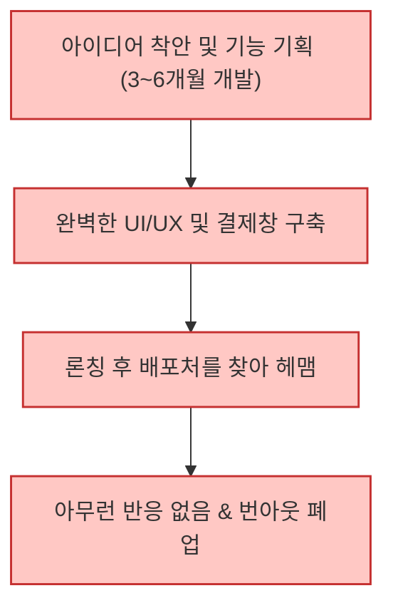
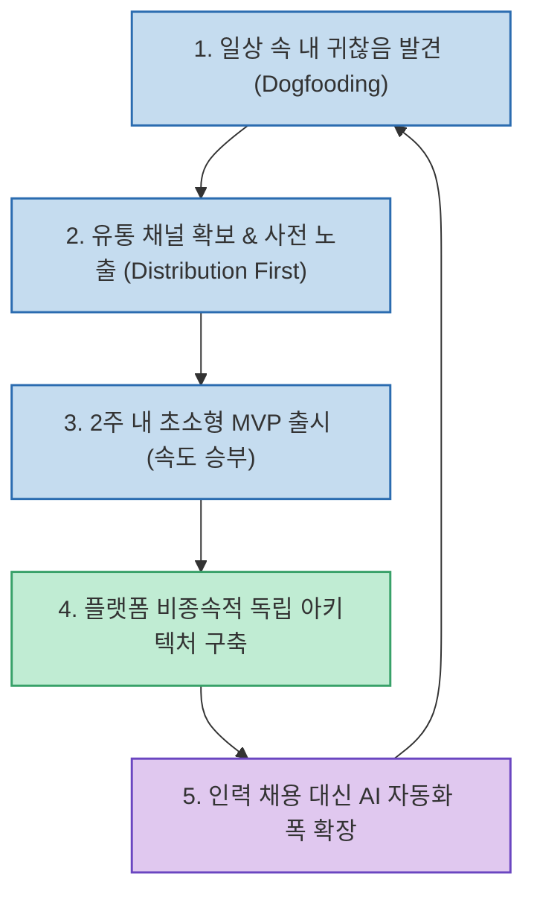

많은 창업자가 AI 도구를 활용해 SaaS나 디지털 프로덕트를 만들 때 가장 먼저 범하는 실수는 "몇 달 동안 방구석에서 완벽한 제품을 만들고 나서야 사람들에게 알리려 하는 것"입니다. 하지만 고수익을 올리는 글로벌 1인 창업자들의 실제 성장 궤적을 뜯어보면, 시작 순서와 실행 공식이 정반대로 일치합니다.

월 2,700만 원부터 연 28억 원의 매출을 올리는 글로벌 AI 1인 창업자(Solopreneur) 5명의 사례를 분석하여, 그들이 공통으로 거친 **6가지 핵심 실행 단계** 와 **마이크로 SaaS 구축 원칙** 을 정리합니다.

<!--more-->

## Sources

- [Threads 분석 원문: @zero__gray](https://www.threads.com/share/_tTR9oOhT/)
- [ZipChat 공식 서비스: Ruslan Leteyski](https://zipchat.ai)
- [Faceless Video: Jacob Seeger](https://faceless.video)
- [AI Directories: Sergiu Chiriac](https://aidirectori.es)

---

## 1. 분석 대상 1인 창업자 5인의 프로필

1. **루슬란 레테이스키 (Ruslan Leteyski)**
   - 프로덕트: **집챗 (ZipChat)** — 이커머스 AI 세일즈 챗봇
   - 성과: 월 $167,000 (연 약 28억 원)
2. **제이콥 시거 (Jacob Seeger)**
   - 프로덕트: **페이스리스 비디오 (Faceless Video)** — 얼굴 없는 AI 쇼츠 생성기
   - 성과: 론칭 10개월 만에 연 $1,000,000 (약 14억 원) ARR 달성
3. **알렉산더 반 레 (Alexander van der)**
   - 프로덕트: **AI 플로우 챗 (AI Flow Chat)** 외 1개
   - 성과: 월 $20,000 (약 2,700만 원)
4. **안토니오 에스쿠데로 (Antonio Escudero)**
   - 프로덕트: **랭크인퍼블릭 (Rankinpublic)** — SEO 및 순위 트래커
   - 성과: 월 $11,000 ~ $17,000 (약 1,500만 ~ 2,300만 원)
5. **세르지우 키리악 (Sergiu Chiriac)**
   - 프로덕트: **AI 디렉터리스 (AI Directories)** — 100+ AI 디렉터리 자동 등록기
   - 성과: 월 $10,000 이상 (최고 $15,700 달성)

---

## 2. 실패하는 방식 vs 5인의 성공 순서 비교

대부분의 실패하는 창업자와 상위 1인 창업자의 작업 순서를 수직 비교하면 명확한 대조를 이룹니다.

### 일반적인 실패 프로세스 (개발 우선형)

### 성공한 5인의 플라이휠 (유통 우선형)

---

## 3. 5인의 공통 6대 실행 원칙

### 1) 실패 경험을 완벽주의 제거와 '속도'로 전환
- 5명 모두 과거에 치명적인 실패(쇼피파이 정책 변경으로 800만 달러 제품 소멸, 연속 6개 서비스 실패, VC 투자 후 매출 0원 폐업)를 겪었습니다.
- 실패를 겪었기 때문에 "완벽한 제품을 만들겠다"는 망상을 버리고, **"최대한 빠르게 시장에 던져서 깨지고 고친다"** 는 태도를 체득했습니다.

### 2) 개발 전 '유통(Distribution)' 먼저 확보
- 알렉산더 반 레의 서비스 성장 공식은 **'노출 → 전환 → 유지'** 였으며, 계획 목록에 '장기 개발'이라는 단계 자체가 없었습니다.
- 안토니오 에스쿠데로는 본체 제품을 수정하지 않고, 무료 리드 마그넷(무료 유인책/미끼 자료)만 배포하여 월 $300이던 매출을 $17,000으로 끌어올렸습니다.
- 제이콥 시거는 개발 전 트위터 인플루언서에게 250달러(약 35만 원)를 지불하고 30만 노출을 먼저 구매해 시장의 반응을 확인했습니다.

### 3) 부끄러울 정도의 극단적 초소형 MVP
- 시거의 첫 MVP는 마인크래프트 게임 영상 위에 레딧 사연을 AI 음성으로 얹은 단순 영상 클립 제작기였습니다.
- 반 레는 2주 만에 첫 제품을 냈고, 일주일 뒤 두 번째 제품을 연속으로 출시했습니다.
- 완성도로 승부하려 하지 않고 **극단적인 속도** 로 승부했습니다.

### 4) 자신이 첫 번째 고객인 '내 문제' 해결
- 키리악은 여러 AI 도구를 출시하다가 매번 100개가 넘는 디렉터리 사이트에 등록하는 과정이 너무 번거로워 내부용 자동화 스크립트를 만들었습니다.
- 이것이 곧 **AI Directories** 서비스가 되었고, 현재 900명 이상의 유료 창업자가 사용하는 월 $9,500짜리 비즈니스가 되었습니다.
- 본인이 매일 겪는 고통을 해결하면 별도의 시장조사 없이도 실제 지불 의사가 증명됩니다.

### 5) 플랫폼 종속성(Platform Risk) 차단
- 레테이스키의 첫 연 800만 달러 비즈니스는 쇼피파이 결제 화면에 얹혀 있었습니다. 쇼피파이가 해당 API 권한을 잠그자 몇 년의 작업이 단 하루 만에 사라졌습니다.
- **"남의 마당에 지은 건물은 임대일 뿐이다."** 라는 교훈을 얻은 그는, 두 번째 제품(ZipChat)을 특정 플랫폼에 종속되지 않고 어떤 웹사이트나 메신저에도 스크립트 하나로 붙는 독립 구조로 설계했습니다.

### 6) 채용 대신 '자동화의 폭'으로 레버리지
- 레테이스키는 월 매출 5만 달러(약 7,000만 원)에 도달할 때까지 정규 직원을 채용하지 않았습니다.
- 시거, 반 레, 에스쿠데로, 키리악은 현재도 1인 운영을 유지하며, 단기 프리랜서나 n8n/Make 및 AI 코딩 에이전트를 통한 자동화 폭을 넓히는 방식으로 사업을 확장했습니다.

---

## 4. 지금 당장 적용해볼 수 있는 4단계 행동 지침

1. **내 불편함 적기**: 매주 업무나 일상에서 반복하는 가장 귀찮은 수작업 하나를 메모하세요. 그것이 곧 1호 제품입니다.
2. **배포처 먼저 정하기**: 코드를 한 줄이라도 짜기 전에 어디에 홍보하고 누구에게 노출할지 확정하세요. 배포 채널이 없다면 개발을 시작하지 마세요.
3. **2주 단위로 쳐내기**: 3개월 이상 걸리는 기획은 과감히 버리고, 2주 안에 배포 가능한 핵심 기능 1개로 압축하세요.
4. **플랫폼 독립성 확인**: 특정 단일 플랫폼의 정책 변경 한 번으로 서비스가 문을 닫는 구조인지 반드시 점검하세요.
