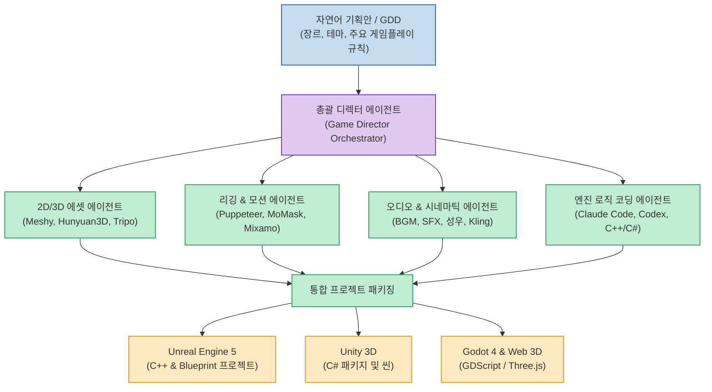
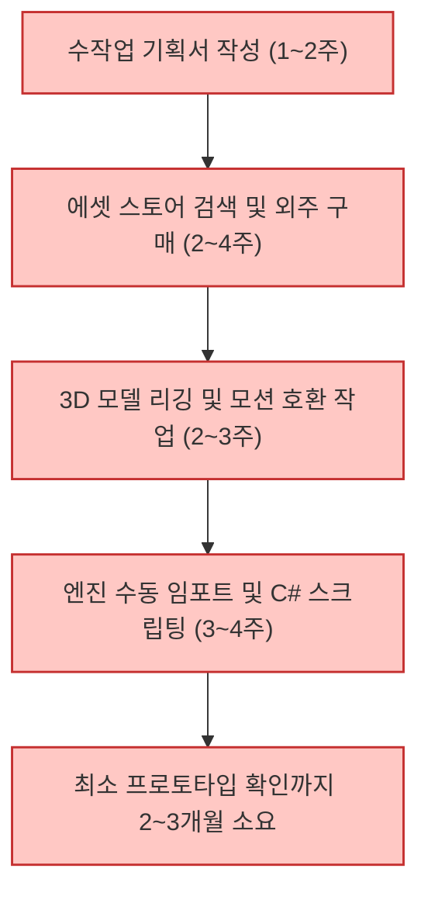
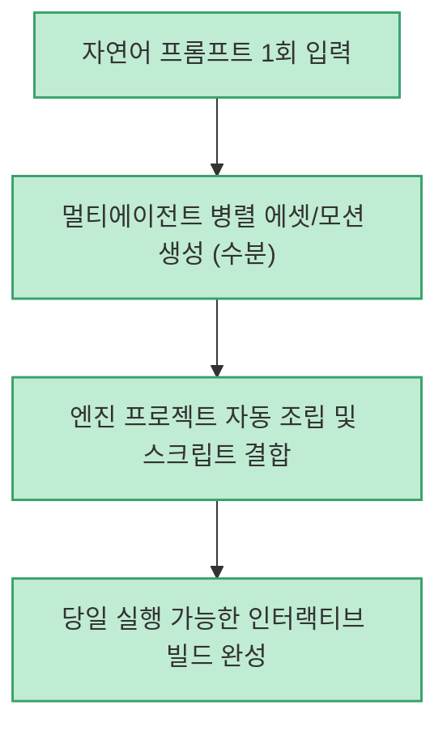

게임 개발은 기획, 2D 컨셉 아트, 3D 모델링, 리깅, 모션 캡처, 사운드 디자인, 게임 엔진 프로그래밍 등 각기 다른 전문 분야의 인력이 수개월에서 수년간 협업해야 하는 대표적인 고비용 복합 산업입니다. 최근 다양한 생성 AI 모델이 등장했지만, 각 모델이 파편화되어 있어 실제 상용 게임 엔진 파이프라인에 유기적으로 연결하기는 여전히 어려웠습니다.

오픈소스 프로젝트로 공개된 **GameFactory-3A (3AGameFactory)** 는 자연어 게임 요구사항("젤다 스타일의 판타지 오픈월드 탐험 프로토타입을 만들어줘") 하나로 3D 에셋, 캐릭터 모션, 오디오, 시네마틱 트레일러, 언리얼 엔진 5(UE5) 및 유니티(Unity) 연동 코드까지 원스톱으로 자동 생성하는 오픈소스 멀티에이전트 프레임워크입니다.

<!--more-->

## Sources

- [공식 GitHub 저장소: OpenDCAI/GameFactory-3A](https://github.com/OpenDCAI/GameFactory-3A)
- [Threads 공유 원문: @h2smusic](https://www.threads.com/share/BAV110dK6k/)

---

## 1. GameFactory-3A 엔드투엔드 오케스트레이션 구조

GameFactory-3A는 단일 LLM에 의존하지 않고, 각 파이프라인 단계에 특화된 AI 에이전트와 도구를 총괄 지휘하는 계층형 아키텍처를 채택하고 있습니다.

---

## 2. 주요 서브 파이프라인 상세 분석

### 1) 기획 및 컨셉 분해 (Game Design Breakdown)
- 입력받은 자연어 문장을 바탕으로 게임 세계관, 레벨 디자인, 등장인물 특성, 핵심 메커니즘을 상세 게임 디자인 문서(GDD)와 구조화된 JSON 스키마로 분해합니다.

### 2) 3D 에셋 생성 및 최적화
- **2D 컨셉 아트 생성**: 텍스트 프롬프트를 통해 캐릭터 및 소품의 4방위(정면, 측면, 후면) 뷰를 우선 렌더링합니다.
- **3D 메시 생성**: Hunyuan3D, Meshy 등 최신 3D 생성 파이프라인을 호출하여 텍스처와 노멀 맵이 포함된 OBJ/FBX 에셋을 생성합니다.
- **LOD 및 토폴로지 정리**: 게임 엔진에서 실시간 렌더링이 가능하도록 폴리곤 수를 최적화합니다.

### 3) 리깅 & 모션 합성 (Rigging & Animation)
- 수동 본(Bone) 작업 없이 Puppeteer와 MoMask 기반의 오토 리깅 알고리즘을 적용합니다.
- 대기(Idle), 걷기(Walk), 달리기(Run), 공격(Attack) 등 기본 모션 데이터를 캐릭터 관절에 바인딩하여 엔진에서 즉시 제어 가능한 상태로 만듭니다.

### 4) 멀티 엔진 브릿지 (Engine Code Integration)
- 단순 에셋 나열이 아닌, 대상 엔진의 씬 구성 파일과 상호작용 C++/C#/GDScript 코드를 함께 생성합니다.
- 캐릭터 컨트롤러, 카메라 추적, 충돌체(Collider), 기본 UI(체력바, 인벤토리)가 결합된 완성형 프로젝트 템플릿 형태로 출력됩니다.

---

## 3. 전통적 인디 게임 제작 vs GameFactory-3A 비교

전통적인 소규모 개발 프로세스와 에이전트 자동화 프로세스를 단계별로 비교하면 다음과 같습니다.

### 기존 인디 게임 프로토타이핑 프로세스

### GameFactory-3A 자동화 프로토타이핑 프로세스

---

## 4. 실무 활용 방안 및 시사점

1. **아이디어 검증 및 사전 제작(Pre-production) 가속**: 개발 착수 전 재미 요소와 플레이 감각을 당일 즉시 테스트할 수 있어 수천만 원의 초기 기획 비용을 방지합니다.
2. **에이전트 코딩 생태계와의 결합**: Claude Code나 Codex와 결합하여 엔진 빌드 중 발생하는 컴파일 에러나 런타임 버그를 실시간으로 자가 치유(Self-healing)할 수 있습니다.
3. **1인 개발자의 3A급 도전**: 대규모 스튜디오만 가능했던 시네마틱 트레일러 제작과 풍부한 3D 월드 구성을 1인 또는 소규모 팀이 자체적으로 소화할 수 있는 강력한 레버리지가 됩니다.
