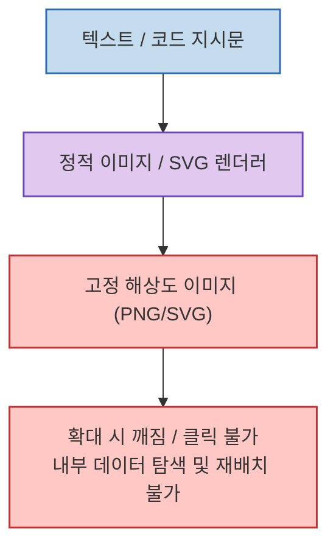
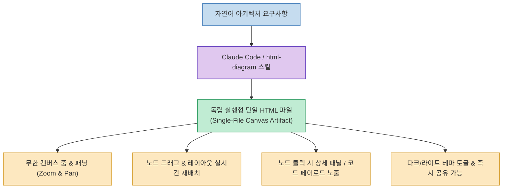
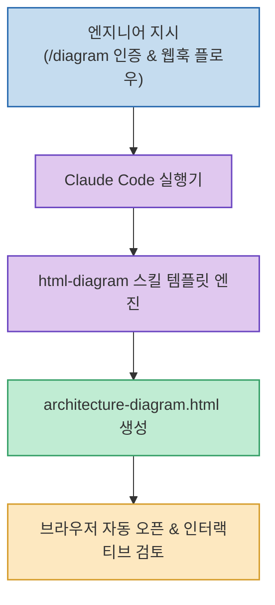

복잡한 시스템 아키텍처나 상태 전이도, 워크플로우를 설계할 때 Mermaid나 캡처 이미지 같은 정적 다이어그램은 화면이 복잡해질수록 가독성이 급격히 떨어지는 한계가 있습니다. 노드가 수십 개로 늘어나면 텍스트가 겹치거나 화면 밖으로 밀려나고, 특정 컴포넌트의 상세 설명이나 페이로드를 확인하려면 별도의 문서를 찾아 헤매야 합니다.

오픈소스로 공개된 **html-diagram** 은 AI 코딩 에이전트(Claude Code, Codex, Cursor 등)와 결합하여 **"문서 자체가 곧 줌·패닝과 인터랙션이 가능한 독립형 시각화 에디터"** 가 되는 인터랙티브 HTML 도식을 단 한 번의 프롬프트로 생성해 주는 에이전트 네이티브 스킬입니다.

<!--more-->

## Sources

- [공식 GitHub 저장소: tonywjs/html-diagram](https://github.com/tonywjs/html-diagram)
- [스킬 설치 및 실행 가이드 (Skills Ecosystem)](https://github.com/tonywjs/html-diagram#readme)

---

## 1. 정적 다이어그램 vs html-diagram 아키텍처 비교

기존 정적 도식 렌더링 방식과 html-diagram 방식의 핵심 차이를 수직 스택 다이어그램으로 비교하면 다음과 같습니다.

### 기존 정적 다이어그램 파이프라인


### html-diagram 인터랙티브 파이프라인


---

## 2. html-diagram의 주요 핵심 특징

1. **외부 종속성 없는 단일 HTML 파일 (Single-File Artifact)**
   - 생성된 도식은 외부 서버나 무거운 번들러 없이 웹 브라우저에서 바로 열 수 있는 순수 HTML/CSS/JS 단일 파일로 구성됩니다.
   - 이메일 첨부, 슬랙 공유, 사내 위키 임베드, 로컬 오프라인 환경에서도 100% 동일하게 구동됩니다.

2. **직관적인 조작감 (캔버스 조작 & 드래그앤드롭)**
   - 마우스 휠 또는 터치패드로 자유로운 줌인/줌아웃과 캔버스 이동이 가능합니다.
   - 배치된 노드를 마우스로 끌어 원하는 위치로 이동시키면 연결된 화살표(Edge)가 부드럽게 실시간으로 따라붙습니다.

3. **심층 정보 계층화 (Click-to-Inspect)**
   - 단순한 라벨 수준을 넘어, 각 노드를 클릭했을 때 열리는 사이드 패널에 API 스펙, JSON 페이로드, 설명 주석, 에러 코드 등을 풍부하게 담을 수 있습니다.

4. **에이전트 친화적 포맷**
   - Claude Code나 Codex가 프롬프트로부터 바로 완성도 높은 HTML/SVG 코드를 조립할 수 있도록 구조화된 스킬 템플릿과 프롬프트 프로토콜을 제공합니다.

---

## 3. 설치 및 실전 활용 워크플로우

### 에이전트 스킬 등록 및 실행

Claude Code 환경에서 `skills` 폴더나 커스텀 도구로 등록하여 즉시 사용할 수 있습니다.

```bash
# npx를 통한 템플릿 초기화 또는 스킬 등록
npx @tonywjs/html-diagram init
```

Claude Code CLI 세션에서 다음과 같이 지시하면 브라우저에서 즉시 열어볼 수 있는 파일이 생성됩니다:

```text
> "/diagram 우리 마이크로서비스 인증 플로우와 결제 웹훅 처리 과정을 인터랙티브한 HTML 도식으로 작성해줘. 각 서비스 노드를 클릭하면 호출 API 경로와 요청 바디 샘플이 사이드바에 나오도록 구성해줘."
```



---

## 4. 실무 적용 시사점 및 기대 효과

- **기술 문서화의 패러다임 전환**: 복잡한 인프라나 백엔드 파이프라인을 정적 이미지 대신 **"살아있는 인터랙티브 문서"** 로 제공함으로써 팀 내 온보딩 시간과 커뮤니케이션 오류를 획기적으로 줄여줍니다.
- **AI 페어 프로그래밍의 시각적 피드백**: 코드를 리팩토링하거나 아키텍처를 설계할 때 에이전트에게 시각적 산출물을 요구하고, 마우스로 노드를 직접 재배치하며 검토할 수 있습니다.
- **독립형 배포 용이성**: 빌드 스텝이나 백엔드가 필요 없는 단일 정적 파일이므로 GitHub Pages, Vercel, 사내 S3 버킷 등에 원클릭으로 호스팅할 수 있습니다.
