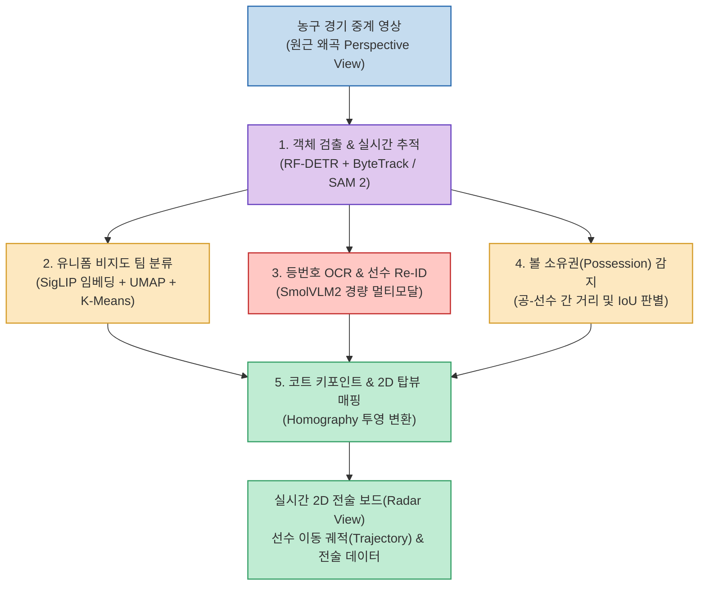
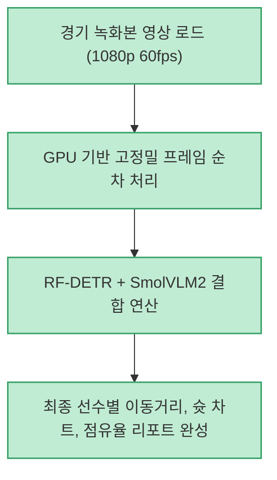
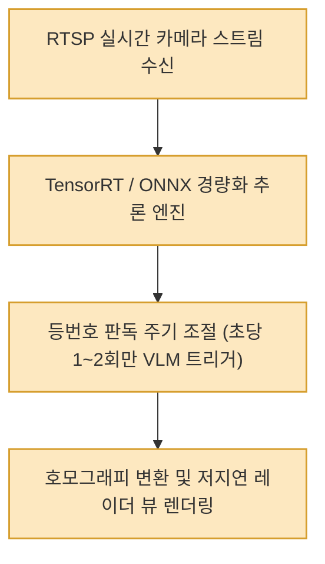

농구나 축구 같은 팀 스포츠 영상 분석은 컴퓨터 비전 분야에서 난이도가 가장 높은 영역 중 하나입니다. 코트 위 10명의 선수가 좁은 공간에서 맹렬히 교차하며 서로를 가리고(Occlusion), 중계 카메라의 시점과 줌이 실시간으로 급격히 변하며, 선수들의 빠른 방향 전환과 가속으로 인해 단순 객체 검출기만으로는 선수의 일관된 ID를 유지하기 어렵기 때문입니다.

Roboflow의 오픈소스 프로젝트 **roboflow/sports** 는 최신 비전 트랜스포머(RF-DETR), 경량 멀티모달 모델(SmolVLM2), 그리고 기하학적 투영 변환(Homography)을 결합하여, **일반 경기 영상으로부터 선수 추적, 등번호 인식, 2D 평면 전술 보드 매핑까지 완결하는 5단계 멀티스테이지 AI 파이프라인** 을 제공합니다.

<!--more-->

## Sources

- [공식 GitHub 저장소: roboflow/sports](https://github.com/roboflow/sports)
- [공식 튜토리얼 영상: Basketball AI: Player Tracking with Python](https://www.youtube.com/watch?v=yGQb9KkvQ1Q)
- [Threads 기술 분석: @deajeonai](https://www.threads.com/share/BAVdPqOeTy/)

---

## 1. 5단계 멀티스테이지 비전 AI 아키텍처

단일 모델로 모든 것을 해결하려 하지 않고, 검출 ➔ 추적 ➔ 팀 분류 ➔ 등번호 식별 ➔ 전술 캔버스 투영으로 역할을 세분화한 파이프라인입니다.

---

## 2. 세부 파이프라인 핵심 메커니즘

### 1) RF-DETR + ByteTrack: 객체 검출 및 다중 객체 추적
- 기존 YOLO 대비 긴 문맥과 겹침 현상에 강인한 트랜스포머 기반의 **RF-DETR** 을 통해 농구공, 선수, 심판의 바운딩 박스를 검출합니다.
- **ByteTrack** 알고리즘을 연결하여 선수가 순간적으로 가려지거나 점프 후 착지할 때도 끊김 없이 고유 추적 ID(Track ID)를 유지합니다.

### 2) SigLIP 기반 비지도 팀 클러스터링
- 유니폼 색상을 하드코딩된 RGB 값으로 판별하면 조명이나 그림자에 취약합니다.
- 선수 영역의 크롭 이미지를 **SigLIP(Vision Transformer)** 에 통과시켜 고차원 특징 벡터를 추출한 뒤, **UMAP** 으로 차원을 축소하고 **K-Means 클러스터링** 을 수행하여 별도의 사전 라벨링 없이 홈팀, 어웨이팀, 심판을 99% 정확도로 자동 분리합니다.

### 3) SmolVLM2를 통한 등번호 OCR 및 Re-ID
- 일반적인 범용 OCR은 선수가 역동적으로 몸을 비틀거나 유니폼에 주름이 질 때 글자를 놓치기 쉽습니다.
- 경량 비전 언어 모델인 **SmolVLM2** 를 활용하여 저해상도 등번호 영역에서도 문맥 기반으로 숫자를 판독해 내며, 선수 명단(Roster) 데이터베이스와 매칭하여 카메라 시점이 바뀌어도 선수의 신원을 즉시 재식별(Re-Identification)합니다.

### 4) 호모그래피(Homography) 2D 전술 좌표계 변환
- 중계 카메라의 원근각도 영상을 전술 분석에 직접 쓰기는 어렵습니다.
- 코트의 림, 자유투 라인, 3점 라인 등 주요 랜드마크 키포인트를 탐지한 뒤, 3x3 **호모그래피(Homography) 평면 변환 행렬** 을 계산하여 카메라 좌표를 실제 농구 코트 규격(28m x 15m)의 2D 평면 탑뷰(Radar View) 좌표로 정밀하게 왜곡 보정 투영합니다.

---

## 3. 실무 구현 시 고려사항: 오프라인 vs 실시간(Live)

### 오프라인 배치 분석 워크플로우

### 실시간(Live) 스트리밍 최적화 워크플로우

---

## 4. 스포츠 분석 및 AI 엔지니어링 시사점

- **모듈러 아키텍처의 강력함**: 거대한 단일 AI 모델을 만드는 대신 검출, 임베딩, VLM, 기하학적 수식을 유기적으로 결합하여 상용 프로덕션 수준의 스포츠 분석 솔루션을 오픈소스만으로 구축할 수 있음을 입증했습니다.
- **아마추어 및 프로 구단의 데이터 민주화**: 수천만 원대 고가 외산 트래킹 장비(ChyronHego, Second Spectrum 등) 없이도, 단일 중계 카메라 영상만으로 프로 수준의 공간 전술 데이터와 선수 히트맵을 생성할 수 있는 강력한 오픈소스 기반을 제공합니다.
