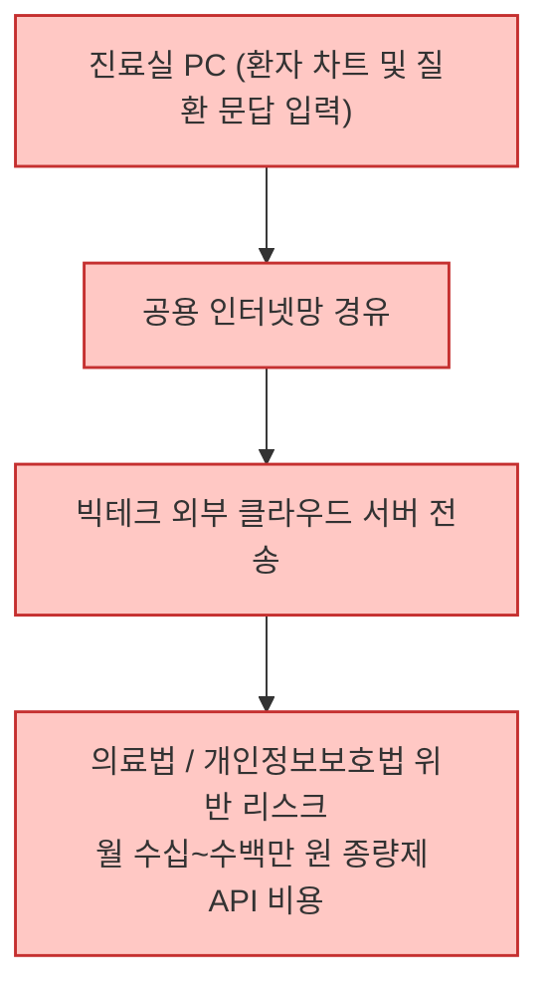
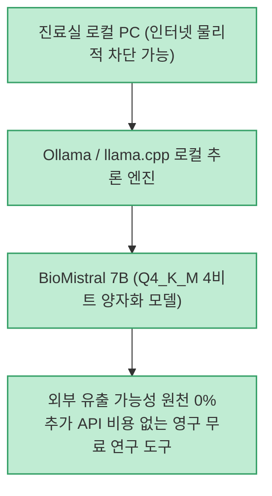
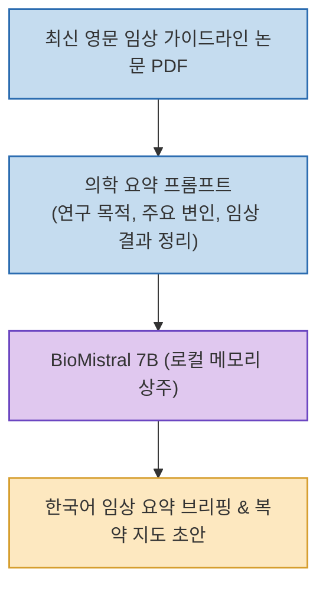

임상 진료와 의학 연구 현장에서 AI 언어 모델의 활용 가치는 날로 커지고 있습니다. 수십 페이지에 달하는 영문 학술지 최신 가이드라인 요약, 희귀 질환 감별 보조, 환자 맞춤형 복약 지도문 작성 등 다양한 업무를 획기적으로 단축할 수 있기 때문입니다. 하지만 일선 의료기관에서는 **"환자의 민감한 의료 데이터(PHI)가 외부 상용 클라우드로 전송될 때 발생하는 법적·보안상 유출 위험"** 과 **"고가의 엔터프라이즈 API 구독 비용"** 으로 인해 도입을 망설이는 경우가 많습니다.

프랑스 국립 컴퓨터과학·자동제어 연구소(Inria)와 의학 연구진이 공개한 **BioMistral 7B** 는 PubMed 수백만 편의 의학 문헌을 사전 학습시킨 오픈소스 의료 특화 LLM입니다. 고성능 클라우드 서버 없이도, **인터넷 연결이 차단된 일반 진료실 PC에서 단 한 줄의 명령어로 100% 오프라인 구동** 이 가능합니다.

<!--more-->

## Sources

- [공식 GitHub 저장소: biomistral/biomistral](https://github.com/biomistral/biomistral)
- [Hugging Face 모델 가중치: BioMistral/BioMistral-7B](https://huggingface.co/BioMistral/BioMistral-7B)
- [Threads 기술 소개: @an_kl_ko](https://www.threads.com/share/BAmm4gxWHy/)

---

## 1. 클라우드 상용 AI vs 로컬 온프레미스 의료 LLM 비교

병원 환경에서 클라우드 방식과 로컬 폐쇄망 방식의 아키텍처 차이를 비교하면 다음과 같습니다.

### 클라우드 상용 API 방식 (데이터 유출 위험)


### BioMistral 로컬 오프라인 방식 (완전 무유출)


---

## 2. BioMistral 7B의 주요 핵심 특장점

1. **검증된 의학 지식 및 USMLE 벤치마크 성능**
   - Mistral 7B 모델을 기반으로 PubMed Central(PMC)의 오픈 액세스 의학 논문 수백만 편을 사전 학습했습니다.
   - PubMedQA, MedQA(미국 의사 면허 시험 USMLE 문항 기반), MedMCQA 벤치마크에서 기존 범용 7B 모델을 압도하며 상용 폐쇄형 모델에 근접하는 정밀한 의료 답변 능력을 보여줍니다.

2. **Ollama 기반 원클릭 설치 및 오프라인 구동**
   - 복잡한 파이썬 환경이나 쿠버네티스 세팅 없이, 오픈소스 런타임인 Ollama를 통해 명령어 한 줄로 모델을 내려받아 즉시 데스크톱에서 실행할 수 있습니다.
   - 설치 완료 후 인터넷 선을 완전히 뽑은 격리망(Air-gapped) 환경에서도 100% 동일하게 동작합니다.

3. **영문 최신 논문 30초 핵심 브리핑**
   - 수십 장 분량의 방대한 의학 학술지 PDF 원문을 입력하면, 임상 프로토콜, 환자군 선정 기준, 주요 부작용 지표, 통계적 유의성(p-value)을 한국어 핵심 브리핑으로 30초 만에 정리해 줍니다.

4. **4비트 양자화(Q4_K_M)를 통한 하드웨어 비용 최소화**
   - 가중치를 4비트로 압축한 양자화(GGUF) 버전을 활용하면, 고가의 엔터프라이즈 AI 서버 없이도 **100만 원대 보급형 GPU(VRAM 8GB~12GB)가 탑재된 일반 PC** 에서 초당 30토큰 이상의 쾌적한 속도를 보장합니다.

---

## 3. 원클릭 로컬 설치 및 실전 활용 워크플로우

```bash
# 1. Ollama를 통해 BioMistral 모델 즉시 실행
ollama run biomistral

# 또는 HuggingFace GGUF 양자화 파일 직접 등록
ollama run hf.co/BioMistral/BioMistral-7B-GGUF:Q4_K_M
```



---

## 4. 진료 현장 도입 시 권장 사양 및 시사점

- **권장 하드웨어**: NVIDIA RTX 3060 / 4060 (VRAM 8GB~12GB) 또는 Apple Silicon Mac (통합 메모리 16GB 이상) 환경에서 가장 이상적인 가성비를 냅니다.
- **오픈소스 기술 민주화의 의의**: 빅테크의 폐쇄적 클라우드 구독 생태계에 의존하지 않고, 일선 개원의와 연구자가 개인 진료실 책상 위에서 안전하게 나만의 24시간 의학 연구 인턴을 확보할 수 있는 실질적인 대안을 제시합니다.
