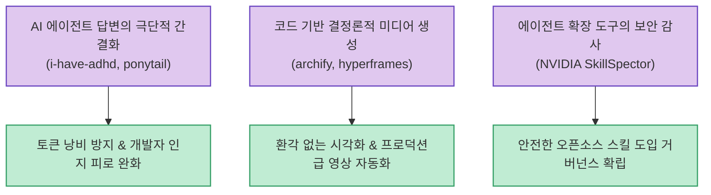

AI 오픈소스 생태계는 모델 자체의 파라미터 경쟁을 넘어, 실제 개발자와 실무진의 워크플로우에 직접 결합하는 에이전트 도구(Agent Skills), 로컬 추론 파이프라인, 그리고 멀티모달 콘텐츠 생성 프레임워크로 빠르게 분화하고 있습니다.

X(Twitter)의 기술 큐레이터 Unifory(@Unity_ForYou)가 공유한 **"이번 주 GitHub에서 가장 가파른 스타(Stars) 증가세를 기록한 AI 리포지토리 10선"** 을 바탕으로, 각 프로젝트의 핵심 설계 철학과 엔지니어링 시사점을 심층 분석합니다.

<!--more-->

## Sources

- [X(Twitter) 큐레이션 원문: @Unity_ForYou](https://x.com/Unity_ForYou/status/2098619834267529469)
- [1. i-have-adhd: ayghri/i-have-adhd](https://github.com/ayghri/i-have-adhd)
- [2. ponytail: DietrichGebert/ponytail](https://github.com/DietrichGebert/ponytail)
- [3. archify: tt-a1i/archify](https://github.com/tt-a1i/archify)
- [4. ECC: affaan-m/ECC](https://github.com/affaan-m/ECC)
- [5. VoiceStudio: debpalash/VoiceStudio](https://github.com/debpalash/VoiceStudio)
- [6. hyperframes: heygen-com/hyperframes](https://github.com/heygen-com/hyperframes)
- [7. OpenMAIC: THU-MAIC/OpenMAIC](https://github.com/THU-MAIC/OpenMAIC)
- [8. magnitude: magnitudedev/magnitude](https://github.com/magnitudedev/magnitude)
- [9. WeKnora: Tencent/WeKnora](https://github.com/Tencent/WeKnora)
- [10. SkillSpector: NVIDIA/SkillSpector](https://github.com/NVIDIA/SkillSpector)

---

## 1. 10대 급상승 리포지토리 생태계 분류 맵

이번 주 주목받은 10개 프로젝트는 크게 4가지 도메인(코딩 에이전트 생산성, 미디어 생성 자동화, 로컬 지식·추론 엔진, 에이전트 보안 검증)으로 체계화할 수 있습니다.

```mermaid
flowchart TD
    classDef devNode fill:#c5dcef,stroke:#2b6cb0,stroke-width:1.5px,color:#333;
    classDef mediaNode fill:#fde8c0,stroke:#d69e2e,stroke-width:1.5px,color:#333;
    classDef infraNode fill:#c0ecd3,stroke:#38a169,stroke-width:1.5px,color:#333;
    classDef secNode fill:#ffc8c4,stroke:#c53030,stroke-width:1.5px,color:#333;

    Hub["이번 주 GitHub Trending AI TOP 10"] --> GroupDev["1. 코딩 에이전트 최적화 & 스킬"]
    Hub --> GroupMedia["2. 멀티모달 & 미디어 생성"]
    Hub --> GroupInfra["3. 로컬 추론 & 지식 인프라"]
    Hub --> GroupSec["4. 에이전트 거버넌스 & 보안"]

    GroupDev --> D1["i-have-adhd (+13k)<br>사족 제거 · 3단계 극단 요약"]
    GroupDev --> D2["ponytail (+11k)<br>외부 라이브러리 절제 · 단순성 우선"]
    GroupDev --> D3["archify (+11k)<br>코드 기반 인터랙티브 HTML 도식"]
    GroupDev --> D4["ECC (+8.7k)<br>계획·테스트·리뷰·기억 통합 플랫폼"]

    GroupMedia --> M1["VoiceStudio (+5.5k)<br>올인원 로컬 음성/더빙 스위트"]
    GroupMedia --> M2["hyperframes (+5.1k)<br>HTML/CSS 기반 재현형 MP4 렌더러"]
    GroupMedia --> M3["OpenMAIC (+4.5k)<br>멀티에이전트 교육 슬라이드 조립"]

    GroupInfra --> I1["magnitude (+2.1k)<br>하드웨어 자동 감지 최적 로컬 엔진"]
    GroupInfra --> I2["WeKnora (+960)<br>텐센트 자가진화 RAG & Wiki 허브"]

    GroupSec --> S1["SkillSpector (+910)<br>NVIDIA 에이전트 스킬 보안 감사기"]

    class GroupDev,D1,D2,D3,D4 devNode;
    class GroupMedia,M1,M2,M3 mediaNode;
    class GroupInfra,I1,I2 infraNode;
    class GroupSec,S1 secNode;
```

---

## 2. 부문별 핵심 프로젝트 심층 분석

### 1) 코딩 에이전트 군더더기 제거 및 단순성 추구
- **i-have-adhd (주간 +13,000 Stars, 트렌딩 1위)**
  - 에이전트가 답변 첫머리에 늘어놓는 "좋은 질문입니다", "이제 코드를 설명하겠습니다" 같은 번지르르한 수식어를 원천 차단합니다.
  - 오직 **"1. 결론 ➔ 2. 실행 절차 ➔ 3. 다음 행동"** 의 3단계로 출력을 제한하여 엔지니어의 인지 부하(Cognitive Load)를 최소화합니다.
- **ponytail (주간 +11,000 Stars)**
  - LLM이 사소한 유틸리티 구현에도 `npm install`이나 복잡한 프레임워크 의존성을 무분별하게 추가하는 성향을 억제합니다.
  - 언어 표준 라이브러리와 가장 직관적이고 미니멀한 코드베이스 유지를 최우선 명령으로 주입합니다.
- **archify (주간 +11,000 Stars)**
  - 복잡한 코드베이스나 시스템 문서를 정적 텍스트가 아닌, 브라우저에서 직접 노드를 클릭하고 데이터 흐름을 검증할 수 있는 인터랙티브 HTML/SVG 다이어그램으로 변환합니다.
- **ECC (주간 +8,700 Stars)**
  - Claude Code와 Codex에 **계획 수립(Plan), 자동화 테스트(Test), 정밀 코드 리뷰(Review), 세션 지속 메모리(Memory)** 를 파이프라인으로 엮어 재현성 높은 개발 환경을 구축합니다.

### 2) 멀티모달 & 미디어 에셋 파이프라인
- **VoiceStudio (주간 +5,500 Stars)**
  - 외부 상용 클라우드 API를 쓰지 않고, 로컬 환경에서 음성 클로닝, TTS 합성, 자막 전사, 다국어 영상 더빙, 오디오북 출판을 완결 짓는 올인원 오픈소스 스위트입니다.
- **hyperframes (주간 +5,100 Stars / HeyGen)**
  - 프롬프트 기반의 무작위 영상 생성이 아닌, **HTML/CSS 레이아웃과 키프레임 애니메이션 코드를 기반으로 100% 결정론적이고 재현 가능한 MP4 비디오** 를 렌더링하는 에이전트 네이티브 프레임워크입니다.
- **OpenMAIC (주간 +4,500 Stars / 칭화대)**
  - 긴 강의 자료나 기술 문서로부터 슬라이드 구성, 객관식 퀴즈, 실시간 대화형 시뮬레이션을 다중 에이전트가 분업하여 하나의 완결된 코스웨어로 완성합니다.

### 3) 로컬 인프라 & 엔터프라이즈 지식 베이스
- **magnitude (주간 +2,100 Stars)**
  - Mac M시리즈 칩셋, 엔비디아/AMD GPU, 시스템 램 용량을 1초 만에 스캔하여 메모리 부족(OOM) 없이 가장 쾌적하게 구동되는 오픈소스 LLM 가중치를 자동 배포하고 코딩 에이전트에 붙여줍니다.
- **WeKnora (주간 +960 Stars / 텐센트)**
  - 방대한 사내 PDF와 문서를 수집하여 단순 키워드 검색을 넘어, 지식 그래프 RAG와 스스로 업데이트되는 기업 전용 자동 갱신 Wiki 시스템을 구축합니다.

### 4) 에이전트 보안 거버넌스 (NVIDIA SkillSpector)
- 급증하는 에이전트 스킬(Claude Skills, MCP 도구) 생태계에서 가장 큰 보안 위협인 **프롬프트 인젝션, 기밀 API 키 유출, 악의적 터미널 명령어 주입** 을 설치 전 단계에서 정적/동적으로 검증하는 보안 스캐너입니다.

---

## 3. 엔지니어링 시사점

- **토큰 경제와 인지 집중력**: 화려한 대화보다 "단순한 코드"와 "핵심 결과"만을 요구하는 스킬들이 1, 2위를 차지한 것은 현업 개발자들이 AI의 지나친 장황함에 피로를 느끼고 있음을 보여줍니다.
- **코드 기반 미디어 제어**: 비디오와 다이어그램을 순수 프롬프트 생성이 아닌 HTML/CSS 코드 형태로 제어함으로써, 버전 관리와 세밀한 재현성을 동시에 확보하는 방향으로 진화하고 있습니다.
- **보안의 필수화**: 에이전트가 쉘 명령과 파일 시스템을 직접 조작하는 시대가 되면서, 스킬 도입 전 보안 감사(SkillSpector)는 선택이 아닌 필수 안전망이 되고 있습니다.
