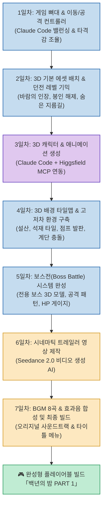
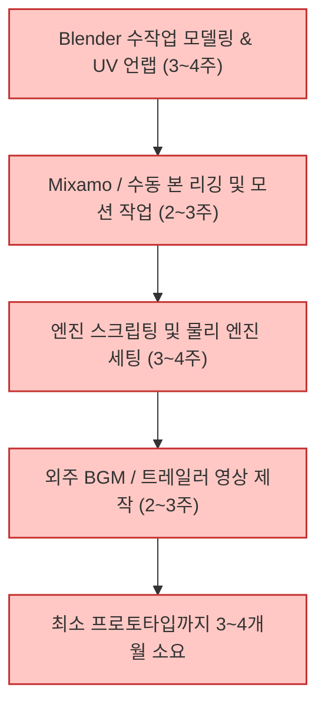
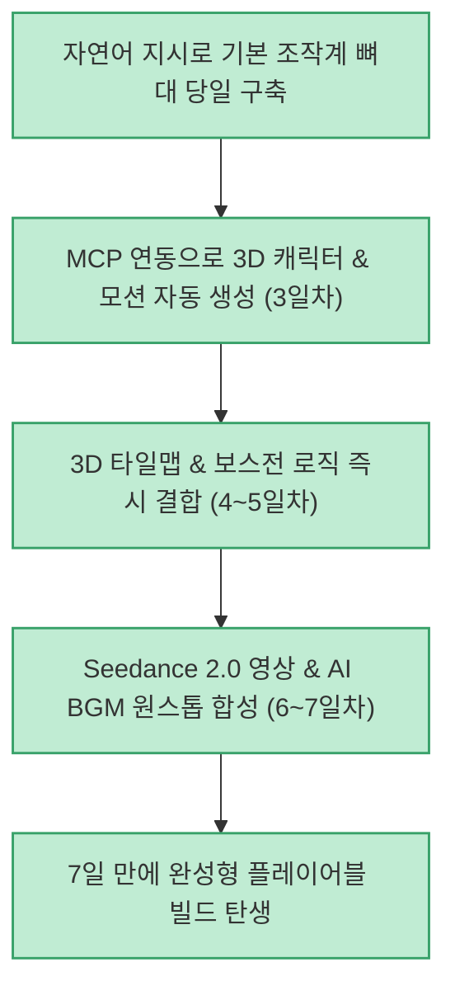

게임 개발은 기획, 2D/3D 그래픽 에셋, 애니메이션, 사운드, 엔진 프로그래밍 등 각기 다른 전문 직군이 모여 수개월 이상 협업해야 하는 복합 프로젝트입니다. 하지만 최근 Claude Code 같은 터미널 코딩 에이전트와 모델 컨텍스트 프로토콜(MCP) 기반 생성 AI 도구들이 유기적으로 결합하면서, 1인 개발자가 단 일주일 만에 상용 수준의 완성형 3D 액션 RPG 프로토타입을 완성하는 것이 현실화되었습니다.

유튜브 채널 **스마트대디** 가 공개한 **"7일간 혼자 RPG 게임 만들면 생기는 일"** 은 오리지널 3D 액션 RPG **「백년의 밤」** 을 기획부터 코딩, 3D 에셋 자동 생성(Higgsfield MCP), 시네마틱 영상(Seedance 2.0), BGM까지 단 7일 만에 조립해 낸 전 과정을 생생하게 보여줍니다.

<!--more-->

## Sources

- [공식 유튜브 영상: 7일간 혼자 RPG 게임 만들면 생기는 일 (스마트대디)](https://youtu.be/Kbf8yqauzF0)
- [Higgsfield MCP 커넥터: Higgsfield MCP Connectors](https://mcp.higgsfield.ai/mcp)

---

## 1. 7일간의 일차별 게임 개발 플로우차트

기본 엔진 뼈대 작성부터 멀티모달 AI 도구들을 계층적으로 결합하여 최종 플레이어블 빌드를 완성한 7일간의 워크플로우입니다.

---

## 2. 핵심 기술 하이라이트 및 워크플로우

### 1) Claude Code와 Higgsfield MCP의 결합
- **기존의 한계**: 코딩 에이전트는 웹 로직이나 스크립트 작성에는 탁월하지만, 3D 모델(메시), 텍스처 맵, 캐릭터 모션 데이터를 스스로 만들어내지 못합니다.
- **MCP를 통한 도구 확장**: Claude Code 환경에 **Higgsfield MCP**(`https://mcp.higgsfield.ai/mcp`)를 연동하자, 에이전트가 자체적으로 3D 생성 API를 호출하여 주인공 '이한'의 3D 캐릭터 파일과 걷기·구르기·3단 연속 공격 애니메이션이 바인딩된 에셋 10종을 프로젝트 폴더에 자동으로 생성하고 씬에 배치했습니다.

### 2) 3D 타일맵과 물리 충돌 고저차 환경
- 단순한 플랫 평면이 아닌, 바닥 타일, 폐광 입구, 눈 덮인 설산, 모닥불 등 입체적 3D 타일을 조립했습니다.
- 특히 장식용 오브젝트에 그치지 않고, 플레이어가 점프하여 딛고 올라갈 수 있는 발판과 오르내릴 수 있는 계단의 **고저차 물리 충돌(Collision Detection)** 을 완벽하게 구현했습니다.

### 3) Seedance 2.0 기반 시네마틱 트레일러
- 게임 타이틀 메뉴에 들어갈 프로모션 트레일러 영상을 최신 비디오 생성 AI인 **Seedance 2.0 (시댄스 2.0)** 으로 제작했습니다.
- 게임 키아트 이미지를 시작 프레임(Start frame)으로 지정하고 8초 길이의 고품질 액션 컷 5개를 생성하여 인게임 트레일러 뷰어에 매끄럽게 연동했습니다.

### 4) 오리지널 사운드트랙(OST) & 효과음
- 필드 탐험용 BGM과 긴장감 넘치는 보스전 전투 음악 등 총 8곡의 배경음악을 AI로 생성하여 타격 효과음과 함께 결합했습니다.

---

## 3. 전통적 인디 게임 개발 vs Claude Code + MCP 개발 비교

### 전통적인 소규모 3D 인디 개발

### Claude Code + Higgsfield MCP 워크플로우

---

## 4. 인디 게임 개발의 미래와 시사점

- **에이전트와 MCP의 시너지**: LLM이 MCP를 통해 그래픽, 3D, 비디오, 오디오 엔진을 직접 제어할 때 1인 창작자의 생산성이 수십 배 증폭될 수 있음을 증명했습니다.
- **기획자의 비전 실현**: 고난도 3D 소프트웨어(Blender, Maya)의 조작 장벽에 가로막혀 있던 1인 창작자도 머릿속의 판타지 세계관과 액션 메커니즘을 실제 손으로 만질 수 있는 프로덕트로 현실화할 수 있는 시대가 열렸습니다.
