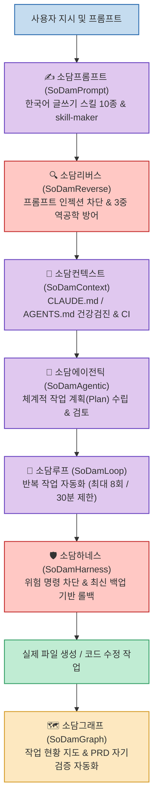
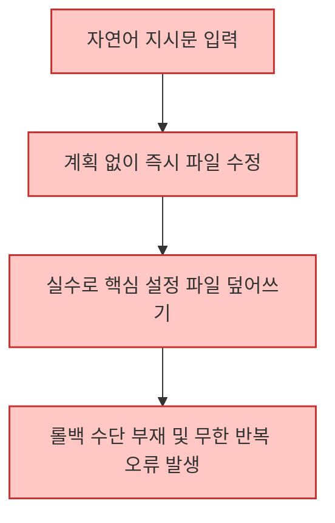
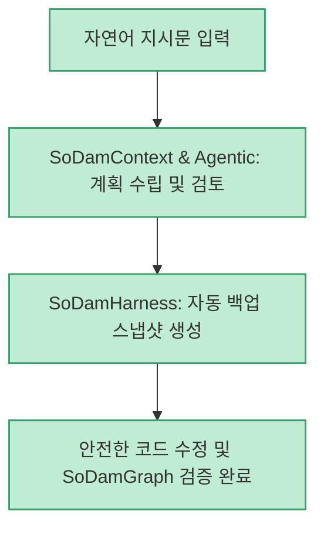

터미널 기반 AI 코딩 에이전트인 Claude Code를 실무에 본격적으로 도입하면 강력한 생산성을 경험하는 동시에, 중요한 파일의 우발적 덮어쓰기나 무한 반복 루프, 부실한 프로젝트 컨텍스트 관리 같은 실전 위험에 노출되곤 합니다.

오픈소스로 공개된 **SoDam Family (소담 패밀리 7형제)** 는 Claude Code를 초보자부터 전문가까지 안전하고 체계적으로 사용할 수 있도록 돕는 **7대 엔지니어링 플러그인 모음** 입니다. 최근 실제 장기 운영 과정에서 발견된 예외 상황(Edge Cases)과 취약점을 전면 보완한 실전 개선판이 업데이트되었습니다.

<!--more-->

## Sources

- [공식 GitHub 저장소: sodam-ai/SoDam-Family](https://github.com/sodam-ai/SoDam-Family)
- [Threads 업데이트 소식: @sodam_ai](https://www.threads.com/share/BACm9-pMR-/)

---

## 1. 소담 패밀리 7대 엔지니어링 통합 아키텍처

소담 패밀리는 사용자의 자연어 프롬프트가 실행되어 결과물이 파일시스템에 영구 반영되기까지의 전 과정을 7개의 독립적 가드레일과 도구로 방어하고 지원합니다.

---

## 2. 7개 플러그인별 핵심 기능 및 최근 개선 내역

### 1) 🛡️ SoDamHarness (소담하네스) — 안전 게이트
- **역할**: 파일 삭제(`rm`), 위험한 덮어쓰기, 시스템 파괴적 명령어 실행을 사전에 감지하고 차단하거나 자동 백업을 강제합니다.
- **최근 개선점**: 작업 롤백(되돌리기) 시 이전 여러 백업본 중 **"가장 최신의 백업 파일"** 을 지능적으로 우선 선택하도록 로직을 수정하여 안전한 복원력을 확보했습니다.

### 2) 📄 SoDamContext (소담컨텍스트) — 설명서 건강검진
- **역할**: 프로젝트 루트의 `CLAUDE.md`나 `AGENTS.md`가 부실하거나 충돌할 경우 규칙을 진단하고 정규화합니다.
- **최근 개선점**: 컨텍스트 검진 이력 추적 기능, 자가진단 로직, 경로 보호 규칙 및 CI 연동을 강화했습니다.

### 3) 🔁 SoDamLoop (소담루프) — 반복 자동화 엔진
- **역할**: 파일 대량 일괄 변환이나 다단계 테스트 등 반복 작업을 정해진 규칙 내에서 안전하게 연속 실행합니다.
- **최근 개선점**: 에이전트가 목표를 조기 달성했다고 오판하는 버그 수정, 30분 보호시간(Timeout) 계산 로직 정밀화, 세션 간 상태 격리(Session Isolation)를 보완했습니다.

### 4) 🧭 SoDamAgentic (소담에이전틱) — 계획 및 검토
- **역할**: "계획 수립 ➔ 단계별 실행 ➔ 사후 검토"의 에이전틱 루틴을 강제하여 섣부른 코드 수정을 방지합니다.
- **최근 개선점**: `NotebookEdit` 도구 사용 시 민감한 API 키나 개인정보가 노출되는지 점검하는 검사 누락 문제를 완벽히 패치했습니다.

### 5) ✍️ SoDamPrompt (소담프롬프트) — 맞춤형 스킬 빌더
- **역할**: 입문자를 위한 빈칸 채우기 형태의 한국어 글쓰기 스킬 10종을 제공합니다.
- **최근 개선점**: 사용자가 원하는 맞춤형 스킬을 대화형으로 즉석에서 제작해 주는 **`skill-maker`** 도구가 새롭게 탑재되었습니다.

### 6) 🔍 SoDamReverse (SoDam리버스) — 3중 역공학 방어
- **역할**: AI 자체 거부, 위험 명령 차단(deny) 훅, SHA-256 파일 무결성 검사의 3겹 방어벽을 통해 시스템 탈옥을 차단합니다.
- **최근 개선점**: 악의적인 프롬프트 인젝션(Prompt Injection) 방어 알고리즘과 레드팀 모의 침투 테스트 시나리오를 대폭 강화했습니다.

### 7) 🗺️ SoDamGraph (소담그래프) — 진행 현황 지도
- **역할**: 읽기 전용으로 동작하며 `/graph-where`, `/graph-next`, `/graph-why` 명령으로 현재 프로젝트 위치와 다음 할 일을 안내합니다.
- **최근 개선점**: 기획 문서 작성 시 **PRD(제품 요구사항 정의서)의 누락 및 논리 결함을 스스로 검토하는 자기검증(Self-Validation)** 자동화 기능이 추가되었습니다.

---

## 3. 일반 Claude Code 작업 vs 소담 패밀리 적용 비교

### 순정 Claude Code 환경 (위험 노출형)

### SoDam Family 환경 (다중 안전망형)

---

## 4. 실무 도입 시사점

- **왕초보를 위한 한국어 생태계**: 난해한 영문 설정 대신 직관적인 한국어 문서와 설명서 진단 도구를 갖추어 진입 장벽을 낮췄습니다.
- **엔터프라이즈급 안정성 추구**: 일회성 토이 프로젝트가 아니라, 실무에서 수백 번의 세션을 돌리며 축적된 예외 케이스(키 노출, 롤백 정밀도, 무한 루프)를 집요하게 수정하여 에이전트의 신뢰도를 한 단계 끌어올렸습니다.
