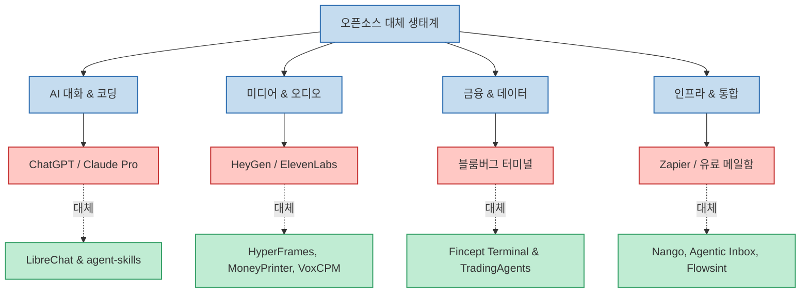
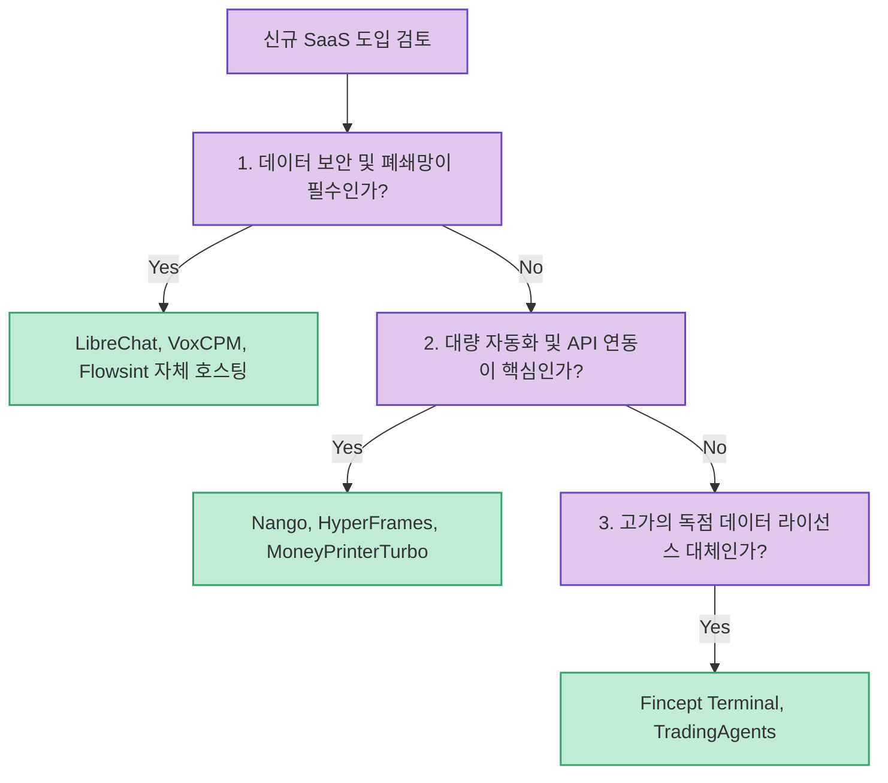

소프트웨어 개발과 비즈니스 운영에서 SaaS 구독료는 눈덩이처럼 불어나기 쉽습니다. 특히 생성 AI 도구, 데이터 분석 터미널, 미디어 생성기, 워크플로우 통합 서비스 등은 팀 단위로 결제할 때 월 수십만 원에서 수백만 원에 달하는 고정 지출을 유발합니다.

하지만 글로벌 오픈소스 커뮤니티(GitHub)에는 유료 상용 제품 못지않은 완성도를 자랑하며, 라이선스 비용 없이 자체 호스팅(Self-hosted)하여 사내 데이터 보안까지 완벽하게 지킬 수 있는 훌륭한 오픈소스 대체제들이 활발히 개발되고 있습니다. 클리앙과 레딧에서 크게 주목받은 **유료 SaaS를 완벽히 대체하는 10대 핵심 오픈소스 프로젝트** 를 분석합니다.

<!--more-->

## Sources

- [클리앙 원문 큐레이션: 막내딸병원비](https://m.clien.net/service/board/park/19264022)
- [1. TradingAgents: TauricResearch/TradingAgents](https://github.com/TauricResearch/TradingAgents)
- [2. LibreChat: danny-avila/LibreChat](https://github.com/danny-avila/LibreChat)
- [3. HyperFrames: heygen-com/hyperframes](https://github.com/heygen-com/hyperframes)
- [4. Fincept Terminal: Fincept-Corporation/FinceptTerminal](https://github.com/Fincept-Corporation/FinceptTerminal)
- [5. MoneyPrinterTurbo: harry0703/MoneyPrinterTurbo](https://github.com/harry0703/MoneyPrinterTurbo)
- [6. Agentic Inbox: cloudflare/agentic-inbox](https://github.com/cloudflare/agentic-inbox)
- [7. VoxCPM: OpenBMB/VoxCPM](https://github.com/OpenBMB/VoxCPM)
- [8. Flowsint: reconurge/flowsint](https://github.com/reconurge/flowsint)
- [9. agent-skills: addyosmani/agent-skills](https://github.com/addyosmani/agent-skills)
- [10. Nango: NangoHQ/nango](https://github.com/NangoHQ/nango)

---

## 1. 상용 유료 SaaS vs 오픈소스 대체제 맵

각 오픈소스가 어떤 상용 독점 서비스(Proprietary SaaS)를 대체하는지 한눈에 파악할 수 있는 아키텍처 맵입니다.

---

## 2. 10대 오픈소스 프로젝트 심층 분석

### 1) 금융 및 퀀트 트레이딩 분석
- **TradingAgents**: 다중 AI 에이전트가 시장 데이터 수집, 감성 분석, 리스크 관리, 매매 전략 도출을 분업하여 수행하는 오픈소스 퀀트 트레이딩 프레임워크.
- **Fincept Terminal**: 수천만 원대 블룸버그 터미널(Bloomberg Terminal)을 지향하며, 글로벌 주식 시세, 거시 경제 지표, 기업 재무제표를 터미널 인터페이스에서 시각화하는 금융 분석 도구.

### 2) AI 인터페이스 및 에이전트 확장
- **LibreChat**: OpenAI, Anthropic, Google Gemini, 로컬 Ollama 등 시중의 모든 LLM을 하나의 모던 웹 인터페이스에서 통합 관리. 멀티모달, RAG 검색, 코드 실행기를 지원하는 오픈소스 AI 허브.
- **agent-skills (Addy Osmani)**: 구글 엔지니어링 리더 애디 오스마니가 큐레이션한 AI 코딩 에이전트용 표준 스킬 모음. Claude Code, Cursor, Codex 등에서 즉시 호출 가능.

### 3) 차세대 미디어 및 오디오 생성
- **HyperFrames (HeyGen)**: HTML, CSS, 애니메이션 코드를 기반으로 결정론적이고 재현 가능한 고해상도 MP4 영상을 프로그래밍 방식으로 렌더링하는 비디오 프레임워크.
- **MoneyPrinterTurbo**: 키워드 입력 한 번으로 대본 작성, 음성 합성(TTS), 영상 클립 매칭, 자막 싱크까지 원스톱으로 처리하여 유튜브 쇼츠와 틱톡 영상을 대량 생성.
- **VoxCPM (OpenBMB)**: 토크나이저 없이 고품질 다국어 음성을 합성하고 짧은 오디오 샘플로 목소리를 복제하는 오픈소스 제로샷 보이스 클로닝 모델.

### 4) 인프라, 보안 및 API 연동 자동화
- **Agentic Inbox (Cloudflare)**: Cloudflare Workers와 내장 AI를 결합하여 나만의 커스텀 도메인 이메일을 안전하게 수신하고 지능형 자동 분류 및 답장 초안을 생성하는 서버리스 메일 클라이언트.
- **Flowsint**: 도메인, IP, 소셜 계정 등 인터넷에 공개된 인텔리전스를 수집하고 관계망 그래프를 분석하는 오픈소스 OSINT(Open Source Intelligence) 플랫폼.
- **Nango**: 100개 이상의 외부 SaaS(GitHub, Slack, Google, Salesforce)와의 복잡한 OAuth 2.0 인증과 양방향 데이터 동기화를 단 몇 줄로 해결하는 오픈소스 통합 플랫폼.

---

## 3. 실무 도입 시 기대 효과 및 선택 기준

- **비용 최적화**: 고가의 상용 구독료 지출을 줄이고, 남는 예산을 하드웨어나 핵심 비즈니스 로직 고도화에 집중 투자할 수 있습니다.
- **데이터 주권(Data Sovereignty) 확보**: 금융 거래 데이터, 기업 내부 이메일, 기술 문서가 외부 상용 서비스 서버로 유출되지 않고 사내 인프라 내부에서 안전하게 보존됩니다.
- **커스터마이징의 유연성**: 오픈소스 코드를 직접 수정하여 자사 워크플로우에 100% 맞춤형으로 확장할 수 있습니다.
