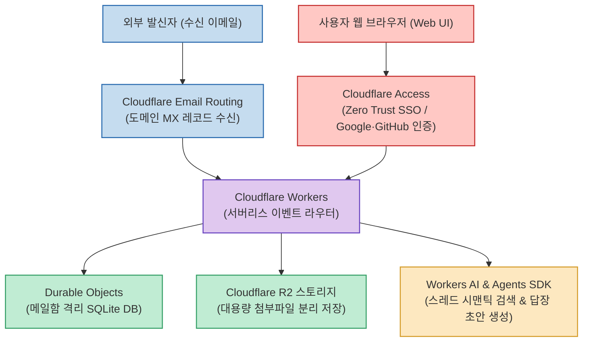
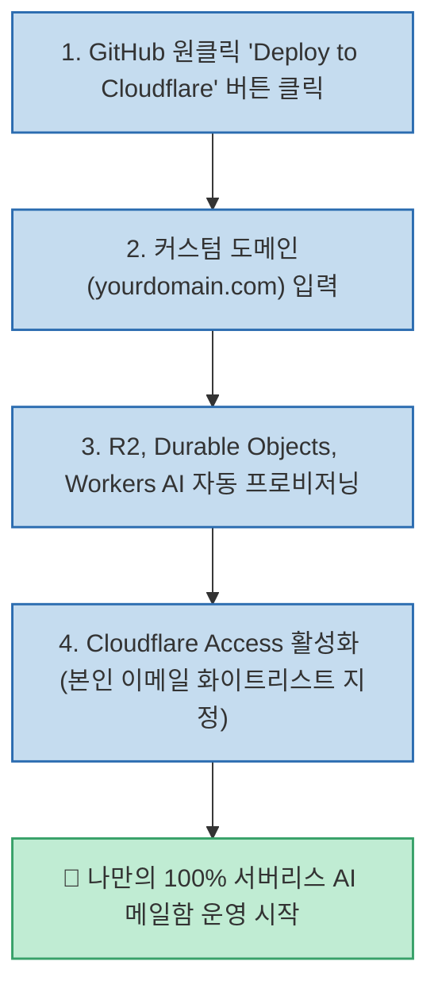

개인 도메인을 사용해 이메일을 운영하려면 Google Workspace나 ProtonMail 같은 유료 SaaS를 구독하거나, 복잡한 리눅스 메일 서버(Postfix, Dovecot)를 직접 설정해야 했습니다. 여기에 이메일을 자동으로 읽고 요약해 주는 AI 기능을 붙이려면 고가의 상용 API와 타사 서비스에 내 메일 본문을 전송해야 하는 프라이버시 침해 문제가 항상 뒤따랐습니다.

Cloudflare가 공식 오픈소스로 공개한 **Agentic Inbox (cloudflare/agentic-inbox)** 는 별도의 가상머신(VPS)이나 데이터베이스 서버 호스팅 없이, **Cloudflare 계정 하나로 나만의 도메인 메일 서버와 AI 이메일 어시스턴트를 100% 서버리스로 운영** 할 수 있는 혁신적인 셀프호스팅 웹 메일 플랫폼입니다.

<!--more-->

## Sources

- [공식 GitHub 저장소: cloudflare/agentic-inbox](https://github.com/cloudflare/agentic-inbox)
- [Cloudflare 공식 기술 블로그: Email for Agents](https://blog.cloudflare.com/email-for-agents/)
- [X(Twitter) 기술 큐레이션: @jungeAGI](https://x.com/jungeAGI/status/2099891244839129518)

---

## 1. Agentic Inbox의 완전 서버리스 엣지 아키텍처

Agentic Inbox는 수신, 스토리지, 데이터베이스, AI 추론, 제로 트러스트 보안까지 Cloudflare의 엣지 인프라 컴포넌트들을 유기적으로 결합하여 동작합니다.

---

## 2. 주요 핵심 구성 요소 및 작동 메커니즘

### 1) 무비용 인바운드 라우팅 (Email Routing)
- 내 도메인(`me@mydomain.com`)의 DNS MX 레코드를 Cloudflare로 지정해 두면, 들어오는 모든 인바운드 이메일을 Email Routing 규칙이 가로채어 Workers 스크립트로 즉시 전달합니다.
- 복잡한 SMTP 데몬 설정이나 포트 개방 없이도 안정적인 메일 수신 파이프라인이 완성됩니다.

### 2) 메일함별 SQLite 완전 격리 (Durable Objects)
- 메일 스레드와 메타데이터는 전역 단일 DB에 섞이지 않고, 각 메일함마다 독립적으로 프로비저닝되는 **Durable Object 내장 SQLite** 에 안전하게 저장됩니다.
- 엣지 환경에서 초고속 읽기/쓰기가 가능하며 계정 간 데이터 유출 위험이 물리적으로 차단됩니다.

### 3) 무제한 첨부파일 스토리지 (Cloudflare R2)
- 이메일에 첨부된 대용량 이미지, PDF, 압축 파일은 S3 API와 호환되는 R2 버킷에 분리 보관됩니다.
- 아웃바운드 데이터 전송료(Egress Fee)가 무료이므로 대용량 첨부파일 다운로드 시 추가 요금 부담이 없습니다.

### 4) 내장 AI 이메일 에이전트 (Agents SDK & Workers AI)
- 수신된 이메일의 핵심 내용을 요약하고, 과거 주고받은 관련 대화 맥락을 벡터 기반으로 역추적하여 자연스러운 회신(Reply) 초안을 자동으로 생성합니다.
- 외부 OpenAI나 Anthropic API 키 없이도 Cloudflare Workers AI 환경에 상주하는 오픈소스 모델(Llama 3 등)을 엣지에서 직접 구동할 수 있습니다.

### 5) 에이전트를 위한 이메일 프로토콜 (MCP 지원)
- Claude Code, Cursor 등 외부 코딩 에이전트가 **MCP(Model Context Protocol)** 를 통해 내 메일함을 안전하게 읽고 지시된 보고서를 외부로 발송할 수 있는 "Email for Agents" 인터페이스를 제공합니다.

---

## 3. 원클릭 배포 및 보안 설정

---

## 4. 실무 도입 가치

- **인프라 비용의 혁신**: 서버 호스팅 비용이나 메일 서비스 월정액 요금 없이, Cloudflare 무료 티어 한도 내에서 나만의 커스텀 도메인 이메일 시스템을 완벽하게 운영할 수 있습니다.
- **철저한 프라이버시 보호**: 이메일 본문과 첨부파일이 제3자 데이터 마이닝에 노출되지 않으며, Cloudflare Access(Zero Trust)를 통해 관리자 본인만 접근할 수 있는 강력한 방화벽이 형성됩니다.
