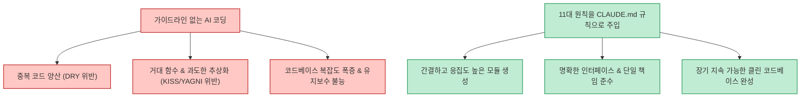

소프트웨어 개발 기술과 프레임워크는 눈부시게 빠른 속도로 변합니다. 새로운 언어와 라이브러리가 매년 쏟아져 나오고, 최근에는 Claude Code나 Cursor 같은 자율 코딩 에이전트가 단 몇 초 만에 수백 줄의 코드를 작성하는 시대가 되었습니다. 하지만 기술 스택이 아무리 바뀌어도 **"유지보수하기 쉽고, 버그를 빠르게 격리하며, 변경에 유연한 시스템"** 을 만드는 기본 원리는 수십 년간 변하지 않았습니다.

X(Twitter)의 소프트웨어 엔지니어 Dhairya Karekar(@dkare1009)가 정리한 **"더 일찍 알았더라면 좋았을 11가지 소프트웨어 엔지니어링 핵심 원칙"** 을 바탕으로, 각 원칙의 본질과 AI 코딩 환경에서 코드 품질을 통제하는 실전 지침을 정리합니다.

<!--more-->

## Sources

- [X(Twitter) 원문 분석: @dkare1009](https://x.com/dkare1009/status/2099717443279036819)

---

## 1. 11대 엔지니어링 원칙의 구조적 분류

이 원칙들은 단순한 암기용 체크리스트가 아니라 설계, 구현, 검증의 세 영역에서 시스템의 엔트로피를 낮추는 방어선 역할을 합니다.

```mermaid
flowchart TD
    classDef archNode fill:#c5dcef,stroke:#2b6cb0,stroke-width:1.5px,color:#333;
    classDef codeNode fill:#e0c8ef,stroke:#6b46c1,stroke-width:1.5px,color:#333;
    classDef optNode fill:#c0ecd3,stroke:#38a169,stroke-width:1.5px,color:#333;
    classDef hubNode fill:#fde8c0,stroke:#d69e2e,stroke-width:1.5px,color:#333;

    Hub["11대 소프트웨어 엔지니어링 원칙"] --> G1["1. 아키텍처 & 구조 설계"]
    Hub --> G2["2. 코드 작성 & 단순성 유지"]
    Hub --> G3["3. 안정성 & 최적화"]

    G1 --> P1["SOLID (객체지향 설계 표준)"]
    G1 --> P5["SRP (단일 책임 원칙)"]
    G1 --> P6["Open/Closed (개방 폐쇄 원칙)"]
    G1 --> P7["Dependency Inversion (의존성 역전)"]
    G1 --> P8["Composition over Inheritance (합성 우선)"]
    G1 --> P9["Separation of Concerns (관심사 분리)"]

    G2 --> P2["DRY (중복 배제 - SSOT)"]
    G2 --> P3["KISS (단순성 유지)"]
    G2 --> P4["YAGNI (추측 구현 금지)"]

    G3 --> P10["Fail Fast (빠른 예외 격리)"]
    G3 --> P11["Measure First (측정 기반 최적화)"]

    class Hub hubNode;
    class G1,P1,P5,P6,P7,P8,P9 archNode;
    class G2,P2,P3,P4 codeNode;
    class G3,P10,P11 optNode;
```

---

## 2. 11대 핵심 원칙 상세 분석

### 1) 아키텍처 및 객체지향 설계
- **SOLID**: 유지보수성과 확장성이 뛰어난 설계를 위한 5가지 원칙(SRP, OCP, LSP, ISP, DIP)의 결합체.
- **SRP (Single Responsibility Principle)**: 하나의 클래스나 함수는 오직 **단 하나의 변경 이유** 만을 가져야 합니다. 모든 역할을 다 하는 만능(God) 객체는 결합도를 높이고 사이드 이펙트를 유발합니다.
- **Open/Closed Principle**: 기존에 잘 작동하는 검증된 코드를 뜯어고치지 않고도(Closed for modification), 새로운 기능이나 정책을 인터페이스 확장을 통해 덧붙일 수 있어야(Open for extension) 합니다.
- **Dependency Inversion Principle**: 고수준의 비즈니스 로직이 특정 데이터베이스나 서드파티 라이브러리 같은 저수준 세부 구현체에 직접 의존하지 않고, 추상화(인터페이스)에 의존하여 유연성을 확보합니다.
- **Composition over Inheritance**: 경직되고 부서지기 쉬운 다단계 클래스 상속 계층 대신, 작고 독립적인 컴포넌트들을 조립(Composition)하여 복잡성을 제어합니다.
- **Separation of Concerns (관심사의 분리)**: UI 렌더링, 데이터 액세스, 도메인 비즈니스 로직을 물리적/논리적으로 명확히 분리하여 독립적인 테스트가 가능하도록 만듭니다.

### 2) 코드 작성 및 단순성 유지
- **DRY (Don't Repeat Yourself)**: 모든 지식과 비즈니스 로직은 시스템 내에서 단 하나의 유일한 표현(단일 진실 공급원, SSOT)을 가져야 합니다. 코드 복사·붙여넣기는 잠재적인 버그의 온상입니다.
- **KISS (Keep It Simple, Stupid)**: 화려한 기교나 불필요한 과도한 추상화를 경계하고, 읽기 쉽고 의도가 한눈에 드러나는 단순한 코드를 최우선으로 작성합니다.
- **YAGNI (You Aren't Gonna Need It)**: "언젠가 미래에 쓰일지도 모른다"는 추측으로 미리 작성한 기능은 90% 이상 낭비가 되거나 기술 부채가 됩니다. 오직 **지금 당장 필요한 기능** 에 집중합니다.

### 3) 런타임 안정성 및 성능 최적화
- **Fail Fast (빠른 실패)**: 잘못된 입력이나 이상 상태가 발생했을 때 침묵하거나 뒤로 미루지 않고, 진입점(Input Validation)에서 즉시 에러를 터뜨려 디버깅 비용을 1/10로 단축합니다.
- **Measure First (측정 우선)**: "성급한 최적화는 모든 악의 근원"이라는 도널드 크누스의 격언처럼, 추측으로 코드를 복잡하게 비틀지 말고 반드시 프로파일러와 벤치마크로 실제 병목을 측정한 뒤 최적화를 진행합니다.

---

## 3. AI 에이전트 코딩 시대에 이 원칙들이 필수적인 이유

- **AI의 기본 성향 교정**: LLM은 이전 맥락을 충분히 파악하지 못하면 비슷한 헬퍼 함수를 중복 생성(DRY 위반)하거나, 과도한 제네릭과 디자인 패턴을 남발(KISS/YAGNI 위반)하는 경향이 있습니다.
- **시스템 룰 파일(`.cursorrules`, `CLAUDE.md`) 주입**: 프로젝트 초기 단계에 이 11대 원칙을 명문화해 두면, 에이전트가 코드를 작성하고 리팩토링할 때 자체 검증 기준으로 삼아 코드 품질을 비약적으로 높일 수 있습니다.
- **엔지니어의 역할 진화**: 타이핑 속도가 아닌, 생성된 코드가 객체지향 원칙과 단순성을 지키고 있는지 감시하고 판단하는 **아키텍처 감수 능력** 이 현대 엔지니어의 핵심 경쟁력입니다.
