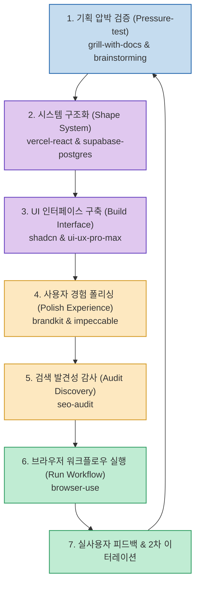
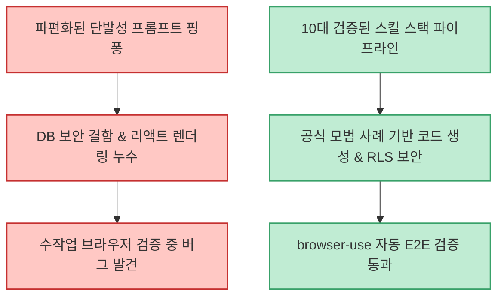

Claude Code나 Cursor 같은 AI 코딩 에이전트가 발전하면서 개별 함수나 컴포넌트를 생성하는 속도는 비약적으로 빨라졌습니다. 하지만 실제 서비스 개발은 단순히 코드를 생성하는 것을 넘어, 기획 검증부터 시스템 설계, UI 컴포넌트 조립, 데이터베이스 보안 강화, 시각적 폴리싱, SEO 감사, 그리고 실제 브라우저에서의 동작 테스트까지 하나의 유기적인 사이클로 연결되어야 합니다.

X(Twitter)의 기술 분석가 beamnxw(@beamnxw)가 소개한 **"제품 개발 풀 루프(Full Product Loop)를 완성하는 10대 Agent Skills"** 는 합산 349만 회 이상의 다운로드를 기록하며 글로벌 엔지니어들에게 검증된 모범 스택입니다. 이 10대 스킬이 어떻게 하나의 완성형 개발 파이프라인으로 연결되는지 정리합니다.

<!--more-->

## Sources

- [X(Twitter) 원문 분석: @beamnxw](https://x.com/beamnxw/status/2099589086595964965)
- [1. grill-with-docs: mattpocock/skills](https://github.com/mattpocock/skills)
- [2. vercel-react-best-practices: vercel-labs/agent-skills](https://github.com/vercel-labs/agent-skills)
- [3. supabase-postgres-best-practices: supabase/agent-skills](https://github.com/supabase/agent-skills)
- [4. brainstorming: obra/superpowers](https://github.com/obra/superpowers)
- [5. ui-ux-pro-max: nextlevelbuilder/ui-ux-pro-max-skill](https://github.com/nextlevelbuilder/ui-ux-pro-max-skill)
- [6. brandkit: leonxlnx/taste-skill](https://github.com/leonxlnx/taste-skill)
- [7. impeccable: pbakaus/impeccable](https://github.com/pbakaus/impeccable)
- [8. seo-audit: coreyhaines31/marketingskills](https://github.com/coreyhaines31/marketingskills)
- [9. browser-use: browser-use/browser-use](https://github.com/browser-use/browser-use)
- [10. shadcn: shadcn-ui/ui](https://github.com/shadcn-ui/ui)

---

## 1. 7단계 Full Product Loop 파이프라인

10대 스킬은 제품 라이프사이클의 7단계에 정확히 대응하여 빈틈없는 개발 루프를 형성합니다.

---

## 2. 10대 핵심 Agent Skills 상세 분석

### 1) 기획 및 아이디어 발상 (Ideation & Planning)
- **grill-with-docs (Matt Pocock)**: 개발자가 대충 넘어가기 쉬운 엣지 케이스나 아키텍처 결함을 에이전트가 역으로 집요하게 질문하여 기획을 압박 검증(Pressure-test)합니다. 공식 프레임워크 문서와 대조하여 논리적 허점을 사전에 박멸합니다.
- **brainstorming (Jesse Vincent / superpowers)**: 기능 정의 전 편향되지 않은 사용자 시나리오와 창의적인 대안을 다각도로 도출합니다.

### 2) 아키텍처 및 데이터베이스 설계 (Architecture & DB)
- **vercel-react-best-practices (Vercel Labs)**: Next.js 및 React의 서버 컴포넌트(RSC), 번들 사이즈 최적화, 불필요한 리렌더링 방지 등 Vercel 공식 엔지니어링 모범 사례를 강제합니다.
- **supabase-postgres-best-practices (Supabase)**: 데이터베이스 정규화, 복합 인덱스 설계, Row Level Security(RLS) 보안 정책을 프로덕션 수준으로 구축합니다.

### 3) 디자인 시스템 및 비주얼 폴리싱 (UI/UX & Polish)
- **shadcn (shadcn/ui)**: Tailwind CSS 기반의 접근성 높고 재사용 가능한 모던 UI 컴포넌트를 즉시 코드로 주입합니다.
- **ui-ux-pro-max**: 색상 팔레트, 타이포그래피 계층, 컴포넌트 패딩 등 전문 디자이너 수준의 UI/UX 규격을 적용합니다.
- **brandkit**: 일관된 브랜드 보이스와 룩앤필(Taste)을 코드 전반에 통일성 있게 유지합니다.
- **impeccable (Paul Bakaus)**: 밋밋한 화면에 마이크로 인터랙션과 트랜지션을 불어넣어 완성도를 극대화합니다.

### 4) 검색 최적화 및 브라우저 E2E 테스트 (SEO & Verification)
- **seo-audit (Corey Haines)**: 메타 태그, 오픈그래프, JSON-LD 구조화 데이터 등 검색 엔진 노출도를 자동 진단합니다.
- **browser-use**: 에이전트가 실제 헤드리스/GUI 브라우저를 띄워 회원가입, 결제, API 응답 흐름을 직접 마우스로 조작하며 E2E 검증을 완결합니다.

---

## 3. 실무 적용 시 기대 효과

- **토큰 효율 극대화**: 모호한 지시문으로 AI와 수십 번 대화를 주고받는 낭비를 없애고, 각 도메인 공식 팀의 모범 규격을 주입해 첫 시도에서 프로덕션 품질을 달성합니다.
- **1인 개발자의 완전 자율화**: 기획 검증부터 실제 브라우저 E2E 테스트까지 전 과정을 혼자서도 대형 팀 수준의 품질로 완주할 수 있습니다.
