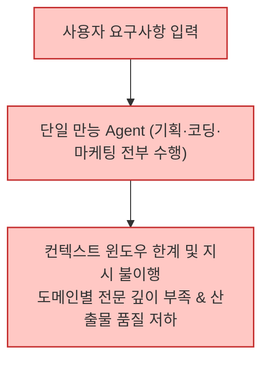
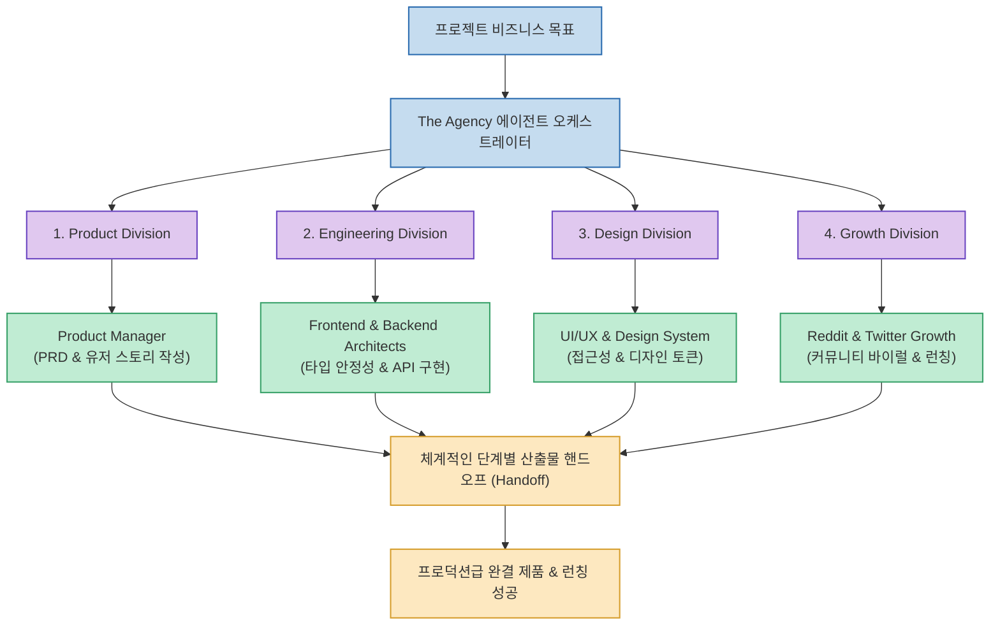

AI 코딩 에이전트나 대형 언어 모델(LLM)을 실무에 적용할 때 흔히 겪는 병목은 "모든 것을 혼자 다 하려는 만능(Generalist) 프롬프트의 한계"입니다. 프론트엔드 최적화, 백엔드 보안, 사용자 리서치, Reddit 그로스 마케팅, E2E 테스트를 단일 에이전트에게 한 번에 요구하면, 맥락이 오염되거나 전문성이 결여된 겉핥기식 답변으로 이어지기 십상입니다.

오픈소스로 공개된 **The Agency (msitarzewski/agency-agents)** 는 실제 기업 조직의 7대 핵심 부서와 수십 개 전문 직무를 세밀한 페르소나, 표준 워크플로우, 그리고 명확한 기술 산출물 규격으로 분해한 오픈소스 에이전트 로스터입니다. 출시 일주일 만에 GitHub Stars 1.5만 개를 돌파하며 폭발적인 관심을 받고 있습니다.

<!--more-->

## Sources

- [공식 GitHub 저장소: msitarzewski/agency-agents](https://github.com/msitarzewski/agency-agents)
- [공식 데스크톱 웹앱: agencyagents.app](https://agencyagents.app)
- [X(Twitter) 큐레이션 원문: @shanyanggm](https://x.com/shanyanggm/status/2099664499175199010)

---

## 1. 만능 에이전트 vs The Agency 분업화 아키텍처

단일 만능 에이전트와 분업화된 전문 스페셜리스트 팀의 구조적 차이를 비교하면 다음과 같습니다.

### 기존 단일 만능 에이전트 방식 (컨텍스트 오염 및 낮은 완성도)


### The Agency 분업형 에코시스템 (역할 위임 및 핸드오프)


---

## 2. 7대 주요 부서(Divisions) 구성 및 전문 역할

1. **엔지니어링 부서 (Engineering - 7개 에이전트)**
   - **Frontend Developer**: React/Vue/Angular, 픽셀 퍼펙트 UI, Core Web Vitals 성능 최적화.
   - **Backend Architect**: 고성능 API 설계, 데이터베이스 인덱싱 및 분산 트랜잭션.
   - **Mobile Developer**: iOS/Android 크로스 플랫폼 네이티브 앱 구현.
   - **AI Engineer / DevOps / Rapid Prototyper / Senior SWE**: 모델 파이프라인, CI/CD 자동화, MVP 쾌속 개발, 아키텍처 리뷰.

2. **디자인 부서 (Design - 7개 에이전트)**
   - UI/UX 디자이너, 사용자 리서처, 정보 아키텍트, 브랜드 아이덴티티, 스토리텔러, 디자인 시스템 전문가.

3. **그로스 & 마케팅 부서 (Growth - 8개 에이전트)**
   - 콘텐츠 전략가, X(Twitter) 매니저, TikTok/Reels 크리에이터, Reddit 커뮤니티 닌자, 앱스토어 최적화(ASO), SEO 전문가, 이메일 마케팅 퍼널 설계자.

4. **프로덕트 & 프로젝트 관리 (Product & PM - 8개 에이전트)**
   - 제품 책임자(PM), 기능 우선순위 결정자, 수익화 전략가, 스크럼 마스터, 딜리버리 리드 등.

5. **품질 검증 및 운영 (QA & Support - 13개 에이전트)**
   - 테스트 자동화 엔지니어, 보안 감사관(Security Auditor), 접근성(a11y) 검사기, 테크니컬 라이터, 인시던트 대응자 등.

---

## 3. 멀티 툴 지원 및 단계적 설치 가이드

The Agency는 Claude Code, Cursor, Codex, Gemini CLI, Antigravity, OpenCode, Windsurf 등 현존하는 주요 AI 코딩 환경을 네이티브로 지원합니다.

### 1) 전용 데스크톱 앱 (Agency Agents)
- macOS, Linux, Windows용 독립형 GUI 앱([agencyagents.app](https://agencyagents.app))을 통해 터미널 명령어 없이 클릭 한 번으로 원하는 직무 에이전트를 내 로컬 도구에 주입하고 자동 업데이트할 수 있습니다.

### 2) 터미널 선별 설치 스크립트
모든 에이전트를 한꺼번에 활성화하면 컨텍스트 낭비가 발생하므로, 실무에서는 **엔지니어링(Engineering)** 과 **그로스(Growth)** 등 필요한 팀 단위로 선별 설치하는 것을 권장합니다.

```bash
# Claude Code에 엔지니어링 및 보안 감사 부서만 선별 주입
./scripts/install.sh --tool claude-code --division engineering,security

# Cursor IDE에 프론트엔드 개발자 및 UI 디자이너만 주입
./scripts/install.sh --tool cursor --agent frontend-developer,ui-designer
```

---

## 4. 실무 도입 시사점

- **1인 창업자의 가상 조직화**: 1인 개발자나 소규모 스타트업이 디자이너, PM, 마케터, QA 전문가를 팀원으로 고용한 것과 같은 다각도의 전문 피드백을 확보할 수 있습니다.
- **표준화된 산출물 템플릿**: 각 에이전트 파일마다 구체적인 코드 스니펫, 인터뷰 체크리스트, 성공 지표가 명시되어 있어 에이전트 간 업무 인수인계(Handoff)가 물 흐르듯 자연스럽게 이어집니다.
