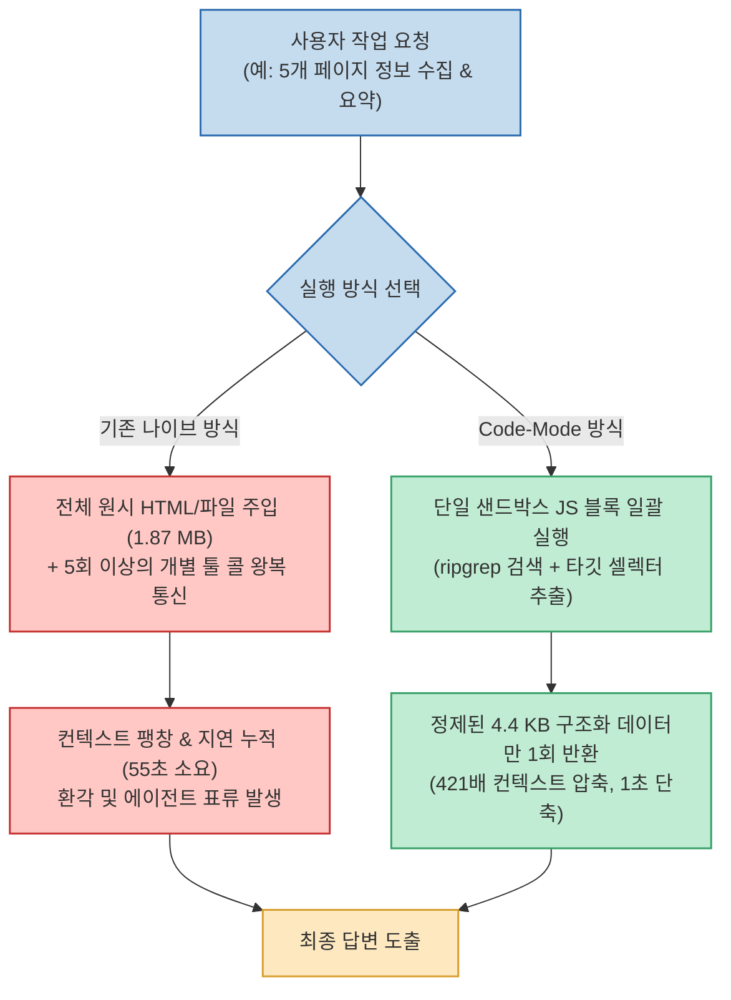

Claude Code, Cursor, ChatGPT 등 고성능 AI 도구를 업무에 도입한 뒤 "AI가 생각보다 너무 느리고 엉뚱한 답변을 낸다"고 토로하는 사용자들을 흔히 보게 됩니다. 수십 초에서 수 분 동안 로딩 스피너만 돌다가 결국 내가 원치 않는 엉뚱한 맥락을 인용해 답변을 내놓는 현상입니다.

하지만 이 병목의 원인을 파고들어 보면, 모델 자체의 지능이나 API 서버의 레이턴시 문제라기보다는 **"AI에게 불필요한 전체 문서를 통째로 읽게 만드는 잘못된 프롬프트와 툴 호출 구조"** 때문인 경우가 대부분입니다.

최근 오픈소스 프로젝트 **aside-codemode** 는 5개 웹페이지 검색에 7.19초 걸리던 작업을 단 0.19초로, 50개 파일 탐색에 55초 걸리던 작업을 단 1초로 단축하며 이 문제의 해법을 증명했습니다. AI 에이전트의 지연을 극적으로 없애는 기술적 접근법(Code-Mode)과 일상 업무에서 누구나 즉시 적용할 수 있는 4대 프롬프트 원칙을 정리합니다.

<!--more-->

## Sources

- [GitHub 저장소: lidge-jun/aside-codemode](https://github.com/lidge-jun/aside-codemode)
- [Threads 인사이트 큐레이션: @an_kl_ko](https://www.threads.com/share/BAYOiFQtfT/)

---

## 1. 기존 에이전트 탐색 vs Code-Mode 아키텍처 비교

기존의 나이브(Naive)한 에이전트는 거대한 원시 텍스트를 LLM 컨텍스트에 쏟아붓고 여러 번 왕복 통신을 거치지만, Code-Mode는 격리된 샌드박스 내부에서 데이터를 사전 필터링하여 최소한의 정제된 데이터만 모델에 전달합니다.

---

## 2. aside-codemode가 증명한 50배 단축 메커니즘

`lidge-jun/aside-codemode`의 핵심 설계 철학은 **"50장의 카드를 넘기는 대신 단 한 장의 시트에 요약본을 담아 모델에 건네는 것"** 입니다.

### 1) 브라우징 압축: 1.87 MB 유입 ➔ 4.4 KB 반환
- 일반적인 브라우저 에이전트는 웹페이지 5개를 방문할 때마다 약 1,865,043 바이트의 거대한 HTML 돔 트리를 모델의 컨텍스트 창에 그대로 밀어 넣습니다. 5번의 네트워크 라운드트립과 모델의 읽기 연산이 반복됩니다.
- `aside-codemode`는 브라우저 내부에서 단일 `browse.exec` 스크립트를 실행해 타이틀과 첫 번째 링크 등 꼭 필요한 데이터만 추출합니다. 모델에는 단 4,430 바이트의 정제된 행(Row)만 전달되므로, 통신 횟수는 5회에서 1회로 줄고 총 소요 시간은 **2.5초** 로 단축됩니다 (421배 압축).

### 2) 파일 검색 혁신: 55초 ➔ 1초
- 50개 파일에서 `TODO` 주석을 찾을 때, 파일마다 `read_file`을 수십 번 호출하는 대신 고성능 `ripgrep(rg)` 기반의 단일 자바스크립트 블록 안에서 일괄 매칭을 완료하여 반환합니다.

---

## 3. 일상 업무와 프롬프트에서 즉시 쓰는 4대 원칙

코딩을 하지 않는 일반 사용자라도 엑셀, 노션, 고객 문의 등 일상 업무에서 AI에게 일을 맡길 때 아래 4가지 원칙만 지키면 응답 속도와 정확도를 즉각 3배 이상 끌어올릴 수 있습니다.

### 1) 전체 문서 대신 필요한 '범위'만 좁혀주기 (Scope Reduction)
- **흔한 실수**: 수천 행짜리 엑셀 시트 전체를 복사해서 "이번 달 지출 내역만 정리해줘"라고 던지는 경우. AI는 무관한 과거 수년 치 행까지 다 읽느라 속도가 처지고 엉뚱한 행을 오독합니다.
- **개선 방법**: 필요한 기간(예: 9월 1일~15일)의 열과 행만 잘라서 전달하거나, "B열(날짜)과 E열(금액)만 참고하라"고 범위를 사전 한정합니다.

### 2) 반복 작업의 판정 규칙을 첫 문장에 명시하기 (Rule Definition)
- *"취소된 건이나 환불 영수증은 집계에서 제외할 것"* 처럼 모호성을 없애는 핵심 필터링 규칙을 프롬프트 최상단에 1문장으로 선언합니다. AI가 고민하는 탐색 경로를 차단할 수 있습니다.

### 3) 원하는 결과 형식을 사전에 고정하기 (Output Formatting)
- *"불릿 포인트 3개로 요약할 것"*, *"날짜, 항목, 금액으로 이루어진 마크다운 목록으로 출력할 것"* 처럼 형식을 강제하면, AI가 서두와 결론에 쏟아내는 불필요한 장황한 생성 토큰을 없애 지연 시간을 절반으로 줄입니다.

### 4) 대형 작업은 한 번에 몰지 말고 단계별로 확인하기 (Step-by-step)
- 수십 페이지 분량의 번역이나 정리를 한 번에 지시하면 중간에 컨텍스트가 꼬입니다. "1단계: 목차 및 항목 분류 ➔ 확인 후 2단계: 본문 상세 분석"으로 쪼개어 피드백을 주는 것이 최종 소요 시간을 훨씬 단축합니다.
