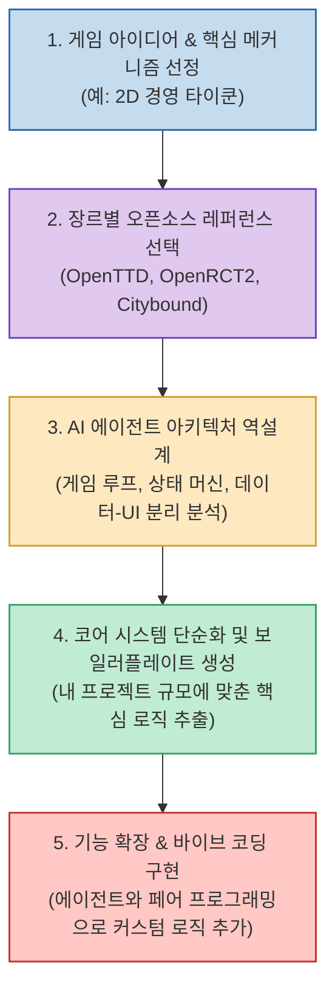

Claude Code나 Cursor 같은 자율 코딩 에이전트의 발전으로 "게임 하나 만들어줘"라는 프롬프트만 입력하면 AI가 실행 가능한 코드를 뚝딱 작성해 주는 시대가 되었습니다. 하지만 프로토타입 단계를 넘어 본격적인 게임 시스템을 구축하려고 하면 곧바로 깊은 한계에 부딪힙니다.

"실제 상용급 게임은 엔티티와 컴포넌트 구조를 어떻게 분리했지?", "FPS의 정밀한 히트스캔 판정과 네트워크 동기화는 어디서 처리하지?", "타이쿤이나 도시 건설 시뮬레이션의 틱(Tick) 기반 경제 루프는 어떻게 짰지?"와 같은 구조적인 물음에는 단편적인 AI 생성 코드나 튜토리얼만으로 답을 찾기 어렵습니다.

이럴 때 가장 좋은 스승은 이미 완성되어 전 세계 유저들에게 검증받은 **"진짜 게임 소스코드"** 를 뜯어보는 것입니다. GitHub에서 1.4만 스타 이상을 기록하며 17개 장르별 오픈소스 게임들의 공식 홈과 소스코드 저장소를 집대성한 **bobeff/open-source-games** 와, 이를 AI 바이브 코딩(Vibe Coding)의 레퍼런스로 활용하는 실전 전략을 정리합니다.

<!--more-->

## Sources

- [GitHub 저장소: bobeff/open-source-games (Stars 14.6k+)](https://github.com/bobeff/open-source-games)
- [Threads 기술 큐레이션: @cc.dev_](https://www.threads.com/share/BARce24Ern/)

---

## 1. 레퍼런스 주도 바이브 코딩(Reference-Driven Vibe Coding) 워크플로우

단순히 AI에게 무에서 유를 창조하도록 맡기는 나이브(Naive)한 방식 대신, 검증된 오픈소스 게임 코드를 에이전트의 시각으로 먼저 분석시킨 뒤 내 프로젝트에 맞게 축소·조합하는 워크플로우입니다.



---

## 2. 17개 장르별 주요 오픈소스 게임 라인업

`bobeff/open-source-games` 저장소는 큐레이션 자체에 CC0-1.0(퍼블릭 도메인) 라이선스를 적용하여 누구나 자유롭게 탐색할 수 있는 거대한 소스코드 도서관입니다.

### 1) 전설적인 게임 엔진 및 고전 FPS
- **id Software 명작 시리즈**: `Doom`, `Doom 3`, `Quake`, `Quake II`, `Quake III Arena`, `Wolfenstein 3D`
- **고전 액션 FPS**: `Duke Nukem 3D`, `Shadow Warrior`
- **학습 포인트**: C/C++ 기반의 극한 메모리 최적화, BSP 트리 렌더링 파이프라인, 공간 분할 기법, 고속 벡터 연산 로직.

### 2) 타이쿤·경영 및 도시 건설 시뮬레이션
- **대표 프로젝트**: `OpenRCT2` (롤러코스터 타이쿤 2 현대화 엔진), `OpenTTD` (트랜스포트 타이쿤 디럭스), `OpenLoco`, `CorsixTH` (테마 병원 오픈소스 구현체), `Citybound`, `Cytopia`
- **학습 포인트**: 이산 사건 시뮬레이션(Discrete Event Simulation), 그리드 타일 맵 데이터베이스, 승객/화물 길찾기(A* 알고리즘) 및 경제 수지 균형 로직.

### 3) 우주 시뮬레이션 및 샌드박스
- **대표 프로젝트**: `Endless Sky`, `Pioneer`
- **학습 포인트**: 거대한 2D/3D 은하계 항법 시스템, 절차적 퀘스트 생성 엔진, 물리 기반 궤도 역학.

---

## 3. 실전 바이브 코딩 활용법: AI 프롬프트의 질을 바꾸는 법

AI에게 아무런 맥락 없이 *"도시 건설 게임 만들어줘"* 라고 요청하면 수백 줄의 난잡한 스파게티 코드가 반환됩니다. 하지만 실제 오픈소스 코드를 레퍼런스로 제공하면 프롬프트의 차원이 달라집니다.

### 1) 검증된 프로젝트 구조 분석 요청
```text
"OpenTTD 저장소의 src/economy.cpp와 src/viewport.cpp를 읽고,
1) 시뮬레이션 루프와 렌더링 뷰포트가 어떻게 스레드나 인터페이스로 분리되어 있는지,
2) 매 틱(Tick)마다 회계 정산이 일어나는 핵심 이벤트 핸들러의 흐름을 초보자 눈높이로 설명해줘."
```

### 2) 핵심 아키텍처의 단순화(Downsizing) 추출
```text
"방금 분석한 OpenTTD의 구조를 모방해서, 내가 React와 Canvas2D로 만들 초소형 타이쿤 게임에 필요한
1) GameLoop(고정 틱 업데이트), 2) TileGrid 상태 관리, 3) IncomeSystem의 최소 보일러플레이트 구조만 
단일 TypeScript 프로젝트로 단순화해서 설계해줘."
```

### 3) 소스 포트(Source Port) 비교를 통한 현대화 학습
오리지널 소스와 이를 현대 운영체제에 맞게 리팩토링한 소스 포트(예: `Chocolate Doom`)를 AI에게 동시에 비교 분석시키면, **"30년 전의 레거시 코드가 현대적인 멀티플랫폼 환경에서 어떻게 추상화 계층을 거쳐 살아났는가"** 를 가장 빠르고 생생하게 학습할 수 있습니다.

---

## 4. 라이선스 주의사항

- 목록 저장소(`bobeff/open-source-games`)는 CC0 라이선스이지만, **각 개별 게임의 소스코드는 GPL, AGPL, MIT, BSD, 독자 라이선스 등 조건이 제각각** 입니다.
- 단순히 코드를 읽고 아키텍처 패턴을 학습하는 것은 자유롭지만, 상용 게임 개발 시 코드를 직접 복사·붙여넣기하거나 에셋을 재배포하려면 반드시 대상 프로젝트의 `LICENSE` 조항(카피레프트 조항 유무)을 사전 점검해야 합니다.
