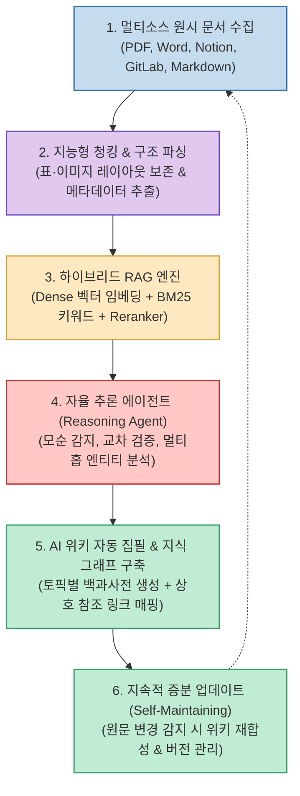

대부분의 기업과 조직에서 지식 관리(KM, Knowledge Management)는 가장 골치 아픈 난제 중 하나입니다. Confluence, Notion, 슬랙, 구글 드라이브, GitLab 위키 등 사일로화된 도구마다 문서가 제각각 흩어져 있고, 작성된 문서는 시간이 지나면서 업데이트되지 않아 '문서 부패(Document Rot)'가 발생합니다. 필요한 정보를 찾으려면 담당자에게 일일이 DM을 보내야 하고, 새로 입사한 온보딩 인원은 맥락을 파악하는 데만 수주를 소비합니다.

최근 RAG(Retrieval-Augmented Generation) 시스템이 문서 검색의 대안으로 도입되고 있지만, 단순한 청킹(Chunking)과 벡터 유사도 검색만으로는 서로 다른 문서 간의 인과관계나 최신 변경 사항을 파악하지 못해 환각이나 단편적인 답변에 그치는 한계가 있었습니다.

중국의 대표 빅테크 기업 텐센트(Tencent)가 오픈소스로 공개한 **WeKnora (Tencent/WeKnora)** 는 이러한 한계를 극복하고, **"회사 내부의 원시 문서를 스스로 진화하는 AI 위키와 지식 그래프(Knowledge Graph)로 자동 변환하는 오픈소스 엔터프라이즈 지식 플랫폼"** 입니다. 공개 직후 GitHub에서 2.5만 개 이상의 스타를 기록하며 차세대 엔터프라이즈 AI 아키텍처로 주목받고 있는 WeKnora의 핵심 메커니즘을 심층 분석합니다.

<!--more-->

## Sources

- [공식 GitHub 저장소: Tencent/WeKnora](https://github.com/Tencent/WeKnora)
- [Threads 기술 큐레이션 및 심층 분석: @h2smusic](https://www.threads.com/share/BAKnayukvg/)

---

## 1. WeKnora의 6단계 자가 진화 지식 플라이휠 아키텍처

WeKnora의 가장 강력한 차별점은 단순 검색 인터페이스에 머물지 않고, **수집된 파편화 문서를 AI 에이전트가 읽고, 구조화된 위키 페이지를 직접 집필하며, 지식 그래프로 상호 연결하는 폐루프(Closed Loop) 플라이휠** 을 구축했다는 점입니다.

---

## 2. WeKnora 핵심 아키텍처 컴포넌트

### 1) 파편화된 엔터프라이즈 소스 연동 및 지능형 파싱
- **멀티 커넥터**: Confluence, Notion, GitLab/GitHub 리포지토리, 로컬 파일 시스템, 클라우드 오브젝트 스토리지(S3 등)로부터 PDF, DOCX, PPTX, Markdown, 이메일 등의 원본 데이터를 자동 동기화합니다.
- **문맥 보존 파싱**: 복잡한 표(Table), 수식, 아키텍처 다이어그램을 단순 텍스트로 뭉개지 않고, 구조화된 계층형 블록(Hierarchical Tree)으로 인식하여 청킹 손실을 최소화합니다.

### 2) GraphRAG 기반의 하이브리드 검색 레이어
- **벡터와 그래프의 결합**: 단어 유사도 기반의 Dense 임베딩 검색(Milvus/Qdrant)과 키워드 정밀도의 BM25 검색을 결합하고, 여기에 **지식 그래프(Knowledge Graph)** 를 결합하여 다단계 추론(Multi-hop Reasoning)을 지원합니다.
- **엔티티 관계 탐색**: 예컨대 "프로젝트 A의 데이터베이스 페일오버 절차"를 질의하면, 단순 키워드 매칭을 넘어 '프로젝트 A ➔ 사용 DB(PostgreSQL) ➔ 클러스터 설정 문서 ➔ 페일오버 매뉴얼'로 이어지는 그래프 경로를 추적하여 답변 맥락을 완성합니다.

### 3) 자율 추론 에이전트의 AI 위키 자동 생성
- **위키 백과사전 자동 집필**: 수천 개의 흩어진 문서 조각들을 사람이 일일이 정리할 필요 없이, 에이전트가 주제별(프로젝트, 도메인 기술, 조직 규칙 등)로 일목요연한 위키 문서를 작성합니다.
- **모순 감지 및 팩트체킹**: 서로 다른 문서에서 상충되는 정보(예: 2024년 정책 문서와 2026년 업데이트 문서 간의 버전 불일치)가 발견되면, 날짜 메타데이터와 작성 맥락을 분석하여 최신 진실 공급원(SSOT)을 판별하고 경고를 남깁니다.

### 4) 자가 유지보수(Self-Maintaining) 메커니즘
- **변경분 증분 업데이트**: Git 커밋이나 사내 위키 수정이 감지되면 전체 인덱스를 재구축하지 않고, 영향받는 지식 그래프 노드와 위키 섹션만을 타깃팅하여 백그라운드에서 증분 갱신합니다.
- **인간 검토 루프(Human-in-the-Loop)**: 중요한 사내 정책이나 아키텍처 결정 사항에 대해서는 AI가 작성한 위키 초안에 대해 도메인 전문가가 원클릭으로 승인하거나 수정할 수 있는 검토 큐를 제공합니다.

---

## 3. 전통적인 RAG vs WeKnora 비교

### 1) 검색 및 정보 처리 패러다임
- **기존 나이브(Naive) RAG**:
  - 원시 문서를 수백 토큰 단위로 기계적 분할하여 벡터화.
  - 문서 간의 연결 관계가 유실되어 질문과 유사한 단편 조각만 반환.
  - 파편화된 조각들을 LLM이 조립하는 과정에서 환각 발생 위험 증가.
- **WeKnora 지식 플랫폼**:
  - 문서를 읽고 AI가 스스로 정리된 구조화 위키를 사전 합성.
  - 지식 그래프를 통해 인물, 시스템, 서비스 간의 종속성을 명시적 에지(Edge)로 모델링.
  - 구조화된 종합 페이지를 바탕으로 근거가 명확한 답변 생성.

### 2) 유지보수 비용 및 운영성
- **기존 사내 위키**: 사람이 손수 작성해야 하므로 초기 도입 몇 달 뒤 방치되어 죽은 문서 창고로 전락.
- **WeKnora**: 원본 코드나 기획서가 변경되면 AI 에이전트가 알아서 위키 페이지를 업데이트하므로 살아 숨쉬는 지식 베이스 유지 가능.

---

## 4. 프라이버시 및 엔터프라이즈 보안

WeKnora는 기업 환경에서의 실무 도입을 염두에 두고 설계되었습니다:
- **로컬 LLM 완벽 지원**: 사외 클라우드로 데이터 반출이 불가능한 폐쇄망 환경을 위해 Ollama, vLLM을 통한 오픈소스 모델(DeepSeek, LLaMA, Qwen 등) 온프레미스 배포를 기본 지원합니다.
- **역할 기반 접근 제어 (RBAC)**: 직급이나 부서별 권한에 따라 검색 가능한 문서 범위가 철저히 격리되어, 일반 직원의 질의에 인사/재무 등 기밀 문서가 유출되는 사고를 원천 차단합니다.
- **출처 역추적성 (Citations)**: 생성된 위키와 모든 답변 문장에는 원본 파일명, 페이지 번호, 작성 시점의 링크가 100% 매핑되어 신뢰성을 보장합니다.

---

## 5. 결론: "죽은 문서 창고"에서 "살아있는 집단 지성"으로

기업의 가장 큰 자산은 구성원들이 축적한 경험과 지식입니다. 하지만 그 지식이 제각각의 폴더와 슬랙 채널 속에 묻혀 있다면 없는 것과 다름없습니다.

Tencent WeKnora는 단순한 검색 도구를 넘어, **AI 에이전트가 조직의 도서관 사서이자 테크니컬 라이터가 되어 끊임없이 문서를 엮고 다듬는 미래형 지식 관리 모델** 을 제시합니다. 사내 파편화된 문서로 인해 검색과 온보딩에 피로를 겪고 있는 엔지니어링 팀과 조직이라면, 오픈소스로 직접 구축 가능한 WeKnora의 도입을 적극 검토해 볼 가치가 있습니다.
