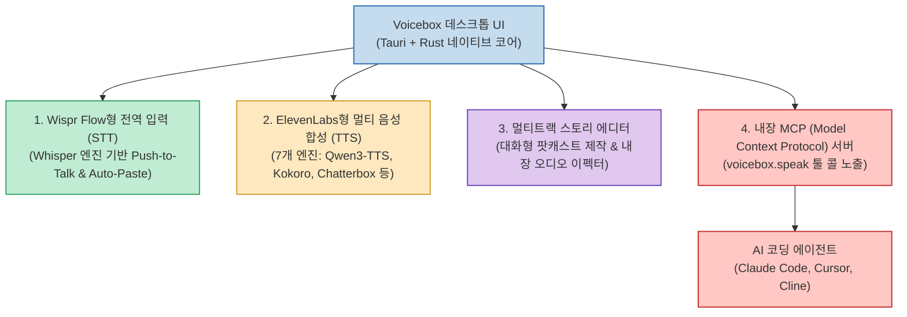

상용 AI 음성 시장은 크게 두 축으로 나뉘어 발전해 왔습니다. 한쪽에는 실감 나는 목소리 복제와 음성 합성(TTS)으로 독주하는 **ElevenLabs** 가 있고, 다른 한쪽에는 전역 단축키를 눌러 어디서나 음성으로 빠르게 글을 쓰는 딕테이션(STT) 도구인 **Wispr Flow** 가 있습니다. 하지만 두 도구 모두 매달 고가의 구독료를 지불해야 하고, 내 음성과 민감한 문서 텍스트가 타사 클라우드 서버로 전송된다는 보안적 우려가 존재했습니다.

오픈소스 프로젝트 **Voicebox (jamiepine/voicebox)** 는 이 입력(STT)과 출력(TTS)의 양대 축을 단 하나의 앱에 결합하고, **외부 서버 통신 없이 사용자 로컬 머신에서 100% 프라이빗하게 구동** 하도록 설계된 차세대 AI 보이스 스튜디오입니다. 공개 직후 GitHub에서 5.4만 개 이상의 스타를 기록하며 폭발적인 관심을 끌고 있는 Voicebox의 아키텍처와 활용법을 정리합니다.

<!--more-->

## Sources

- [GitHub 저장소: jamiepine/voicebox (Stars 54.7k+)](https://github.com/jamiepine/voicebox)
- [공식 웹사이트: voicebox.sh](https://voicebox.sh)
- [Threads 기술 큐레이션: @h2smusic](https://www.threads.com/share/BAXUICzduR/)

---

## 1. Voicebox 로컬 오디오 I/O 아키텍처

Voicebox는 일렉트론(Electron) 대신 가볍고 빠른 **Tauri (Rust)** 기반 네이티브 데스크톱 앱으로 구축되었으며, 로컬 하드웨어(Apple Silicon MLX/Metal, NVIDIA CUDA)를 완벽히 활용합니다.



---

## 2. 주요 핵심 기능 및 기술적 차별점

### 1) 제로샷 음성 복제(Voice Cloning)와 7대 멀티 TTS 엔진
Voicebox는 특정 모델 하나에 종속되지 않고, 작업 목적과 리소스 상황에 맞춰 선택 가능한 **7개의 강력한 오픈소스 TTS 엔진** 을 기본 내장하고 있습니다:
- **Qwen3-TTS & Qwen CustomVoice**: 자연어 명령으로 억양, 감정 톤, 말하는 속도를 정밀하게 제어.
- **Chatterbox Turbo**: `[laugh]`, `[sigh]`, `[gasp]` 같은 비언어적 호흡과 감정 표현 태그를 실시간 반영.
- **Kokoro**: 극도로 가벼운 리소스로 고속 생성되며 50개 이상의 고품질 프리셋 음성 제공.
- **LuxTTS, HumeAI TADA** 등 지원.
- 한국어를 포함한 전 세계 **23개 언어** 합성을 지원하며, 단 몇 초 길이의 오디오 샘플만으로 화자의 음색을 즉시 복제합니다.

### 2) Wispr Flow 스타일의 전역 음성 딕테이션 (STT)
- 전역 단축키(Global Hotkey)를 누른 채 말하면(Push-to-Talk), 백그라운드 로컬 Whisper 모델이 실시간으로 텍스트로 변환합니다.
- 변환 완료 즉시 활성화된 창(VS Code, Notion, Slack, 브라우저 등)의 커서 위치에 텍스트가 자동으로 타이핑(Auto-Paste)되어 업무 속도를 극대화합니다.

### 3) 팟캐스트 및 대화형 오디오 제작 (Stories Editor)
- 멀티트랙 타임라인 인터페이스를 제공하여 2명 이상의 화자가 등장하는 가상 인터뷰, 대화형 오디오북, 팟캐스트 콘텐츠를 하나의 화면에서 시각적으로 조립할 수 있습니다.
- 리버브(Reverb), 딜레이, 코러스, 피치 시프트 등 DAW 수준의 오디오 이펙터를 즉시 적용할 수 있습니다.

---

## 3. MCP 탑재: AI 에이전트에게 "나만의 목소리" 달아주기

Voicebox의 가장 흥미로운 혁신은 **내장 MCP(Model Context Protocol) 서버** 지원입니다.

### 1) Claude Code 및 Cursor 빌드 완료 알림
터미널에서 수 분 이상 걸리는 대규모 리팩토링이나 빌드 테스트를 실행해 두고 다른 창을 보고 있을 때, 에이전트가 작업을 마치면 Voicebox MCP(`voicebox.speak`)를 호출합니다:
```json
{
  "name": "voicebox.speak",
  "arguments": {
    "voice": "my_cloned_voice",
    "text": "12개 파일의 리팩토링과 단위 테스트 검증이 모두 통과했습니다."
  }
}
```
에이전트가 내가 복제해 둔 목소리나 특정 페르소나의 음성으로 직접 사용자에게 보고를 구두로 전달합니다.

### 2) 보이스 페르소나(Voice Persona) 연동
음성 프로필마다 성격이나 역할을 부여하고 번들된 로컬 LLM과 연동하여, 에이전트가 단순 기계적 낭독이 아닌 정해진 톤앤매너(유쾌함, 진중함 등)로 사용자에게 브리핑하도록 설계할 수 있습니다.

---

## 4. 완벽한 온디바이스(On-Device) 데이터 주권

- 모든 음성 가중치, 임시 녹음 데이터, 텍스트 버퍼는 로컬 PC 내부에서만 처리됩니다.
- 클라우드 API 호출이 전혀 발생하지 않으므로 사내 보안 규정이나 민감한 개인정보를 다루는 전문직 환경에서도 안심하고 도입할 수 있습니다.
