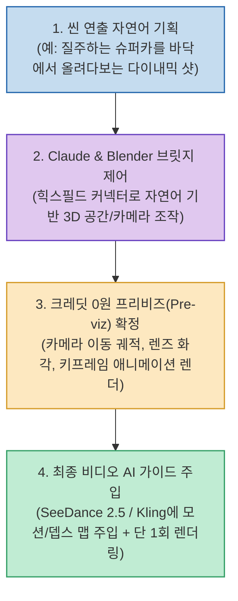

Kling, Runway, Luma Dream Machine, Sora 같은 최신 비디오 생성 AI 도구들이 대중화되면서 누구나 몇 줄의 텍스트만으로 영화 같은 영상을 만들 수 있게 되었습니다. 하지만 실제 상용 프로젝트나 정교한 숏폼 콘텐츠를 제작해 본 사람들은 하나같이 입을 모아 **"비디오 AI의 크레딧이 감당할 수 없을 만큼 빠르게 증발한다"** 고 토로합니다.

"로우 앵글에서 자동차를 올려다보며 빠르게 코너를 회전하는 트래킹 카메라 샷"을 프롬프트로 아무리 상세히 적어도, AI 모델이 매번 앵글과 궤적을 제각각으로 해석하기 때문입니다. 마음에 드는 구도 하나를 건지기 위해 수십 번씩 재렌더링을 돌리다 보면 수만 원 상당의 유료 크레딧이 허공으로 날아갑니다.

유튜브 채널 **'조팀장의 AI 공략집'** 은 이 문제를 해결하기 위해 자연어로 조작하는 Claude와 오픈소스 3D 툴 Blender를 결합하여, **비디오 AI 크레딧 소모 0원으로 완벽한 카메라 무빙 프리비즈(Pre-visualization)를 먼저 확정한 뒤 최종 영상을 렌더링하는 실전 파이프라인** 을 공개했습니다. 그 핵심 워크플로우를 심층 분석합니다.

<!--more-->

## Sources

- [YouTube 영상: 조팀장의 AI 공략집 - 현 시점 크레딧 낭비 없이, 가장 똑똑하게 AI 영상 만드는 법 | Claude & Blender](https://youtu.be/z-51U-OCTFc)

---

## 1. 0원 프리비즈 기반 AI 영상 제작 파이프라인

시행착오와 카메라 각도 수정을 비싼 비디오 생성 AI 모델에서 하지 않고, 무료 3D 툴인 Blender와 Claude 대화 단계에서 완전히 끝내는 구조입니다.



---

## 2. 핵심 워크플로우 3단계

### 1) Claude와 Blender 브릿지 환경 세팅
- **힉스필드(Higgsfield) 플러그인 연결**: 힉스필드 사이트에서 제공하는 브릿지 URL을 복사하여 Claude의 커스텀 커넥터 설정에 등록합니다.
- 이제 Claude는 자연어 대화 창 안에서 로컬에 켜진 Blender를 실시간으로 원격 조작하고 3D 씬을 수정할 수 있는 권한을 얻습니다.

### 2) 자연어로 3D 카메라 궤적 설계 (비용 0원)
- 사용자는 3D 툴의 복잡한 단축키나 파이썬 스크립트를 몰라도 됩니다. Claude에게 원하는 카메라 연출을 일상 언어로 설명합니다:
  ```text
  "카메라를 Z축 지면 근처로 낮추고, 자동차가 좌측에서 우측으로 드리프트할 때 
  차체 전면을 중심에 둔 채 타이트하게 추적하는 3초짜리 트래킹 무빙을 블렌더에 설정해줘."
  ```
- Claude가 Blender 내에서 가상 카메라의 이동 패스, 키프레임 보간, 렌즈 초점 거리를 자동으로 잡아 프리비즈 와이어프레임 영상을 렌더링합니다. 이 단계에서 유료 AI 크레딧은 전혀 들지 않습니다.

### 3) 모션 가이드를 통한 1회 확정 렌더링
- Blender에서 추출한 프리비즈 카메라 모션 데이터(또는 Depth Map)와 함께 피사체 고화질 키프레임 이미지를 최신 비디오 생성 AI(SeeDance 2.5, Kling 등)의 컨트롤넷/모션 가이드로 입력합니다.
- 비디오 모델은 사용자가 확정한 3D 카메라 궤적을 100% 그대로 따라가며 실사 텍스처를 입히므로, **단 1회의 비디오 렌더링만으로 완벽한 의도의 영상** 이 출력됩니다.

---

## 3. 이 워크플로우의 3대 실무적 강점

1. **크레딧 소모 90% 이상 절감**:
   - 구도 실패로 인한 무의미한 재시도를 무료 도구(Blender)에서 사전에 모두 제거하므로 유료 크레딧 낭비가 원천 차단됩니다.
2. **카메라 에셋의 무한 재활용성**:
   - 한 번 정교하게 설계해 둔 카메라 트래킹/틸트/줌 세팅은 그대로 보존하고, 배경(도심 ➔ 설원 ➔ 미래 도시)이나 등장 피사체(차량 ➔ 러너 ➔ 로봇)만 바꾸어 수십 편의 영상을 공장형으로 양산할 수 있습니다.
3. **감독 수준의 정밀한 카메라 연출 통제권**:
   - 텍스트 프롬프트만으로는 도저히 불가능했던 패닝 속도 조절, 카메라 왜곡 제어, 피사체와의 상대적 거리 유지가 픽셀 단위로 정확하게 구현됩니다.
