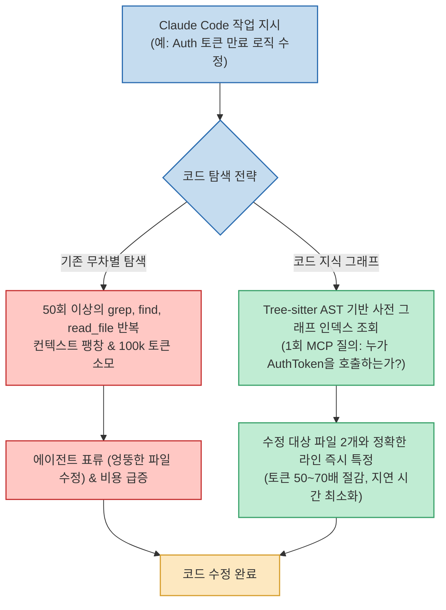

Anthropic의 Claude Code나 Cursor 같은 자율 코딩 에이전트를 실무 대규모 리포지토리에 투입했을 때 가장 뼈아픈 문제는 무엇일까요? 모델의 코딩 실력이 아니라, 단 몇 줄을 고치기 위해 코드베이스 전체를 헤매며 수십 번씩 호출하는 **'탐색 루프의 숨은 세금(Discovery Loop Tax)'** 입니다.

에이전트는 전체 구조를 한눈에 볼 수 없기 때문에 `grep`, `find`, `ls`, `read_file`을 수십 번씩 실행하며 파일들을 뒤적거립니다. 이 과정에서 수만~수십만 토큰이 허공으로 날아가고, 무관한 파일까지 읽다가 원래 작업 목적을 망각하는 **'에이전트 표류(Agent Drift)'** 와 환각이 발생합니다.

해외 AI 개발 전문 채널 The Gray Cat(@thegraytcat)은 이 탐색 병목을 근본적으로 제거하기 위해 코드베이스를 사전 인덱싱하는 양대 오픈소스 지식 그래프 도구인 **Graphify** 와 **CodeGraph** 를 Claude Code 환경에서 직접 맞비교 벤치마크했습니다. 두 도구의 아키텍처 차이점과 실무 벤치마크 결과를 분석합니다.

<!--more-->

## Sources

- [YouTube 벤치마크 영상: The Gray Cat - Graphify vs CodeGraph: I Tested Both With Claude Code](https://youtu.be/Xr2MjfirjqA?si=ANVBFgZiJXWE-Bt-)

---

## 1. 나이브 탐색 vs 코드 지식 그래프(Code Graph) 아키텍처

코드 지식 그래프는 소스코드의 함수, 클래스, 메서드, 모듈을 노드(Node)로 추출하고, 이들 간의 호출(Calls), 임포트(Imports), 상속(Inherits) 관계를 엣지(Edge)로 사전에 연결해 둡니다.

---

## 2. Graphify vs CodeGraph 상세 비교

두 도구 모두 문법 파싱에 고성능 **Tree-sitter** 를 사용하지만, 지향하는 연동 방식과 데이터 커버리지에서 뚜렷한 차이를 보입니다.

### 1) CodeGraph: SQLite 기반의 표준 MCP 서버
- **핵심 엔진**: Tree-sitter + SQLite 관계형 그래프.
- **연동 메커니즘**: **MCP (Model Context Protocol)** 서버.
- **주요 특징**:
  - Claude Code, Cursor, Cline의 설정 파일에 MCP 서버로 등록하기만 하면 즉시 표준 도구(`codegraph_query`)로 활성화됩니다.
  - 심볼 정의, 호출 계층, 상속 관계를 SQL 질의 기반으로 초고속 탐색합니다.
  - 별도의 복잡한 세팅 없이 순수 소스코드 탐색에 가장 직관적이고 표준화된 경험을 제공합니다.

### 2) Graphify: 코드와 문서를 아우르는 멀티모달 지식 그래프
- **핵심 엔진**: Tree-sitter 로컬 AST 분석기 + 멀티 소스 연결기.
- **연동 메커니즘**: CLI 도구 및 Claude Code / Cursor 전용 훅(Hooks).
- **주요 특징**:
  - 단순 코드 심볼에 머무르지 않고, 프로젝트 내 **마크다운 문서, RFC 설계서, PDF 기획서, SQL 스키마** 까지 하나의 그래프로 결합합니다.
  - "이 코드가 왜 이렇게 작성되었는가"에 대한 아키텍처 의도(Docs)와 실제 코드(Code) 사이의 상호 참조를 제공하여, 대규모 모노레포에서 에이전트가 비즈니스 맥락을 잃지 않도록 돕습니다.

---

## 3. Claude Code 실전 벤치마크 결과

실제 복잡한 오픈소스 리포지토리에서 다중 파일 리팩토링 과제를 수행한 결과입니다:

- **탐색 도구 부재 시 (기본 Claude Code)**:
  - 파일 위치를 찾기 위해 평균 40~60회의 파일 읽기 및 탐색 툴 콜을 반복했습니다.
  - 파일 로딩이 누적되면서 컨텍스트 캐시가 밀려나고, 작업 완료까지 수 분 이상 소요되었습니다.
- **지식 그래프 연동 시 (Graphify / CodeGraph)**:
  - 에이전트는 시작 단계에서 단 1~2회의 그래프 질의를 통해 연관된 모듈과 호출 지점을 완벽히 파악했습니다.
  - 탐색 단계의 토큰 소모량이 **기존 대비 50~70배 감소** 하였으며, 엉뚱한 파일을 수정하려는 시도가 완전히 사라졌습니다.

---

## 4. 어떤 도구를 선택해야 할까?

- **CodeGraph가 적합한 팀**: 표준 MCP 프로토콜을 선호하며, 순수 소스코드의 함수/클래스 호출 관계를 빠르고 가볍게 탐색하고자 하는 프로젝트.
- **Graphify가 적합한 팀**: 코드뿐만 아니라 방대한 기획 문서, 설계서, DB 스키마가 리포지토리에 함께 존재하여, 에이전트에게 전체 프로젝트의 "개념적 지도"를 쥐어줘야 하는 대규모 시스템.
