개발자의 생산성을 좌우하는 요인은 거창한 시스템 아키텍처 이론이나 복잡한 프레임워크 지식만이 아닙니다. 오히려 하루에도 수십 번씩 터미널과 에디터에서 반복하는 **"작은 프로그래밍 요령(Small Tricks)"** 들이 쌓여 개발 속도와 디버깅의 피로도를 결정짓습니다.

많은 사전 지식 없이도 오늘 당장 활용할 수 있는 작은 도구와 단축 명령들은 작업의 마찰(Friction)을 줄이고 생각의 흐름이 끊기지 않도록 돕습니다. 소프트웨어 엔지니어 Will Keleher가 정리한 실전 테크닉과 해커뉴스(HN) 개발자들의 토론을 바탕으로, 터미널·Git·SQL의 핵심 요령과 **"AI 에이전트를 관찰하며 새로운 도구를 배우는 최신 학습법"** 을 정리합니다.

<!--more-->

## Sources

- [GeekNews 토픽: 작은 프로그래밍 요령들](https://news.hada.io/topic?id=33778)
- [Will Keleher 블로그 원문: Small Programming Tricks That Matter](https://will-keleher.com/posts/small-programming-tricks-matter/)
- [Hacker News 토론: Small Programming Tricks That Matter](https://news.ycombinator.com/item?id=49729000)

---

## 1. 개발자 생산성을 높이는 4대 영역의 작은 지식들

```mermaid
flowchart TD
    classDef termNode fill:#c5dcef,stroke:#2b6cb0,stroke-width:1.5px,color:#333;
    classDef gitNode fill:#e0c8ef,stroke:#6b46c1,stroke-width:1.5px,color:#333;
    classDef sqlNode fill:#c0ecd3,stroke:#38a169,stroke-width:1.5px,color:#333;
    classDef aiNode fill:#fde8c0,stroke:#d69e2e,stroke-width:1.5px,color:#333;
    classDef hubNode fill:#ffc8c4,stroke:#c53030,stroke-width:1.5px,color:#333;

    Hub["엔지니어링 일상 생산성 루프"] --> T["1. 터미널 & 셸 환경"]
    Hub --> G["2. Git 버전 관리 & 탐색"]
    Hub --> S["3. 데이터 확인 & SQL 검증"]
    Hub --> A["4. AI 에이전트 관찰 학습"]

    T --> T1["fzf 퍼지 검색 & atuin SQLite 히스토리"]
    T --> T2["find 대신 globstar (**/*.md) & ripgrep(rg)"]
    T --> T3["python3 -m http.server 즉시 로컬 서빙"]

    G --> G1["git log -S pattern (문자열 추가/삭제 추적)"]
    G --> G2["git log -G pattern (코드 변경 맥락 추적)"]
    G --> G3["git checkout - (이전 브랜치 고속 복귀)"]

    S --> S1["FROM 없는 SELECT로 DB 내장 함수 즉시 검증"]
    S --> S2["EXPLAIN ANALYZE로 실제 쿼리 실행 병목 측정"]

    A --> A1["Claude Code/Cursor의 CLI 옵션 수동 승인 관찰"]
    A --> A2["자주 쓰이는 복합 명령을 Makefile/Taskfile 표준화"]

    class Hub hubNode;
    class T,T1,T2,T3 termNode;
    class G,G1,G2,G3 gitNode;
    class S,S1,S2 sqlNode;
    class A,A1,A2 aiNode;
```

---

## 2. 실무에서 바로 써먹는 영역별 핵심 팁

### 1) 터미널 & 셸 환경 (Shell & CLI)
- **즉석 파일 공유 서버**: 별도 패키지 설치 없이 `python3 -m http.server` 한 줄이면 현재 디렉터리의 정적 HTML과 파일들을 로컬 네트워크 브라우저로 즉시 서비스할 수 있습니다.
- **셸 히스토리 혁신**:
  - `fzf`를 연동해 `Ctrl + R`을 누르면 퍼지 검색으로 과거 수개월 치 명령을 단어 조각만으로 즉시 찾아냅니다.
  - `atuin`을 사용하면 셸 이력을 SQLite에 저장하여 디렉터리별 실행 이력 분리와 직관적인 방향키 탐색을 지원합니다.
- **복잡한 `find` 대신 셸 글롭(Globstar) 활용**: 많은 경우 복잡한 find 명령어 대신 `**/*.md` 같은 재귀 글롭을 사용하는 것만으로 충분합니다 (Bash는 `shopt -s globstar` 활성화 필요).
- **고속 텍스트 검색**: 레거시 grep, ack 대신 멀티스레드 기반의 `rg` (ripgrep)를 기본 검색 도구로 표준화합니다.

### 2) Git 변경 이력 추적과 고속 상태 전환
- **Git Pickaxe (`git log -S "특정함수"`)**: 특정 문자열이나 함수명이 코드베이스에 **처음 추가되거나 완전히 삭제된 커밋** 만 정확히 집어냅니다. 오래된 모노레포에서 특정 로직이 언제 도입되었는지 추적할 때 최고의 무기입니다.
- **이동 추적 (`git log -G "정규식"`)**: 라인이 수정되거나 다른 블록으로 이동한 이력까지 함께 필터링합니다.
- **이전 작업 위치 즉시 복귀**: 디렉터리 이동 시 `cd -`를 쓰듯, 브랜치를 오갈 때 `git checkout -`를 사용하면 직전 작업 브랜치나 HEAD로 즉각 전환됩니다.

### 3) SQL 데이터 검증과 성능 프로파일링
- **`FROM` 절 없는 단독 `SELECT`**: 데이터베이스 내장 함수의 실제 동작이나 연산자 결과(예: `SELECT TRUE <> NULL;`)를 확인할 때 번거롭게 더미 테이블을 조회할 필요 없이 단독 SELECT로 검증합니다.
- **`EXPLAIN ANALYZE`**: 플래너의 추정치가 아니라 쿼리를 데이터베이스에서 직접 실행한 뒤 실제 소요된 노드별 밀리초 단위 실행 시간을 측정하여 인덱스 누락을 포착합니다.

---

## 3. 새로운 관점: "AI 에이전트를 관찰하며 요령 배우기"

이번 주제의 해커뉴스 토론에서 가장 큰 공감을 얻은 지점은 **"AI 코딩 에이전트의 작업 과정을 지켜보는 것이 최고의 학습법이 된다"** 는 조언이었습니다.

- **명령별 수동 승인 모드 활용**:
  - Claude Code나 Cursor에게 완전 자율 실행을 맡기는 대신, 터미널 명령을 하나씩 검토하고 승인하는 모드를 켜둡니다.
  - 에이전트가 복잡한 시스템 장애나 성능 튜닝 문제를 해결할 때 실행하는 `perf`, `sed`, `awk`, `git` 고급 플래그를 유심히 관찰하면, 내가 수년간 몰랐던 기상천외하고 효율적인 CLI 요령을 발견하게 됩니다.
- **단축키보다 스크립트 표준화**:
  - 알게 된 유용한 명령어 조합은 머리로만 외우려 하지 말고, `Taskfile`, `Makefile`, `Mise` 같은 프로젝트 도구에 스크립트로 즉시 박아두는 것이 진정한 데브옵스 생산성의 완성입니다.
