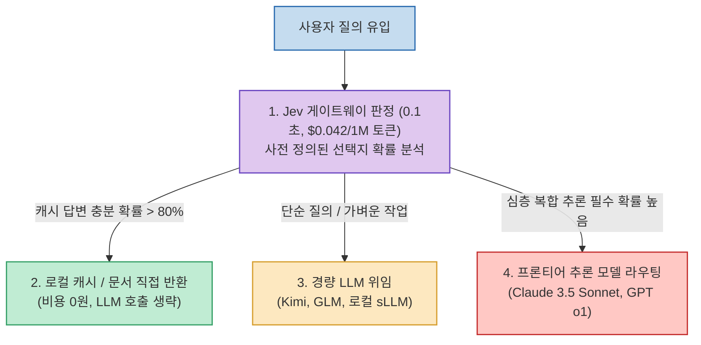

GPT-4o, Claude 3.5 Sonnet, OpenAI o1 같은 대형 언어 모델(LLM)을 사용할 때 우리는 종종 모델이 사람처럼 '생각하고 판단'한다고 착각합니다. 하지만 본질적으로 이들은 앞서 입력된 텍스트를 보고 다음 토큰(단어 조각)을 확률적으로 이어 붙이는 오토리그레시브(Autoregressive) 기반의 **'문장 생성 기계'** 에 불과합니다.

단순히 "이 질문에 대해 A안과 B안 중 무엇이 옳은가?", "이 요청이 사내 캐시 데이터로 처리가 가능한가?" 같은 예/아니오 판정을 내릴 때조차, LLM은 수십 줄의 장황한 설명을 줄줄이 써 내려가느라 수 초의 지연 시간과 불필요한 토큰 비용을 소모합니다.

TypeSafe AI가 공개한 **Jev (typesafe.ai)** 는 이러한 고정관념을 정면으로 뒤집고, **"판단(Decision)과 문장 생성(Generation)을 완전히 분리"** 한 초고속 의사결정 특화 **'System 1' 비-오토리그레시브 모델** 입니다. 글을 단 한 줄도 쓰지 않고 0.1초 만에 수학적 확률만을 반환하는 Jev의 아키텍처와 실무 라우팅 활용법을 정리합니다.

<!--more-->

## Sources

- [공식 웹사이트: TypeSafe AI](https://typesafe.ai/)
- [커뮤니티 쇼케이스: awesomejev.com](https://awesomejev.com/)
- [Threads 기술 인사이트: @dante.labs.pro](https://www.threads.com/share/BAZMQ9CX6m/)

---

## 1. Jev 기반 지능형 모델 라우터 (jev-router) 아키텍처

Jev는 무거운 프론티어 LLM을 직접 호출하기 전, 앞단에서 요청의 복잡도와 필요한 자원을 0.1초 만에 감별하는 **초고속 게이트웨이(Gateway)** 로 동작합니다.

---

## 2. Jev의 핵심 기술적 차별점

### 1) 문장을 쓰지 않는 구조적 무환각 (Zero Hallucination)
- Jev는 자연어 문장을 생성하지 않습니다. "예/아니오", "A·B·C 중 선택", "1~5점 점수"처럼 사전에 타입이 정의된(Typed Output) 정형화된 선택지 안에서만 작동합니다.
- "선택지 A일 확률 91%"와 같이 정밀하게 보정된 확률값(Calibrated Confidence Score)만을 숫자로 반환하므로, 언어 모델 특유의 문장 환각이나 JSON 파싱 에러가 물리적으로 발생하지 않습니다.

### 2) 압도적인 지연 시간과 비용 절감
- **응답 속도**: 평균 **0.1초대** (기존 프론티어 모델 대비 40~200배 고속).
- **호출 비용**: 입력 100만 토큰당 **$0.042** (출력 텍스트가 없으므로 출력 토큰 비용은 **$0**). 기존 대형 모델 대비 최대 400배 저렴합니다.

### 3) LLM과의 분업(Division of Labor)
- Jev와 대형 LLM은 경쟁 관계가 아닙니다. **"판단은 Jev가 0.1초 만에 저비용으로 끝내고, 복잡한 글쓰기와 깊은 서술은 LLM이 맡는 분업 구조"** 를 형성합니다.

---

## 3. 실무 응용 사례 (Awesome Jev)

1. **지능형 비용 절감 라우터 (`jev-router`)**:
   - 모든 사용자 요청을 무조건 비싼 최상위 모델로 보내지 않고, Jev를 통해 질문 난이도와 로컬 데이터 적합성을 먼저 판별함으로써 전체 AI 인프라 API 비용을 **80% 이상 절감**.
2. **브라우저 및 데스크톱 GUI 자동화 (`browser-use/jev-ultrafast`)**:
   - 화면 스크린샷과 UI 요소를 분석해 "지금 클릭해야 할 버튼이 로그인인가, 취소인가"를 0.1초 만에 분기 결정.
3. **고속 AI 평가 및 모더레이션 (LLM-as-a-Judge)**:
   - 생성된 텍스트가 가이드라인에 부합하는지 여부를 실시간으로 판정 및 채점.

---

## 4. 실전 호출 및 이용 방법

TypeSafe 공식 대기 명단 외에도 아래 두 가지 우회 경로를 통해 즉시 프로덕션에 적용할 수 있습니다:
- **Vercel AI Gateway**: 모델명 `typesafe-ai/jev`로 등록되어 Gateway 키만으로 대기 없이 즉시 호출 가능.
- **Cloudflare Workers AI**: `env.AI.run('typesafe/jev', ...)` 형태로 서버리스 엣지 환경에서 선불 크레딧으로 구동 가능 (32k 컨텍스트 지원).
- 브라우저 상에서 기능을 직접 시험해 보려면 공식 웹 플레이그라운드(`console.typesafe.ai`)를 활용할 수 있습니다.
