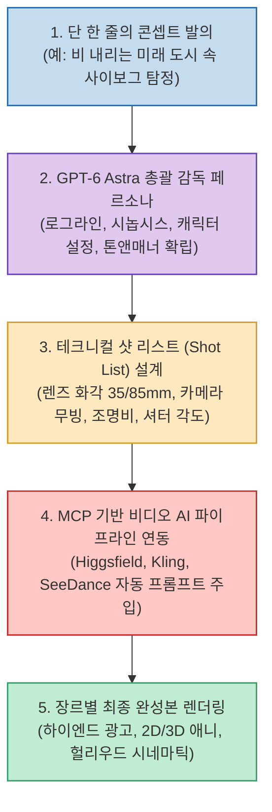

Sora, Kling, Runway Gen-3 등 초고화질 비디오 생성 AI가 보편화되었지만, 여전히 완성도 높은 한 편의 영상을 만들어내는 일은 쉽지 않습니다. 단편적인 5초짜리 클립을 뽑아내는 것을 넘어, 스토리의 기승전결을 구성하고 일관된 비주얼 톤을 유지하며 카메라 워크를 지휘하는 일은 전문적인 영상 감독의 영역이었기 때문입니다.

유튜브 채널 **'피프(PPT)'** 는 OpenAI의 차세대 멀티모달 프론티어 모델 **'GPT-6 Astra'** 에게 단순한 텍스트 질문을 던지는 대신 **'총괄 영상 감독(Executive Director)'** 의 페르소나를 부여하고, 단 한 줄의 아이디어로부터 브랜드 광고(CF), 애니메이션, 영화 시네마틱 트레일러를 원스톱으로 제작하는 파격적인 엔드투엔드 실험을 공개했습니다.

기획자 한 사람이 거대 프로덕션 규모의 영상 제작 파이프라인을 운영할 수 있게 돕는 GPT-6 Astra의 디렉팅 메커니즘과 실전 워크플로우를 분석합니다.

<!--more-->

## Sources

- [YouTube 영상: 피프 - GPT 6 Astra한테 광고, 애니, 영화 다 맡겨봤습니다](https://youtu.be/FmYHXKhDDCM)

---

## 1. 1인 AI 프로덕션 스튜디오 디렉팅 파이프라인

기획자가 러프한 아이디어를 제시하면, GPT-6 Astra가 전문적인 영화 연출 감독의 언어로 샷 리스트를 구체화하고, 이를 MCP(Model Context Protocol)를 통해 비디오 생성 엔진에 직결하는 아키텍처입니다.

---

## 2. GPT-6 Astra의 3단계 영상 디렉팅 메커니즘

### 1) 한 문장에서 기획·각본까지 완성 (Concept to Screenplay)
- 사용자가 *"도시의 네온사인 아래 잃어버린 기억을 추적하는 이야기"* 와 같은 원시적인 아이디어만 입력해도, Astra는 스토리 구조를 3막(도입-위기-절정)으로 분해하고 캐릭터 설정집과 시각적 분위기를 정의하는 무드보드를 즉시 도출합니다.

### 2) 전문 촬영 감독 수준의 샷 리스트 분해
- 막연히 "멋진 영상"을 요구하는 일반 프롬프트와 달리, Astra는 영상 생성 AI가 가장 오독하기 쉬운 기술적 파라미터를 명시합니다:
  - **카메라 렌즈**: 인물 감정 클로즈업용 85mm F1.4, 공간 압도감을 위한 24mm 아나모픽 렌즈.
  - **카메라 무빙**: 트래킹 돌리 인(Tracking Dolly In), 로우 앵글 크레인 업, 360도 오비트 샷.
  - **조명 및 톤**: 사이버펑크 네온 블루 앤 마젠타 림라이트, 텅스텐 키라이트.

### 3) MCP 브릿지를 통한 영상 엔진 직결
- Astra가 설계한 프롬프트는 사람이 복사·붙여넣기할 필요 없이, **MCP(Model Context Protocol)** 및 **힉스필드(Higgsfield)** 브릿지를 통해 비디오 생성 엔진(Kling, SeeDance 등)으로 자동 전달되어 씬별 키프레임과 영상 클립을 연속 생성합니다.

---

## 3. 3대 장르별 실전 제작 테스트 및 결과

1. **프리미엄 브랜드 광고 (Commercial Ad)**
   - 콘셉트: 하이엔드 럭셔리 워치 / 향수 광고.
   - 시계 다이얼의 정밀한 금속 질감, 베젤을 타고 흐르는 빛의 반사, 매크로 렌즈 클로즈업을 결합하여 상용 TV CF 수준의 비주얼 완성.
2. **2D/3D 스타일 애니메이션 (Anime)**
   - 셀 애니메이션 특유의 감각적인 선화 텍스처와 역동적인 액션 라인을 유지하면서, 컷 전환 시에도 주인공 캐릭터의 얼굴과 의상 디자인 일관성을 안정적으로 방어.
3. **헐리우드 시네마틱 트레일러 (Movie Trailer)**
   - 도입부의 미스터리한 복선 ➔ 중반부의 긴박한 체이스 ➔ 절정부의 폭발적 몽타주와 오케스트라 사운드 큐 연동까지 계산하여 실제 극장 개봉작 트레일러에 버금가는 흡인력 연출.

---

## 4. 1인 크리에이터를 위한 실무적 인사이트

- **테크니컬 스킬에서 '디렉팅 역량'으로의 이동**:
  - 타임라인을 일일이 자르고 붙이는 편집 툴의 기술적 숙련도보다, **"AI에게 어떤 세계관을 지시하고 어떤 샷 리스트를 끌어낼 것인가(Prompt Directing)"** 가 창작자의 핵심 경쟁력이 되었습니다.
- **프로덕션 비용과 시간의 압축**:
  - 수천만 원의 제작비와 수십 명의 스태프가 필요했던 콘셉트 필름 제작이, 이제 단 1명의 기획자와 GPT-6 Astra 에이전트의 협업만으로 하루 만에 완결되는 시대가 도래했습니다.
