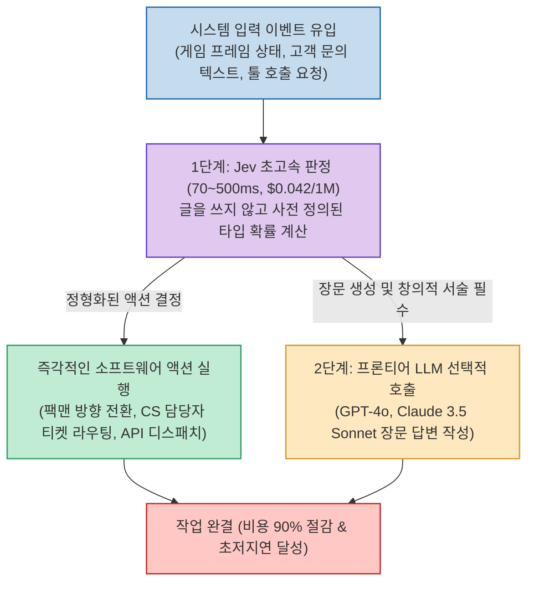

우리가 일상적으로 사용하는 ChatGPT, Claude, Gemini 같은 최신 생성형 AI 모델들은 사람이 읽는 자연스러운 문장을 단어 단위로 이어 붙이는 데 최적화되어 있습니다. 하지만 소프트웨어나 자율 에이전트 시스템에서는 "장황하게 설명하는 긴 글"보다 **"0.1초 만에 오류 없이 내려지는 정확한 판단(Decision)"** 이 훨씬 더 절실한 경우가 많습니다.

전 OpenAI 연구원 디오고 알메이다(Diogo Almeida)가 설립한 스타트업 **타입세이프(TypeSafe) AI** 가 공개한 **Jev(제브)** 는 이러한 기계 친화적 지능(Machine-Native Intelligence)을 극대화한 비-오토리그레시브 의사결정 전용 모델입니다.

유튜브 채널 **'Play with AI Lab'** 이 공개한 **"Jev 모델 공개! 최대 200배 빠르고, 400배 저렴한 AI"** 영상 분석을 바탕으로, 팩맨 게임 실시간 제어 시연과 실무 벤치마크, 그리고 거대 LLM과 Jev를 결합하는 2단계 하이브리드 아키텍처를 심층 분석합니다.

<!--more-->

## Sources

- [YouTube 영상: Play with AI Lab - Jev 모델 공개! 최대 200배 빠르고, 400배 저렴한 AI (TypeSafe AI)](https://youtu.be/z4Py5ZQetcA?si=AdeO8rO_bF6byU-Z)
- [공식 웹사이트: TypeSafe AI](https://typesafe.ai/)
- [커뮤니티 프로젝트 쇼케이스: awesomejev.com](https://awesomejev.com/)

---

## 1. 2단계 하이브리드 의사결정 파이프라인 (Jev + LLM)

Jev는 문장을 쓰는 대신 초고속으로 결정을 내리는 'System 1(직관적 판단)' 계층을 담당하고, 실제 장문의 글쓰기가 필요한 순간에만 대형 LLM(System 2)을 선택적으로 호출하는 분업 구조를 취합니다.

---

## 2. Play with AI Lab이 증명한 주요 벤치마크 및 시연

### 1) 팩맨(Pacman) 실시간 게임 제어 데모
- 영상에서 가장 눈길을 끈 실험은 실시간 아케이드 게임인 팩맨의 플레이입니다.
- 유령의 위치와 먹이 맵 데이터를 프레임 단위로 수신했을 때, Jev는 **70ms(0.07초) 내에 상/하/좌/우 중 최적의 이동 방향을 결정** 하여 매끄럽게 게임을 플레이합니다.
- 수 초의 지연이 발생하는 기존 LLM으로는 불가능했던 실시간 런타임 환경에 AI 의사결정이 즉시 적용될 수 있음을 보여줍니다.

### 2) 대규모 데이터셋 자동 라벨링 및 CS 티켓 라우팅
- 하루 수만 건 이상 발생하는 고객 지원 문의 텍스트를 인입 즉시 환불, 계정, 장애 등 담당 부서로 분류합니다.
- 기존 LLM으로 처리할 경우 수십만 원의 API 비용과 수 분의 대기가 발생하지만, Jev를 적용하면 **단돈 몇 센트의 비용으로 수 초 만에 일괄 라우팅** 이 완료됩니다.

---

## 3. 핵심 수치: 왜 200배 빠르고 400배 저렴한가?

- **지연 시간 (Latency)**:
  - 기존 프론티어 LLM: 2초 ~ 5초 (문장 전체 생성 대기).
  - TypeSafe Jev: **70ms ~ 500ms** (선택지 확률값만 반환).
- **호출 비용 (Cost)**:
  - 입력 100만 토큰당 **$0.042** (약 58원).
  - 출력 토큰 비용은 **$0 (무료)**: 문장을 짓지 않고 타입 결정값만 주므로 출력 토큰 과금이 발생하지 않습니다.
- **원천적 무환각 (Zero Hallucination)**:
  - 정해진 스키마(Choice, Score, Boolean) 내에서 수학적 신뢰도 점수(Calibrated Confidence)만 반환하므로 문장 환각이나 JSON 깨짐 현상이 완전히 차단됩니다.

---

## 4. 결론: "모든 것에 LLM을 쓰던 시대의 종말"

Play with AI Lab 영상이 전달하는 가장 강력한 메시지는 **AI 시스템 아키텍처의 패러다임 시프트** 입니다.

사소한 분류나 예/아니오 판정, 툴 선택까지 수천억 개의 파라미터를 가진 거대 LLM에 맡기는 것은 "자전거로 배달할 수 있는 작은 편지를 대형 덤프트럭으로 나르는 것"과 같습니다. 

판단과 라우팅은 0.1초 만에 끝내는 Jev에게 맡기고, 진짜 사람의 감성과 복합 서술이 필요한 마지막 순간에만 LLM을 호출하는 **2단계 하이브리드 파이프라인** 이야말로 비용과 성능을 모두 잡는 차세대 엔터프라이즈 AI의 표준이 될 것입니다.
