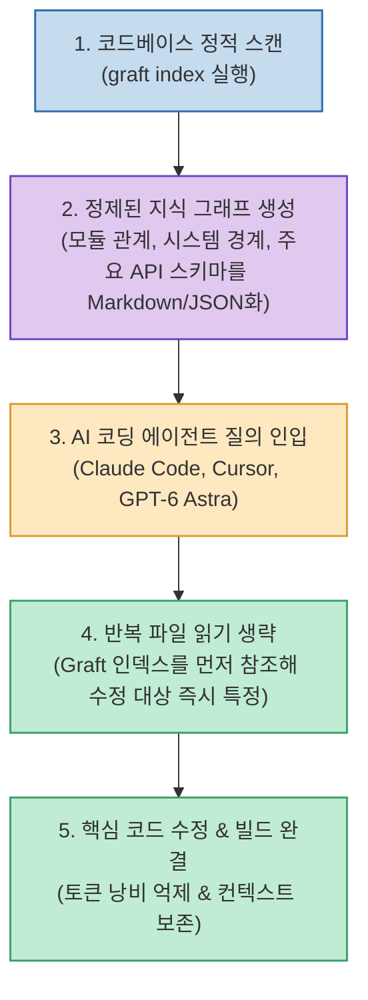

Claude Code, Cursor, Codex, GPT-6 Astra 등 자율 코딩 에이전트를 실무에서 활발히 사용하는 엔지니어들이 겪는 가장 큰 고민거리는 매 세션마다 눈덩이처럼 불어나는 **'탐색 토큰 비용'** 입니다. 파일 몇 개를 고치기 위해 에이전트가 코드베이스 전체를 훑으며 수십 번씩 `grep`과 `read_file`을 반복하다 보면, 정작 실제 코드 작성에는 몇 토큰 쓰지도 못하고 컨텍스트 한도에 도달하거나 비싼 API 요금 고지서를 마주하게 됩니다.

이러한 탐색 병목을 해결하겠다며 최근 GitHub 트렌딩 1위에 오른 오픈소스 도구가 바로 **Graft (NanoNets/Graft)** 입니다. 제작사는 "툴 호출 46% 감소, 토큰 사용량 42% 절감, 시간 60% 단축"을 내걸었습니다.

유튜브 채널 **'개발동생'** 은 이 수치가 과장된 마케팅 문구인지 확인하기 위해 무려 **96회에 걸친 직접 실측 벤치마크** 를 수행했습니다. 영상의 정밀한 테스트 결과와 에이전트 결합 노하우를 정리합니다.

<!--more-->

## Sources

- [YouTube 영상: 개발동생 - 토큰 42% 줄인다는 GitHub 트렌딩 Graft, 직접 실측해보겠습니다. | Astra 같이 쓰세요](https://youtu.be/j7ED8Irjp0o?si=f2U_SQc0_TL3yT0q)
- [GitHub 저장소: NanoNets/Graft](https://github.com/NanoNets/Graft)

---

## 1. Graft 기반 컨텍스트 레이어 아키텍처

Graft는 에이전트가 코드를 무차별적으로 읽기 전에, 사전에 정적 분석을 통해 코드베이스의 시스템 구조와 모듈 간 의존성을 가벼운 **지식 그래프(Markdown / JSON)** 로 구축해 두는 프론트엔드 컨텍스트 레이어입니다.



---

## 2. 개발동생의 96회 실측 벤치마크 결과

개발동생 채널은 가벼운 토이 프로젝트부터 복잡한 대형 모노레포까지 다양한 과제를 설정하고 96회에 걸쳐 실제 토큰 사용량과 응답 시간을 측정했습니다:

### 1) 토큰 절감률 실측
- **소형 및 중소형 프로젝트**: 실제로 **39% ~ 50% 수준의 확실한 토큰 절감** 이 확인되었습니다. 공식 주장(42%)과 거의 일치하는 수치입니다.
- **대형 프로젝트 (무거운 탐색 과제)**: 절감 효과가 다소 둔화되어 **약 27% 수준의 토큰 절감** 을 기록했습니다.

### 2) 작업 완료 시간(Latency)의 진실
- 가벼운 탐색 과제에서는 시간이 단축되었으나,
- **대규모 모노레포에서는 오히려 초기 지식 그래프 로딩 및 파싱 오버헤드로 인해 작업 완료 시간이 비슷하거나 미세하게 더 늘어나는 현상** 이 관측되었습니다.

---

## 3. 실무 엔지니어를 위한 Graft 실전 활용 팁

### 1) GPT-6 Astra 및 고성능 에이전트와의 시너지
- Astra나 o1처럼 지능이 뛰어나지만 토큰 단가가 높은 프론티어 모델을 쓸 때, Graft를 컨텍스트 오프로딩(Context Offloading) 도구로 함께 물려주면 **"비싼 모델이 파일 위치를 찾느라 돈을 낭비하는 현상"** 을 효과적으로 방어할 수 있습니다.

### 2) ⚠️ 필수 보안 설정 (원격 텔레메트리 끄기)
- Graft는 오픈소스이지만 설치 시 기본적으로 사용 통계와 메트릭을 수집하는 텔레메트리(Telemetry)가 활성화되어 있습니다.
- 사내 기밀 코드나 비공개 저장소에서 작업할 때는 설치 직후 반드시 아래 명령어를 실행하여 원격 수집을 차단해야 합니다:
  ```bash
  graft telemetry disable
  ```

---

## 4. 결론: "마법은 아니지만, 지갑을 지켜주는 유용한 도구"

Graft는 모든 대형 프로젝트의 속도를 무조건 단축해 주는 마법의 만능 도구는 아닙니다. 하지만 구조 파악 위주의 일상적인 개발 작업과 탐색 중심 세션에서는 **토큰 사용량을 30~50%가량 확실히 깎아주는 든든한 방어선** 역할을 해냅니다.

AI 코딩 툴의 월간 크레딧이나 API 비용 청구서로 고민하는 엔지니어링 팀이라면, 프로젝트 도입을 검토해 볼 충분한 가치가 있습니다.
