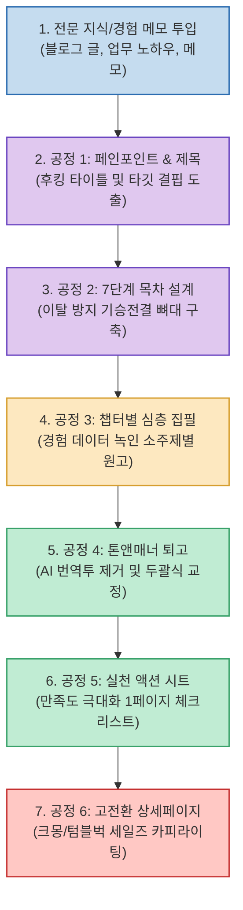

지식 창업이나 1인 부업의 일환으로 PDF 전자책 출판을 결심했다가, 며칠 못 가 백지 상태의 워드 문서를 보며 좌절하는 창작자들이 많습니다. 많은 이들이 인공지능에게 "주식 투자 전자책 50페이지 써줘"라고 무턱대고 명령하지만, 돌아오는 것은 인터넷 백과사전을 긁어모은 듯한 뻔하고 건조한 요약본뿐입니다. 단일 프롬프트로는 책 한 권을 관통하는 내러티브와 독자의 심리적 허들을 넘는 흡인력을 만들어낼 수 없기 때문입니다.

스레드(Threads)의 지식 비즈니스 전문 크리에이터 **@ad.zerocket (스레드스파이)** 가 공개한 **"Claude 전자책 공장 모드"** 는 전통 출판사의 편집 분업 시스템을 프롬프트 엔지니어링으로 완벽히 재현했습니다.

대규모 문맥 유지력과 세련된 한국어 문체 교정 능력을 갖춘 **Claude** 를 활용해, 주말 이틀(48시간) 만에 시장성 검증부터 원고 탈고, 크몽·텀블벅 세일즈 카피까지 단숨에 완성하는 6단계 원고 공장 파이프라인을 분석합니다.

<!--more-->

## Sources

- [Threads 원문: 스레드스파이 (@ad.zerocket) 공유 글](https://www.threads.com/@ad.zerocket/post/DdlY6c7CQL9)

---

## 1. 계층형 전자책 공장 파이프라인 아키텍처

전자책 공장 모드의 핵심은 **"단계별 산출물의 순차적 체이닝(Chaining)"** 입니다. 한 번에 모든 것을 생성하지 않고, 이전 단계의 검증된 결과물을 다음 프롬프트의 컨텍스트로 주입하여 일관성과 전문성을 유지합니다.

---

## 2. 공장을 돌리는 6대 프롬프트 상세 명세

### 1단계: 시장성 검증 및 후킹 제목 추출 (기획 공정)
- **역할**: 타깃 독자가 겪는 절실한 결핍(Pain Point)을 분석하고, 클릭과 구매를 유도하는 5가지 제목과 부제 조합을 뽑아냅니다.
- **프롬프트 템플릿**:
  > "너는 누적 매출 10억 원의 베스트셀러 전자책 전문 기획자야. 내가 가진 [경험/지식 주제]를 바탕으로, [타깃 독자층]이 일상에서 겪는 가장 절실한 고통 3가지를 분석해줘. 그리고 독자가 보자마자 지갑을 열고 싶게 만드는 숫자가 포함된 메인 제목과 호기심을 자극하는 부제 5세트를 제안해줘."

### 2단계: 이탈률 제로 7단계 챕터 목차 설계 (설계 공정)
- **역할**: 독자가 초반에 포기하지 않고 끝까지 완독하도록 유도하는 커리큘럼 아키텍처를 세웁니다.
- **프롬프트 템플릿**:
  > "선정된 제목 [제목 입력]을 바탕으로, 구매자가 주말 이틀 만에 따라 할 수 있는 7단계 챕터 목차를 짜줘. 서론의 문제 제기부터 핵심 원리, 3단계 실천 로드맵, 흔한 실수 극복법까지 기승전결이 완벽해야 해. 각 챕터마다 포함될 소제목 3개와 핵심 전달 메시지를 요약해줘."

### 3단계: 경험 기반 챕터별 심층 본문 집필 (조립 공정)
- **역할**: AI 특유의 뻔한 교과서 말투를 걷어내고, 실제 현장 데이터와 구체적 수치가 들어간 고밀도 초고를 완성합니다.
- **프롬프트 템플릿**:
  > "제[X]장의 소제목 [소제목명]을 집필해줘. 추상적인 설명은 일절 배제하고, 내 실제 경험 [경험 메모 입력]을 자연스럽게 녹여내줘. 독자가 당장 적용할 수 있는 구체적인 가이드와 실제 수치 예시를 포함해 2,000자 분량으로 작성해줘."

### 4단계: 인간적인 문체 교정 (품질 검사 공정)
- **역할**: AI가 쓴 티를 완전히 없애고 흡인력 있는 두괄식 구어체로 다듬습니다.
- **프롬프트 템플릿**:
  > "방금 작성된 원고에서 AI 특유의 기계적인 표현(~에 대해 알아보겠습니다, 결론적으로 등)과 불필요한 미사여구를 모두 삭제해줘. 문장은 최대 2줄 이내로 끊고, 대화하듯 편안하면서도 전문성이 느껴지는 단문 중심으로 퇴고해줘."

### 5단계: 즉시 실행 부록 & 체크리스트 생성 (부가가치 공정)
- **역할**: 책을 다 읽은 독자가 별점 5점 만점 후기를 남기게 만드는 실천 템플릿을 만듭니다.
- **프롬프트 템플릿**:
  > "이 전자책의 독자가 책을 덮고 바로 모니터 옆에 붙여둘 수 있는 1페이지 요약 체크리스트와 노션(Notion) 복사용 실행 템플릿 양식을 불릿 형태로 깔끔하게 정리해줘."

### 6단계: 고전환 세일즈 카피라이팅 작성 (출하 공정)
- **역할**: 크몽, 탈잉, 텀블벅 등에 즉시 복사해 붙여넣을 수 있는 상세페이지를 작성합니다.
- **프롬프트 템플릿**:
  > "이 전자책의 상세페이지를 PAS(Problem-Agitate-Solution) 공식에 맞춰 작성해줘. 이 책을 읽지 않았을 때 겪게 될 시간적 손실을 강조하고, 얼리버드 구매 혜택과 강력한 환불 보증 문구를 포함해 설득력 있게 써줘."

---

## 3. 실전 성공 노하우: Claude Projects와의 결합

이 공장 모드를 200% 활용하는 비결은 **Claude Projects** 기능을 적극 활용하는 것입니다:

- **Project Knowledge에 내 메모 사전 적재**:
  자신이 과거에 썼던 일기, 블로그 포스팅, 업무 일지, 슬랙 대화록 등을 프로젝트 지식으로 등록해 두면, Claude가 외부의 뻔한 지식이 아닌 **"나만의 고유한 경험"** 만을 재료 삼아 글을 조립합니다.
- **Artifacts로 원고 실시간 누적**:
  챕터별로 완성된 원고를 Claude Artifacts 창에 순차적으로 적재해 나가면, 전체 책의 분량과 톤앤매너를 시각적으로 확인하며 퇴고할 수 있습니다.
- **빠른 시장 검증과 피벗**:
  기획부터 상세페이지까지 48시간 안에 완료되므로, 시장의 반응을 보고 아이템을 빠르게 피벗하거나 여러 권의 니치 전자책 라인업을 단기간에 구축할 수 있습니다.
