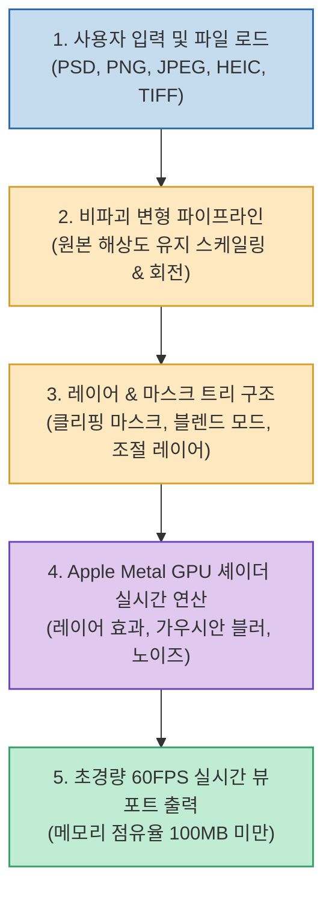

어도비(Adobe)의 크리에이티브 클라우드(Creative Cloud) 구독 모델은 수많은 창작자와 개발자들에게 깊은 피로감을 안겨주었습니다. 매월 결제되는 비싼 구독료는 물론이고, 단지 간단한 이미지 합성이나 누끼 작업, 마스크 조정을 하고 싶을 뿐인데 수 기가바이트(GB)에 달하는 소프트웨어와 정체를 알 수 없는 수십 개의 백그라운드 프로세스가 시스템 자원을 갉아먹기 일쑤입니다.

GIMP나 Photopea 같은 대안이 존재하지만, 손에 익지 않은 어색한 인터페이스와 단축키 체계는 작업의 몰입(Flow)을 끊어버립니다.

이러한 문제의식에서 출발해 스스로 포토샵 구독을 해지하고자 직접 팔을 걷어붙인 개발자가 있습니다. 바로 **Robbie Tilton** 이 공개한 무료 오픈소스 macOS 네이티브 이미지 편집기 **Compositor (`robbietilton/Compositor`, GitHub ⭐ 4.4k+)** 입니다. 놀랍게도 이 앱은 전문적인 레이어 합성 기능을 모두 담고 있으면서도 전체 앱 용량이 단 **12MB** 에 불과합니다.

<!--more-->

## Sources

- [GitHub 저장소: robbietilton/Compositor](https://github.com/robbietilton/Compositor)
- [Threads 원문: CHOI (@choi.openai) 공유 글](https://www.threads.com/@choi.openai/post/DdfWvkSDJfU)
- [개발자 개인 웹사이트: robbietilton.com](https://robbietilton.com)

---

## 1. Compositor의 네이티브 Swift & GPU 파이프라인

Compositor는 일렉트론(Electron)이나 크로스 플랫폼 프레임워크를 일절 사용하지 않고, 100% Apple **Swift** 와 **Metal/Core Graphics** 가속을 기반으로 작성되었습니다.



---

## 2. 12MB 속에 담긴 프로급 핵심 기능

Compositor는 이미지 합성(Compositing)과 후처리(Post-processing)라는 본질에 철저히 집중하여 군더더기를 걷어냈습니다:

1. **완벽한 레이어 및 마스크 시스템**:
   - 레이어 폴더(그룹화), 블렌드 모드(Blend Modes), 개별 투명도(Opacity).
   - 비트맵 레이어 마스크(브러시 칠하기, 채우기, 반전, 페더링, 블러).
   - 클리핑 마스크(Clipping Mask)와 폴더 단위 마스크 완벽 지원.
   - GPU 렌더링 기반 레이어 스타일(드롭 섀도, 스트로크, 컬러 오버레이, 이너 섀도, 아우터 글로우).

2. **포토샵 사용자에게 친숙한 손맛과 단축키**:
   - 단축키 학습 비용이 0입니다. `⌘E`(레이어 병합), `B`(브러시), `E`(지우개), `T`(텍스트 도구), `V`(이동 도구), `⌘R`(눈금자), `⇧⌥⌘S`(웹용 빠른 내보내기) 등 포토샵의 핵심 단축키를 그대로 지원합니다.

3. **스마트 선택 및 내용 인식 채우기(Content-Aware Fill)**:
   - 마술봉(Magic Wand) 및 피사체 추적(Object Tracing), 누끼 따기(Select Subject & Remove Background).
   - 주변 화소를 분석하여 결손 부위를 자연스럽게 메우는 내용 인식 채우기 탑재.

4. **포토샵 PSD 포맷 직접 임포트**:
   - 기존 포토샵으로 작업하던 8-bit RGB PSD 파일을 그대로 열어 레이어 구조와 마스크, 블렌드 모드를 유지한 채 이어서 작업할 수 있습니다.

---

## 3. GPT-6 Astra와 함께 만든 1인 개발의 이정표

제작자 Robbie Tilton은 초기 기획 단계부터 세부 기능 구현까지 **GPT-6 Astra** 와 상호작용하며 복잡한 그래픽스 알고리즘과 인터페이스 설계를 완성했다고 밝혔습니다:

- **AI와 인간의 이상적인 페어 프로그래밍**: 거대 테크 기업의 독점 소프트웨어에 종속되지 않고, 1인 개발자가 최신 AI 코딩 어시스턴트를 활용해 수년 치 공수가 들던 고난도 네이티브 데스크톱 앱을 단기간에 빌드해 낼 수 있음을 보여줍니다.
- **픽셀 후처리의 가치**: 생성형 AI 도구가 발전해도, 창작자가 원하는 의도를 정확히 반영하기 위해 레이어를 미세 조정하고 브러시로 마스크를 다듬는 "마지막 픽셀 단위 후처리"는 여전히 필수적인 영역입니다.

---

## 4. 설치 및 빌드 방법

macOS 26.5 이상 및 Xcode가 설치된 환경에서 오픈소스 소스코드를 직접 빌드하거나 배포된 DMG 패키지를 사용할 수 있습니다:

```bash
# 1. 저장소 복제
git clone https://github.com/robbietilton/Compositor.git
cd Compositor

# 2. Xcode 프로젝트 실행 및 빌드
open Compositor.xcodeproj
```

완전한 MIT 라이선스로 공개되어 있으므로, 필요한 도구나 특화 필터가 있다면 직접 코드를 수정하여 자신만의 맞춤형 그래픽 툴로 확장할 수 있습니다.
