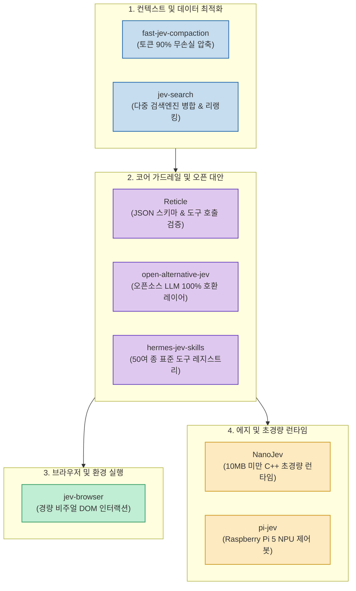

초경량 의사결정 모델이자 에이전트 오케스트레이션 프레임워크인 **Jev** 생태계가 오픈소스 커뮤니티를 중심으로 폭발적으로 성장하고 있습니다. 초기의 단순한 라우팅 실험 단계를 넘어, 이제는 토큰 비용 절감, 브라우저 제어, 실시간 검색, 에지 IoT 디바이스 탑재 등 실무 엔지니어링의 병목을 해결하는 완성도 높은 라이브러리들이 속속 등장하고 있습니다.

X(Twitter)의 AI 엔지니어 **@zhouluobo** 님이 추천한 실무 즉시 도입 가능한 **8대 Jev 오픈소스 프로젝트** 를 기능별 카테고리로 분류하고, 실제 아키텍처에 결합하는 방법과 실전 효용을 상세히 정리합니다.

<!--more-->

## Sources

- [X(Twitter) 원문: @zhouluobo 트윗](https://x.com/zhouluobo/status/2101452286270792061)

---

## 1. Jev 생태계 8대 프로젝트 아키텍처 맵

8개 프로젝트는 에이전트의 생애 주기(컨텍스트 수집 ➔ 추론 및 가드레일 ➔ 외부 연동 및 실행) 전반에 걸쳐 유기적으로 맞물려 동작합니다.

---

## 2. 8대 핵심 프로젝트별 특징과 활용법

### 1) fast-jev-compaction: 대규모 세션 토큰 90% 압축기
- **역할**: 수십 번의 도구 호출과 파일 탐색으로 비대해진 대화 히스토리에서 불필요한 반복 텍스트와 코드 중복을 구조적으로 제거합니다.
- **실무 효용**: 긴 작업을 수행할 때 컨텍스트 윈도우 한도 초과(OOM)를 방지하고 프롬프트 캐시 적중률을 극대화합니다.

### 2) jev-browser: 시각적 DOM 인터랙션 헤드리스 브라우저
- **역할**: 수 메가바이트에 달하는 전체 HTML DOM을 에이전트에게 전송하는 대신, 클릭 가능 요소와 입력 필드만 정제하여 텍스트로 전달합니다.
- **실무 효용**: 브라우저 제어 에이전트의 응답 속도를 10배 이상 끌어올리고 비용을 95% 절감합니다.

### 3) jev-search: 하이브리드 리랭킹 검색 오케스트레이터
- **역할**: Google, Bing, Brave, Tavily 등 복수의 검색 API를 병렬 호출한 뒤, 질문 맥락에 가장 부합하는 문단만 추출하여 재순위화(Re-ranking)합니다.
- **실무 효용**: 허위 정보(Hallucination)를 차단하고 팩트 기반의 최신 지식을 신속히 주입합니다.

### 4) Reticle: 스키마 강제 실행 런타임 가드레일
- **역할**: 모델이 잘못된 인자(Argument)나 파손된 JSON으로 도구를 호출하지 못하도록 엄격한 정적 타입 검증을 수행합니다.
- **실무 효용**: 에이전트 루프가 엉뚱한 파라미터 에러로 멈추는 현상을 원천 차단합니다.

### 5) NanoJev: 10MB 미만 초경량 C++ 임베디드 엔진
- **역할**: 파이썬이나 무거운 런타임 없이 C++로 빌드된 10MB 미만의 초소형 의사결정 바이너리입니다.
- **실무 효용**: 로컬 CLI 유틸리티나 컨테이너 사이드카에서 5ms 이내의 극초단 라우팅을 수행합니다.

### 6) open-alternative-jev: 완전한 오픈소스 LLM 대체 레이어
- **역할**: 상용 독점 API(OpenAI, Anthropic)에 묶이지 않고, 로컬의 vLLM이나 Ollama 기반 Llama-3, Qwen-2.5 모델을 Jev 인터페이스로 완벽히 치환합니다.
- **실무 효용**: 사내 보안망이나 에어갭(Air-gapped) 환경에서 데이터 유출 없는 온프레미스 에이전트 구축이 가능합니다.

### 7) pi-jev: 라즈베리 파이 5 및 ARM 전용 IoT 제어기
- **역할**: Raspberry Pi 5의 NPU 및 GPIO 핀을 직접 제어할 수 있도록 최적화된 하드웨어 친화적 런타임입니다.
- **실무 효용**: 드론, 로봇 팔, 스마트 홈 센서 연동 장비를 외부 클라우드 통신 없이 로컬 제어합니다.

### 8) hermes-jev-skills: 50+ 실전 도구 표준 레지스트리
- **역할**: 파일 편집, SQL 쿼리, Git 조작, 슬랙 알림 등 현업에서 가장 많이 쓰는 50여 종의 툴을 사전 패키징한 모듈입니다.
- **실무 효용**: 도구 작성에 드는 시간 없이 즉시 자율 업무 에이전트를 조립할 수 있습니다.

---

## 3. 실무 도입 전략

- **비용 최적화가 시급한 경우**: `fast-jev-compaction`과 `jev-search`를 도입하여 입출력 토큰을 즉시 압축하십시오.
- **독립 인프라 및 보안이 중요한 경우**: `open-alternative-jev`와 `Reticle`을 결합해 사내 온프레미스 GPU 클러스터에 배포하십시오.
- **하드웨어 및 온디바이스 프로젝트**: `NanoJev`와 `pi-jev`로 외부 의존성 없는 독립 임베디드 에이전트를 구성할 수 있습니다.
