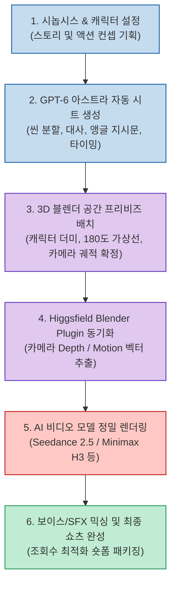

유튜브 쇼츠, 인스타그램 릴스, 틱톡을 중심으로 AI로 생성한 숏폼 드라마와 시네마틱 액션 영상이 수백만 조회수를 기록하며 새로운 미디어 트렌드로 자리 잡았습니다. 하지만 AI 영상 제작을 진지하게 시도해 본 크리에이터라면 누구나 공통된 장벽에 부딪힙니다.

기존의 단순 프롬프트 입력 방식(Text-to-Video)은 **"카메라가 어떻게 움직여야 하는지", "인물이 어디를 바라보고 어떤 동선으로 움직여야 하는지"** 를 정밀하게 지시할 수 없어 원하는 연출이 나올 때까지 수십 번씩 크레딧을 날리는 '랜덤 가챠'에 불과했습니다. 게다가 컷이 바뀔 때마다 인물의 얼굴과 복장이 미묘하게 달라져 시청자의 몰입을 깨뜨리기 일쑤였습니다.

유튜브 채널 **'AI 아스트라 AI Astra'** 가 공개한 제작 기법은 영화 산업의 전문 워크플로우인 **사전 시각화(Pre-visualization, 프리비즈)** 단계를 AI 파이프라인에 이식하여 이 고질적인 문제를 정면으로 돌파했습니다.

**GPT-6 아스트라(Astra)** 의 탄탄한 시나리오 구성력, 무료 3D 오픈소스 **블렌더(Blender)** 의 정밀한 공간 좌표 제어, 그리고 **힉스필드(Higgsfield) 플러그인** 의 영상 렌더링 파워를 결합한 원스톱 AI 드라마 제작 파이프라인을 깊이 있게 분석합니다.

<!--more-->

## Sources

- [YouTube 영상: AI 아스트라 - GPT-6 아스트라 x 블렌더⚡GPT-6 하나로 조회수 터지는 AI 드라마 제작하기!](https://youtu.be/B70hv6CiLRg?si=gxzp2KVMMGorMuMH)
- [힉스필드 AI 공식 플랫폼](https://higgsfield.ai)
- [제작자 공식 Threads 채널: @aiastra0](https://www.threads.com/@aiastra0)

---

## 1. 프리비즈 기반 AI 영상 제작 아키텍처

텍스트 프롬프트에만 의존하던 기존 방식에서 탈피하여, 3D 블렌더 공간에서 물리적 가상 카메라와 캐릭터 더미를 배치한 뒤 비디오 생성 엔진에 공간 데이터를 공급하는 아키텍처입니다.

---

## 2. 4단계 엔드투엔드 제작 프로세스

### 1) 기획 및 씬 분할 시트 생성 (GPT-6 아스트라)
- **프롬프트 템플릿 최적화**: "30초 분량의 사이버펑크 골목 추격 액션 씬을 구성해줘"라고 입력하면, 아스트라가 자동으로 샷 번호, 인물 감정 상태, 카메라 화각(렌즈 mm), 피사체 이동 속도를 표 형태의 구조화된 시트로 출력합니다.
- **초 단위 타임라인 제어**: 긴장감을 고조시키는 컷 전환 주기를 1.5초~2.5초 단위로 쪼개어 시청자 이탈을 막는 숏폼 문법을 사전에 설계합니다.

### 2) 3D 공간 연출 및 프리비즈 (블렌더 브릿지)
- **더미(Dummy) 캐릭터 배치**: 고화질 3D 모델링을 할 필요 없이 단순한 큐브나 관절 마네킹을 배치해 인물 간의 물리적 거리와 시선(Eye-line)을 맞춥니다.
- **가상 카메라 리그(Camera Rig) 제어**: 트래킹 샷(Dolly In/Out), 패닝(Pan), 오버 더 숄더(OTS) 등 실제 촬영 감독이 쓰는 카메라 무빙을 키프레임으로 세팅합니다.

### 3) 힉스필드 AI 영상 모델 합성
- **공간 뎁스 맵(Depth Map) 전송**: 블렌더에서 계산된 카메라 앵글과 3D 뎁스 정보가 `Higgsfield Plugin`을 통해 영상 엔진에 그대로 전달됩니다.
- **일관성 보존**: 무작위로 생성되던 화면이 3D 좌표 가이드를 엄격히 따르기 때문에, 인물의 위치가 튀지 않고 영화 같은 완벽한 앵글의 시네마틱 클립이 출력됩니다.

### 4) 사운드 및 모션 효과 믹싱
- 생성된 고화질 비디오 클립에 AI 보이스오버, 타격음(SFX), 앰비언트 배경음을 결합하여 몰입감을 완성합니다.

---

## 3. 조회수를 폭발시키는 AI 드라마 2대 연출 법칙

1. **180도 가상선 법칙(Axis of Action)의 철저한 준수**:
   - 두 인물이 대화하거나 전투할 때 카메라가 두 사람을 잇는 가상 선을 넘어가면 시청자는 좌우 방향 감각을 잃고 어지러움을 느낍니다. 
   - 블렌더의 3D 뷰포트에서 카메라의 위치를 한쪽 영역에 엄격히 고정함으로써 시각적 피로도를 원천 차단합니다.

2. **텍스트 의존도를 낮추고 공간 데이터를 우선시할 것**:
   - "역동적인 앵글로 뒤돌아보며 주먹을 날린다" 같은 모호한 문장에 의존하면 AI 모델마다 제각각 해석합니다. 
   - 3D 블렌더에서 카메라 궤적과 인물 포즈를 먼저 고정해 주는 것이 제작 시간과 API 비용을 90% 이상 아끼는 유일한 방법입니다.

---

## 4. 1인 제작 환경의 경제성 혁신

과거 방송사나 전문 제작사에서나 가능했던 복잡한 시네마틱 드라마 제작이, 이제는 **GPT-6 아스트라** 의 지능과 무료 오픈소스 **블렌더**, 그리고 **힉스필드** 의 플러그인 생태계를 통해 개인 1인의 방구석 PC에서 단돈 수천 원 수준의 비용으로 실현되고 있습니다.

AI 영상 시장이 '단순 이미지 움직이기' 수준을 지나 '정밀한 연출과 서사가 있는 시네마'로 진화하는 현시점에서, 3D 프리비즈를 접목한 파이프라인은 크리에이터들에게 가장 강력한 경쟁력이 될 것입니다.
