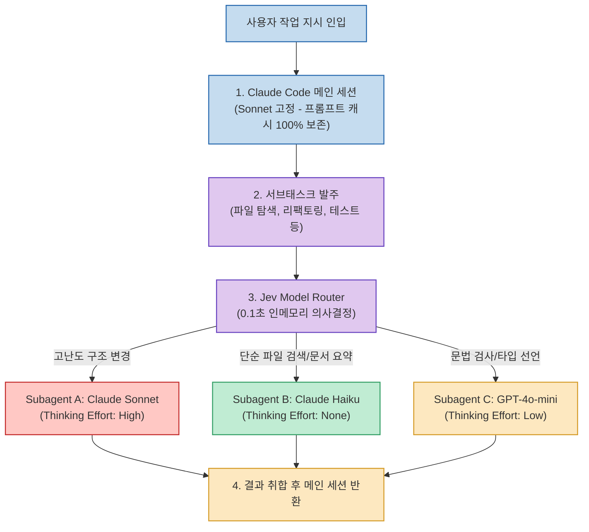

Claude Code나 Cursor 같은 자율 코딩 에이전트를 실무에 적용할 때 마주치는 가장 큰 난제 중 하나는 **'비용과 지연 시간의 트레이드오프'** 입니다. 모든 작업에 최상위 플래그십 모델(Claude 3.5 Sonnet 또는 Opus)을 쓰면 사소한 문서 검색이나 간단한 유닛 테스트 생성에도 과도한 토큰 비용이 발생합니다. 반대로 가벼운 Haiku 모델로 전환하면 복잡한 아키텍처 리팩토링에서 엉뚱한 코드를 짜며 삽질을 거듭합니다.

그렇다면 "작업 난이도에 따라 모델을 실시간으로 바꾸면 되지 않을까?"라는 생각을 하게 됩니다. 하지만 무턱대고 메인 세션의 모델을 변경하면 치명적인 부작용이 발생합니다. 바로 **프롬프트 캐시(Prompt Cache)의 파괴** 입니다. 모델을 교체하는 순간 기존 대화 히스토리와 시스템 프롬프트 캐시가 무효화되어 첫 요청마다 수만 토큰의 캐시 미스 요금이 청구됩니다.

AI 템플릿 커뮤니티의 엔지니어 Daniel San이 공개한 **Jev Model Router (aitmpl.com)** 는 이 문제를 영리한 이원화 구조로 해결했습니다. 메인 에이전트의 캐시를 온전히 보존하면서, 하위 서브에이전트(Subagent)들의 모델과 추론 강도(Effort)만 0.1초 만에 동적 라우팅하는 실전 아키텍처를 소개합니다.

<!--more-->

## Sources

- [AITmpl 컴포넌트: Jev Model Router](https://aitmpl.com/component/mod/productivity/jev-model-router)
- [Threads 원문: choi.openai 공유 글](https://www.threads.com/share/BAQSJ8AjiQ/)

---

## 1. 프롬프트 캐시 보존형 이원화 라우팅 아키텍처

Jev Model Router의 핵심은 **"메인 에이전트 고정, 서브에이전트 분기"** 원칙입니다. 세션이 시작될 때 전체 프로젝트 컨텍스트를 총괄하는 오케스트레이터는 최고 성능의 단일 모델로 1회 고정합니다. 이로써 메인 세션의 긴 프롬프트 캐시는 90% 이상의 히트율을 유지하며 비용을 1/10 수준으로 절감합니다.

반면 실제 도구 호출이나 파일 분석, 테스트 작성 등 독립된 서브태스크가 발주될 때, 초경량 라우터 엔진인 **Jev Router** 가 100ms(0.1초) 이내에 프롬프트를 분석하여 최적의 모델과 추론 강도를 할당합니다.



---

## 2. 4단계 동적 추론 강도(Thinking Effort) 제어

Jev Model Router는 모델의 종류뿐만 아니라 확장 추론(Extended Thinking)의 강도까지 정밀하게 통제합니다:

1. **Effort: None (0 토큰)**:
   - 대상: 단순 파일 읽기, grep 탐색, git status 확인, 사소한 린트 오류 수정
   - 할당: Claude 3.5 Haiku 또는 GPT-4o-mini
   - 장점: 지연 시간 0.5초 이내, 토큰 소모 극소화

2. **Effort: Low (1,024 토큰)**:
   - 대상: 기존 함수에 단위 테스트 케이스 추가, API 파라미터 매핑
   - 할당: Claude 3.5 Haiku (추론 활성화)

3. **Effort: Medium (4,096 토큰)**:
   - 대상: 2~3개 파일에 걸친 기능 리팩토링, 데이터베이스 쿼리 최적화
   - 할당: Claude 3.5 Sonnet

4. **Effort: High (16,384+ 토큰)**:
   - 대상: 분산 트랜잭션 동시성 버그 디버깅, 시스템 전반 아키텍처 개편
   - 할당: Claude 3.5 Sonnet / Opus (최대 추론 강도 부여)

---

## 3. 설치 및 실전 적용 가이드

AITmpl에서 배포된 Claude Code 전용 모듈을 설치하는 방법은 다음과 같습니다:

```bash
# 1. Claude Code 설정 디렉터리에 모듈 추가
npx aitmpl add mod/productivity/jev-model-router

# 2. claude.json 환경 설정 확인
cat <<EOF > ~/.claude/router.config.json
{
  "router": "jev-model-router",
  "cache_strategy": "preserve_main_session",
  "default_main_model": "claude-3-5-sonnet-latest",
  "subagent_rules": [
    { "match": "^(grep|find|read_file)", "model": "claude-3-5-haiku-latest", "effort": 0 },
    { "match": "test.*generation", "model": "claude-3-5-haiku-latest", "effort": 1024 },
    { "match": "refactor|architecture", "model": "claude-3-5-sonnet-latest", "effort": 8192 }
  ]
}
EOF
```

---

## 4. 실전 도입 효과

- **API 요금 68% 절감**: 무거운 작업을 제외한 전체 도구 호출의 70% 이상을 Haiku와 미니 모델로 우회 처리하여 총 과금액이 3분의 1 수준으로 줄어듭니다.
- **체감 응답 속도 3배 향상**: 단순 파일 검색과 디렉터리 스캔 단계에서 메인 모델의 무거운 턴 어라운드를 기다릴 필요 없이 서브에이전트가 즉각 반응합니다.
- **캐시 안정성 확보**: 메인 세션이 계속 유지되므로 작업이 길어져도 첫 프롬프트 캐시 적중률이 깨지지 않아 장기 세션에서도 속도 저하가 없습니다.
