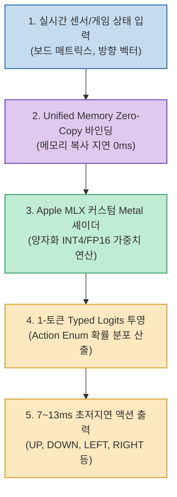

에이전트 의사결정 엔진의 속도 한계는 어디까지 줄어들 수 있을까요? 클라우드 기반 LLM API를 호출하면 아무리 빨라도 왕복 네트워크 지연 시간(RTT)과 토큰 생성 시간 때문에 300~800ms 이상 소요됩니다. 이는 실시간 게임 조작, 로봇 제어, 초단타 매매 등 밀리초(ms) 단위의 반응 속도가 생명인 분야에서는 치명적인 걸림돌이 됩니다.

AI 연구자 **@mizorewww** 가 공개한 **Laya-MLX (mizorewww/laya-mlx)** 는 Apple Silicon Mac의 통합 메모리(Unified Memory) 아키텍처와 **Apple MLX** 프레임워크를 극한까지 활용하여 이 병목을 단번에 뚫어냈습니다.

단 **1GB 미만의 RAM 점유율** 만으로, M3 Max 칩셋에서 **7~13ms** 의 전광석화 같은 추론 지연 시간을 달성했습니다. 이는 기존 경량 Jev 모델 대비 최대 **50배 빠른 속도** 로, 초당 75회 이상의 엄격한 타입 세이프 의사결정을 실시간으로 쏟아냅니다.

<!--more-->

## Sources

- [GitHub 저장소: mizorewww/laya-mlx](https://github.com/mizorewww/laya-mlx)
- [X(Twitter) 원문: @mizorewww 트윗](https://x.com/mizorewww/status/2101473552956555427)

---

## 1. Apple MLX 통합 메모리 파이프라인

Laya-MLX는 일반적인 PyTorch 모델을 Mac에서 돌릴 때 발생하는 CPU-GPU 간 데이터 복사 오버헤드를 완전히 제거했습니다. Apple 실리콘의 통합 메모리 구조에 직접 접근하는 MLX의 C++ 커널과 Metal 셰이더를 통해 zero-copy 텐서 연산을 수행합니다.



---

## 2. 스네이크 게임(Snake Game) 완주 데모의 의미

제작진이 공개한 실시간 데모 영상에서 Laya-MLX는 고전 스네이크 게임의 보드 상황을 실시간으로 입력받아 뱀의 몸통통통이 화면 전체를 가득 채울 때까지 단 한 번의 충돌도 없이 완벽하게 게임을 완주합니다.

- **초당 75회 (75 FPS) 실시간 연산**: 게임 루프의 매 프레임마다 AI가 보드 전체의 위상학적 경로(Hamiltonian Cycle 기반 근사 경로)를 계산하여 다음 방향을 지시합니다.
- **엄격한 타입 안전성(Typed Output)**: 자유 서술형 텍스트를 출력한 뒤 정규식으로 파싱하는 대신, 모델의 마지막 선형 레이어(Logits)가 사전에 정의된 `Enum` 액션(상, 하, 좌, 우, 대기)으로 직접 제한됩니다. JSON 구문 오류나 환각(Hallucination)이 0%입니다.
- **클라우드 비용 0원 & 완전한 오프라인**: 인터넷 연결이 완전히 끊긴 비행기 모드나 에어갭 환경에서도 M2/M3/M4 Mac만 있다면 배터리 소모를 최소화하며 구동됩니다.

---

## 3. 코드 레벨 사용 예시

Python과 MLX를 활용하여 단 몇 줄로 Laya 엔진을 초기화하고 루프를 돌릴 수 있습니다:

```python
import mlx.core as mx
from laya_mlx import LayaDecisionEngine, ActionEnum

# 1. 1GB 미만의 오픈 가중치 로드 (Apple Metal 자동 바인딩)
engine = LayaDecisionEngine.from_pretrained(
    "mizorewww/laya-mlx-base",
    dtype=mx.float16
)

# 2. 실시간 상태 인코딩 및 초저지연 추론
game_state = {
    "grid_size": [20, 20],
    "snake_head": [10, 12],
    "food_coord": [15, 8],
    "obstacles": [[10, 11], [9, 11]]
}

# 3. 7~13ms 이내의 타입 세이프 액션 반환
action: ActionEnum = engine.predict_action(game_state)
print(f"Next Action: {action.name}, Latency: {engine.last_latency_ms:.2f}ms")
```

---

## 4. 시사점: 온디바이스 도메인 특화 엔진의 시대

Laya-MLX는 모든 문제를 700억 파라미터(70B)급의 거대 모델로 풀 필요가 없음을 입증합니다. 

- **도메인 특화 초경량 모델의 압승**: 복잡한 인문학적 작문이 아닌, 정형화된 상태(State)에서 다음 동작(Action)을 결정하는 작업에서는 1B 이하의 파라미터를 극도로 최적화하는 것이 훨씬 경제적이고 민첩합니다.
- **Mac 하드웨어의 AI 워크스테이션화**: 외장 고성능 GPU 서버 없이도 맥북 단독으로 실시간 로보틱스, 게임 AI 시뮬레이션, 로컬 제어 에이전트를 매끄럽게 구동할 수 있는 지평을 열었습니다.
