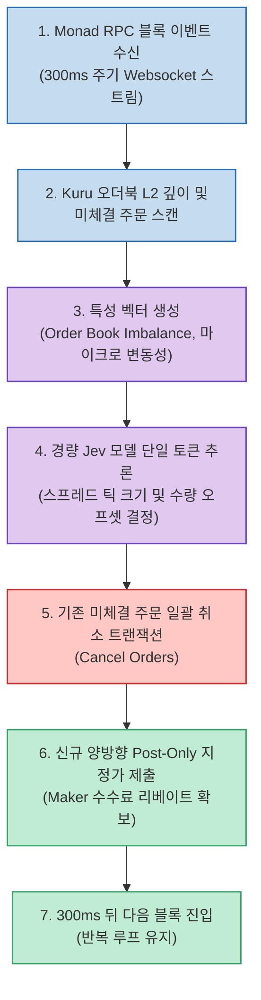

많은 사람들이 AI 트레이딩 봇이라고 하면 복잡한 딥러닝 모델이 미래 가격을 신들린 듯 예측하여 막대한 시세 차익을 남기는 모습을 떠올립니다. 하지만 실전 정량 거래(Quantitative Trading)의 세계, 특히 탈중앙화 거래소(DEX)의 온체인 마켓 메이킹 환경에서는 완전히 다른 현실이 펼쳐집니다.

수수료가 높고 지연 시간이 긴 환경에서는 아무리 훌륭한 예측 모델이 있어도 가스비와 슬리피지 때문에 계좌가 서서히 녹아내립니다. 반면 300ms 블록 타임과 10,000 TPS를 지원하는 초고속 EVM 레이어1 **Monad** 환경에서는 **"예측 정확도"** 보다 **"300ms마다 안정적으로 주문을 취소하고 다시 까는 인프라 파이프라인"** 이 트레이딩 수익률의 9할 이상을 결정합니다.

Jarrod Watts가 공개한 오픈소스 **jev-trader (jarrodwatts/jev-trader)** 는 바로 이 철학을 극단적으로 증명하는 프로젝트입니다. Monad 생태계의 중앙화 오더북 DEX인 **Kuru DEX** 위에서, 초경량 경량화 의사결정 모델인 **Jev** 를 결합해 초 단위로 양방향 지정가 유동성을 공급하는 메이커 봇의 구조를 깊이 있게 살펴봅니다.

<!--more-->

## Sources

- [GitHub 저장소: jarrodwatts/jev-trader](https://github.com/jarrodwatts/jev-trader)
- [Threads 원문: punk.ai2 공유 글](https://www.threads.com/share/_olVtLyGh/)
- [Kuru DEX 기술 문서](https://docs.kuru.io/)

---

## 1. Monad 300ms 블록 환경과 Kuru DEX의 파이프라인

기존 이더리움 메인넷(12초)이나 L2(1~2초) 환경에서는 블록 확정 시간이 길어 온체인 오더북(CLOB)을 구현하기 어려웠고, 대부분 AMM(Uniswap 계열) 유동성 풀 방식을 채택했습니다. 하지만 Monad는 비동기 실행(Asynchronous Execution)과 모나드 BFT 합의 알고리즘을 통해 **300ms 블록 타임** 과 초당 1만 건 이상의 처리량을 제공합니다.

Kuru DEX는 이 초고속 인프라를 활용해 오프체인 매칭 엔진 없이 **100% 온체인 오더북** 을 구현했습니다. `jev-trader`는 이 환경에서 유동성을 공급하고 스프레드를 획득하는 마켓 메이킹 전략을 수행합니다.



---

## 2. 왜 거대 언어 모델(LLM)이 아닌 경량 Jev 모델인가?

전통적인 LLM(Claude 3.5 Sonnet, GPT-4o 등)은 추론 지연 시간만 1,000ms~3,000ms에 달합니다. 300ms마다 새로운 블록이 확정되는 환경에서 2초 뒤에 나온 예측값은 이미 과거의 유물일 뿐이며, 그 사이에 가격이 튀어 주문이 불리한 가격에 체결(Adverse Selection)되어 손실을 입게 됩니다.

`jev-trader`는 다음과 같은 설계 원칙을 적용했습니다:

1. **초저지연 결정론적 의사결정**:
   - 모델 추론 시간이 10~20ms 이내로 끝나야 합니다.
   - 불필요한 장문의 사고 과정(CoT)을 배제하고, 현재 오더북 불균형(Order Book Imbalance)과 최근 체결 틱을 인코딩한 뒤 매수·매도 오프셋만 즉시 출력합니다.

2. **Post-Only 보장 메커니즘**:
   - 시장가로 긁는 테이커(Taker) 주문을 일절 내지 않습니다.
   - 오직 유동성을 채워 넣는 `Post-Only` 옵션만 사용하여 항상 메이커 리베이트를 수취하거나 수수료를 0%로 유지합니다.

3. **취소-배치 트랜잭션(Batch Replacement)**:
   - 주문 취소와 신규 주문 생성을 별도의 RPC 호출로 쪼개지 않고 단일 원자적 배치 호출로 묶어 트랜잭션 오버헤드를 최소화합니다.

---

## 3. 핵심 아키텍처 및 코드 패턴

봇의 핵심 루프는 Node.js / TypeScript 환경에서 ethers.js 또는 viem을 통해 Monad RPC와 긴밀하게 연동됩니다.

```typescript
// jev-trader 핵심 오더북 리프레시 루프 예시
async function executeMarketMakingCycle(market: KuruMarket, model: JevDecisionEngine) {
  // 1. 현재 온체인 L2 오더북 스냅샷 확보
  const orderbook = await market.getOrderBookSnapshot();
  const currentSpread = orderbook.bestAsk - orderbook.bestBid;
  
  // 2. 모델에게 입력할 오더북 불균형(OBI) 지표 산출
  const obi = (orderbook.bidVolume - orderbook.askVolume) / (orderbook.bidVolume + orderbook.askVolume);
  
  // 3. Jev 모델의 실시간 오프셋 판독 (15ms 이내)
  const decision = await model.evaluateSpread({
    midPrice: (orderbook.bestAsk + orderbook.bestBid) / 2n,
    imbalance: obi,
    volatilityWindow: market.getRecentTickDelta()
  });

  // 4. 안전 마진 검증 (스프레드가 역전되지 않도록 강제)
  if (decision.targetBid >= decision.targetAsk) {
    console.warn("스프레드 역전 감지: 주문 스킵");
    return;
  }

  // 5. 원자적 취소 및 신규 주문 제출 (Monad 300ms 블록 동기화)
  await market.replaceBatchOrders({
    cancelOrderIds: market.getActiveOrderIds(),
    newOrders: [
      { side: 'BUY', price: decision.targetBid, size: decision.bidSize, postOnly: true },
      { side: 'SELL', price: decision.targetAsk, size: decision.askSize, postOnly: true }
    ]
  });
}
```

---

## 4. 실전에서 배운 교훈: 예측력보다 실행 인프라

`jev-trader` 프로젝트가 입증한 교훈은 명확합니다:

- **알고리즘의 천재성보다 네트워크와의 거리(Latency)가 우선한다**: RPC 노드와의 레이턴시가 50ms 증가하면 모델의 예측력이 아무리 뛰어나도 프론트러닝(MEV) 봇들의 먹잇감이 됩니다.
- **예측과 실행의 분리**: 머신러닝 모델은 어디까지나 "스프레드를 평소보다 몇 틱 벌릴 것인가"라는 거시적 위험 관리 파라미터만 조정하고, 실제 체결과 취소는 엄격한 규칙 기반 인프라 엔진이 전담해야 시스템이 폭주하지 않습니다.
- **차세대 EVM 생태계의 기회**: Monad와 같이 처리 속도가 웹2 수준으로 올라간 체인에서는 기존 금융권의 HFT(고빈도 거래) 알고리즘과 초경량 온디바이스 AI의 결합이 새로운 격전지가 될 것입니다.
